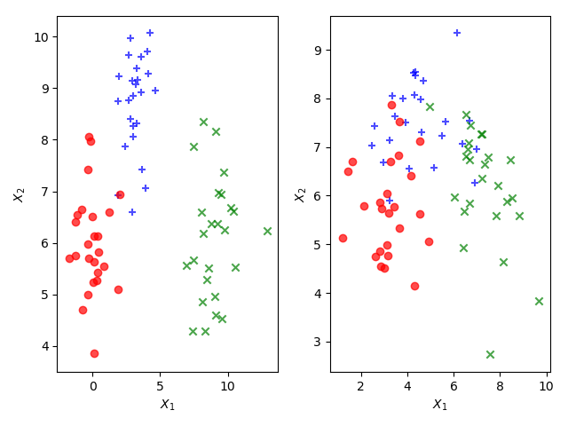

# Table of Contents

1.  [Introduction](#org95d78fa)
2.  [Statistical Learning](#orgb1124a2)

# Introduction

Figure [2](#org61becc9) shows graphs of Wage versus three variables. 

 and 5 the highest level (an advanced graduate degree).  On average, `wage` increases with the level of `education`.")

Figure [4](#orgd5d31e7) shows boxplots of previous days' percentage changes in S&P
500 grouped according to today's change `Up` or `Down`. 

# Statistical Learning

Figure [6](#org12f330a) shows scatter plots of `sales` versus `TV`, `radio`,
and `newspaper` advertising.  In each panel, the figure also includes an OLS
regression line.  

Figure [8](#org9d81f10) is a plot of `Income` versus `Years of Education` from the
Income data set.  In the left panel, the \`\`true'' function (given by blue line)
is actually my guess.  

 and `years of education` for 30 individuals.  Right: The blue curve represents the true underlying relationship between `income` and `years of education`, which is generally unknown (but is known in this case because the data are simulated).  The vertical lines represent the error associated with each observation.  Note that some of the errors are positive (when an observation lies above the blue curve) and some are negative (when an observation lies below the curve).  Overall, these errors have approximately mean zero.")

Figure [10](#org2bb6e72) is a plot of `Income` versus `Years of Education` and
`Seniority` from the `Income` data set.  Since the book does not provide the
true values of `Income`, \`\`true'' values shown in the plot are actually third
order polynomial fit.  

Figure [12](#org6f2433d) shows an example of the parametric approach applied to
the `Income` data from previous figure. 

.  The observations are shown in red, and the blue plane indicates the least squares fit to the data.")

Figure [14](#org854415b) provides an illustration of the trade-off between
flexibility and interpretability for some of the methods covered in this book.

Figure [16](#orgcc84660) provides a simple illustration of the clustering problem.

