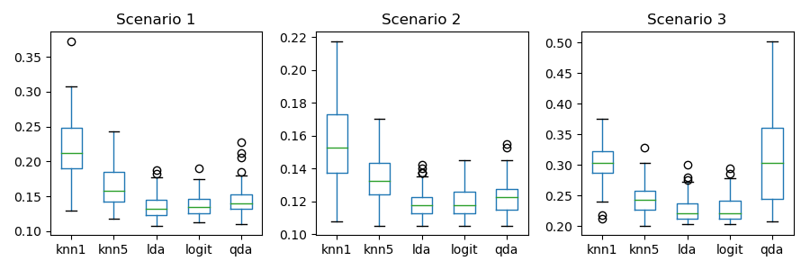
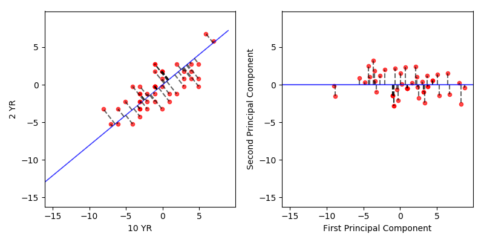

# Table of Contents

1.  [Introduction](#orgf4a13d3)
2.  [Statistical Learning](#org993a694)
    1.  [What is Statistical Learning?](#orgf913a15)
    2.  [Assessing Model Accuracy](#orgdaf7185)
    3.  [Lab: Introduction to Python](#org10a0ada)
        1.  [Basic Commands](#org3507bba)
        2.  [Graphics](#org29fb151)
        3.  [Indexing Data](#orgf5d88ff)
        4.  [Loading Data](#org8da83f6)
        5.  [Additional Graphical and Numerical Summaries](#org33da3dd)
3.  [Linear Regression](#orge26424f)
    1.  [Simple Linear Regression](#orgd83890c)
    2.  [Multiple Linear Regression](#orgaa67831)
    3.  [Other Considerations in the Regression Model](#org63ae12f)
    4.  [The Marketing Plan](#org0090830)
    5.  [Comparison of Linear Regression with K-Nearest Neighbors](#org723f836)
    6.  [Lab: Linear Regression](#org948bde6)
        1.  [Libraries](#org8e56926)
        2.  [Simple Linear Regression](#org94657fe)
        3.  [Multiple Linear Regression](#org1e8a2f2)
        4.  [Interaction Terms](#orgac4fa3a)
        5.  [Non-linear Transformations of the Predictors](#org279c839)
        6.  [Qualitative Predictors](#org16358f9)
        7.  [Calling `R` from `Python`](#orgb6804c3)
4.  [Classification](#org821fa53)
    1.  [An Overview of Classification](#orgdc96128)
    2.  [Why Not Linear Regression?](#org3802e6f)
    3.  [Logistic Regression](#orgf8dc2a6)
    4.  [Linear Discriminant Analysis](#org05cef42)
    5.  [A Comparison of Classification Methods](#orgcf614a5)
    6.  [Lab: Logistic Regression, LDA, QDA, and KNN](#org2bcbc34)
        1.  [The Stock Market Data](#org93a6bab)
        2.  [Logistc Regression](#orgfa3e673)
        3.  [Linear Discriminant Analysis](#org1dc1c55)
        4.  [Quadratic Discriminant Analysis](#org426ded4)
        5.  [K-Nearest Neightbors](#org3de87c5)
        6.  [An Application to Caravan Insurance Data](#org027e6dd)
5.  [Resampling Methods](#org28e7542)
    1.  [Cross-Validation](#org01db70e)
    2.  [The Bootstrap](#orgbf55f9a)
    3.  [Lab: Cross-Validation and the Bootstrap](#org7737577)
        1.  [The Validation Set Approach](#org61bdaeb)
        2.  [Leave-One-Out Cross-Validation](#org2b27c08)
        3.  [k-Fold Cross-Validation](#org8fd48f8)
        4.  [The Bootstrap](#org6ca132c)
6.  [Linear Model Selection and Regularization](#org13f9b4a)
    1.  [Subset Selection](#org3403b5c)
    2.  [Shrinkage Methods](#org142177f)
    3.  [Dimension Reduction Methods](#org18419ca)
    4.  [Considerations in High Dimensions](#org4f81bde)
    5.  [Lab 1: Subset Selection Methods](#orga24c85e)
        1.  [Best Subset Selection](#orga3b12bc)
        2.  [Forward and Backward Stepwise Selection](#orgefc40bb)
        3.  [Choosing Among Models Using the Validation Set Approach and Cross-Validation](#orgde6c947)
    6.  [Lab 2: Ridge Regression and the Lasso](#org1d3fa4e)
        1.  [Ridge Regression](#org52abc17)
        2.  [The Lasso](#org86e878d)
    7.  [Lab 3: PCR and PLS Regression](#org6cde368)
        1.  [Principal Components Regression](#org9593e1e)
        2.  [Partial Least Squares](#org80808ca)
7.  [Moving Beyond Linearity](#org39b38a9)
    1.  [Polynomial Regression](#org90e04b2)
    2.  [Step Functions](#org732c4e8)
    3.  [Basis Functions](#org85028a5)
    4.  [Regression Splines](#orgf1f6021)
    5.  [Lab: Non-linear Modeling](#org507d805)
        1.  [Polynomial Regression and Step Functions](#orgb92fa95)
8.  [Tree-Based Models](#org4ba7331)
    1.  [The Basics of Decision Trees](#org4d4bc21)
        1.  [Regression Trees](#org41d8eea)
        2.  [Classification Trees](#org08b4ff9)
        3.  [Trees versus Linear Models](#org00161ac)
    2.  [Bagging, Random Forests, Boosting](#orgecd992a)
    3.  [Lab: Decision Trees](#org5779b1b)
        1.  [Fitting Classification Trees](#org1b4130e)
        2.  [Fitting Regression Trees](#org67550cf)
        3.  [Bagging and Random Forests](#org0a97b5a)
        4.  [Boosting](#org5f58802)
9.  [Support Vector Machines](#org3690217)
    1.  [Maximal Margin Classifier](#org448c4aa)
        1.  [What is a Hyperplane?](#org192bbe0)
        2.  [Classification Using a Separating Hyperplane](#org9257664)
        3.  [The Maximal Margin Classifier](#org89ebdc1)
        4.  [Construction of the Maximal Margin Classifier](#orga9979fa)
        5.  [The Non-separable Case](#orgebf7bb0)
    2.  [Support Vector Classifiers](#org46462a5)
        1.  [Overview of the Support Vector Classifier](#org0fe726c)
        2.  [Details of the Support Vector Classifier](#org6760531)
    3.  [Support Vector Machines](#org7b905c1)
        1.  [Classification with Non-linear Decision Boundaries](#org5940b13)
        2.  [The Support Vector Machine](#org838ebc4)
        3.  [An Application to the Heart Disease Data](#orge811a7e)
    4.  [SVMs with More than Two Classes](#org523eff8)
        1.  [One-Versus-One Classification](#orgea30027)
        2.  [One-Versus-All Classification](#org9f5fc8f)
    5.  [Relationship with Logistic Regression](#org143aef4)
    6.  [Lab: Support Vector Machines](#orga28208b)
        1.  [Support Vector Classifier](#org81d5a8d)
        2.  [Support Vector Machine](#org056adec)
        3.  [ROC Curves](#org7733f62)
        4.  [SVM with Multiple Classes](#org55dcfd4)
        5.  [Application to Gene Expression Data](#org918fb45)
10. [Unsupervised Learning](#org1e3b5cb)
    1.  [The Challenge of Unsupervised Learning](#orgfda7845)
    2.  [Principal Component Analysis](#org1efa423)
        1.  [What are Principal Components?](#org6dc339b)
        2.  [Another Interpretation of Principal Components](#orgccf18e2)

# Introduction

Figure [2](#org6b4fd1c) shows graphs of Wage versus three variables. 

 and 5 the highest level (an advanced graduate degree).  On average, `wage` increases with the level of `education`.")

Figure [4](#org20d6451) shows boxplots of previous days' percentage changes in S&P
500 grouped according to today's change `Up` or `Down`. 

# Statistical Learning

## What is Statistical Learning?

Figure [7](#org4c27947) shows scatter plots of `sales` versus `TV`, `radio`,
and `newspaper` advertising.  In each panel, the figure also includes an OLS
regression line.  

Figure [9](#orga87090e) is a plot of `Income` versus `Years of Education` from the
Income data set.  In the left panel, the \`\`true'' function (given by blue line)
is actually my guess.  

 and `years of education` for 30 individuals.  Right: The blue curve represents the true underlying relationship between `income` and `years of education`, which is generally unknown (but is known in this case because the data are simulated).  The vertical lines represent the error associated with each observation.  Note that some of the errors are positive (when an observation lies above the blue curve) and some are negative (when an observation lies below the curve).  Overall, these errors have approximately mean zero.")

Figure [11](#org3669262) is a plot of `Income` versus `Years of Education` and
`Seniority` from the `Income` data set.  Since the book does not provide the
true values of `Income`, \`\`true'' values shown in the plot are actually third
order polynomial fit.  

Figure [13](#orgea549c1) shows an example of the parametric approach applied to
the `Income` data from previous figure. 

.  The observations are shown in red, and the blue plane indicates the least squares fit to the data.")

Figure [15](#orgc222bdc) provides an illustration of the trade-off between
flexibility and interpretability for some of the methods covered in this book.

Figure [17](#org66849e6) provides a simple illustration of the clustering problem.

## Assessing Model Accuracy

Figure [21](#org1191df6) illustrates the tradeoff between training MSE and test
MSE.  We select a \`\`true function'' whose shape is similar to that shown in the
book.  In the left panel, the orange, blue, and green curves illustrate three possible estimates
for \(f\) given by the black curve.  The orange line is the linear regression
fit, which is relatively inflexible.  The blue and green curves were produced
using *smoothing splines* from `UnivariateSpline` function in `scipy` package.
We obtain different levels of flexibility by varying the parameter `s`, which
affects the number of knots.  

For the right panel, we have chosen polynomial fits.  The degree of polynomial
represents the level of flexibility.  This is because the function
`UnivariateSpline` does not more than five degrees of freedom.  

When we repeat the simulations for figure [21](#org1191df6), we see considerable
variation in the right panel MSE plots.  But the overall conclusion remains the
same.   

, shown in black.  Three estimates of \(f\) are shown: the linear regression line (orange curve), and two smoothing spline fits (blue and green curves).  Right: Training MSE (grey curve), test MSE (red curve), and minimum possible test MSE over all methods (dashed grey line).")

Figure [23](#org4ad7df8) provides another example in which the true \(f\) is
approximately linear. 

 using a different true \(f\) that is much closer to linear.  In this setting, linear regression provides a very good fit to the data.")

Figure [25](#org10aa695) displays an example in which \(f\) is highly
non-linear. The training and test MSE curves still exhibit the same general
patterns.

, using a different \(f\) that is far from linear.  In this setting, linear regression provides a very poor fit to the data.")

Figure [27](#org7456eed) displays the relationship between bias, variance, and
test MSE.  This relationship is referred to as *bias-variance trade-off*.  When
simulations are repeated, we see considerable variation in different graphs,
especially for MSE lines.  But overall shape remains the same. 

, variance (orange curve), \(Var(\epsilon)\) (dashed line), and test MSE (red curve) for the three data sets in figures [21](#org1191df6) - [25](#org10aa695).  The vertical dotted line indicates the flexibility level corresponding to the smallest test MSE.")

Figure [29](#orgeff9ca6) provides an example using a simulated data set in
two-dimensional space consisting of predictors \(X_1\) and \(X_2\).  

Figure [31](#orga97c051) displays the KNN decision boundary, using \(K=10\), when
applied to the simulated data set from figure [29](#orgeff9ca6).  Even though
the true distribution is not known by the KNN classifier, the KNN decision
making boundary is very close to that of the Bayes classifier.  

, using \(K = 10\). The Bayes decision boundary is shown as a dashed line.  The KNN and Bayes decision boundaries are very similar.")

 obtained using \(K=1\) and \(K=100\) on the data from figure [29](#orgeff9ca6).  With \(K=1\), the decision boundary is overly flexible, while with \(K=100\) it is not sufficiently flexible.  The Bayes decision boundary is shown as dashed line.")

In figure [34](#orgec7d808) we have plotted the KNN test and training errors as
a function of \(\frac{1}{K}\).  As \(\frac{1}{K}\) increases, the method becomes
more flexible.  As in the regression setting, the training error rate
consistently declines as the flexibility increases.  However, the test error
exhibits the characteristic U-shape, declining at first (with a minimum at
approximately \(K=10\)) before increasing again when the method becomes
excessively flexible and overfits. 

 and test error rate (orange, 5,000 observations) on the data from figure [29](#orgeff9ca6) as the level of flexibility (assessed using \(\frac{1}{K}\)) increases, or equivalently as the number of neighbors \(K\) decreases.  The black dashed line indicates the Bayes error rate.")

## Lab: Introduction to Python

### Basic Commands

In `Python` a list can be created by enclosing comma-separated elements by
square brackets.  Length of a list can be obtained using `len` function.

    x = [1, 3, 2, 5]
    print(len(x))
    y = 3
    z = 5
    print(y + z)

    4
    8

To create an array of numbers, use `array` function in `numpy` library.  `numpy`
functions can be used to perform element-wise operations on arrays.

    import numpy as np
    x = np.array([[1, 2], [3, 4]])
    y = np.array([6, 7, 8, 9]).reshape((2, 2))
    print(x)
    print(y)
    print(x ** 2)
    print(np.sqrt(y))

    [[1 2]
     [3 4]]
    [[6 7]
     [8 9]]
    [[ 1  4]
     [ 9 16]]
    [[2.44948974 2.64575131]
     [2.82842712 3.        ]]

`numpy.random` has a number of functions to generate random variables that
follow a given distribution.  Here we create two correlated sets of numbers, `x`
and `y`, and use `numpy.corrcoef` to calculate correlation between them. 

    import numpy as np
    np.random.seed(911)
    x = np.random.normal(size=50)
    y = x + np.random.normal(loc=50, scale=0.1, size=50)
    print(np.corrcoef(x, y))
    print(np.corrcoef(x, y)[0, 1])
    print(np.mean(x))
    print(np.var(y))
    print(np.std(y) ** 2)

    [[1.         0.99374931]
     [0.99374931 1.        ]]
    0.9937493134584551
    -0.020219724397254404
    0.9330621750073689
    0.9330621750073688

### Graphics

`matplotlib` library has a number of functions to plot data in `Python`.  It is
possible to view graphs on screen or save them in file for inclusion in a
document. 

    import numpy as np
    import matplotlib               # only if we need to save figure in file
    matplotlib.use('Agg')           # only to save figure in file
    import matplotlib.pyplot as plt
    
    x = np.random.normal(size=100)
    y = np.random.normal(size=100)
    plt.plot(x, y)
    plt.xlabel('This is x-axis')
    plt.ylabel('This is y-axis')
    plt.title('Plot of X vs Y')
    
    plt.savefig('xyPlot.png')       # only to save figure in a file

`numpy` function `linspace` can be used to create a sequence between a start and
an end of a given length.  

    import numpy as np
    import matplotlib.pyplot as plt
    
    x = np.linspace(-np.pi, np.pi, num=50)
    y = x
    xx, yy = np.meshgrid(x, y)
    zz = np.cos(yy) / (1 + xx ** 2)
    
    plt.contour(xx, yy, zz)
    
    fig, ax = plt.subplots()
    zza = (zz - zz.T) / 2.0
    CS = ax.contour(xx, yy, zza)
    ax.clabel(CS, inline=1)

### Indexing Data

To access elements of an array, specify indexes inside square brackets.  It is
possible to access multiple rows and columns. `shape` method gives number of
rows followed by number of columns. 

    import numpy as np
    
    A = np.array(np.arange(1, 17))
    A = A.reshape(4, 4, order='F')  # column first, Fortran style
    print(A)
    print(A[1, 2])
    print(A[(0,2),:][:,(1,3)])
    print(A[range(0,3),:][:,range(1,4)])
    print(A[range(0, 2), :])
    print(A[:, range(0, 2)])
    print(A[0,:])
    print(A.shape)

    [[ 1  5  9 13]
     [ 2  6 10 14]
     [ 3  7 11 15]
     [ 4  8 12 16]]
    10
    [ 5 15]
    [ 5 10 15]
    [[ 1  5  9 13]
     [ 2  6 10 14]]
    [[1 5]
     [2 6]
     [3 7]
     [4 8]]
    (4, 4)

### Loading Data

`pandas` library provides `read_csv` function to read files with data in
rectangular shape.  

    import pandas as pd
    Auto = pd.read_csv('data/Auto.csv')
    print(Auto.head())
    print(Auto.shape)
    print(Auto.columns)

        mpg  cylinders  displacement  ... year  origin                       name
    0  18.0          8         307.0  ...   70       1  chevrolet chevelle malibu
    1  15.0          8         350.0  ...   70       1          buick skylark 320
    2  18.0          8         318.0  ...   70       1         plymouth satellite
    3  16.0          8         304.0  ...   70       1              amc rebel sst
    4  17.0          8         302.0  ...   70       1                ford torino
    
    [5 rows x 9 columns]
    (397, 9)
    Index(['mpg', 'cylinders', 'displacement', 'horsepower', 'weight',
           'acceleration', 'year', 'origin', 'name'],
          dtype='object')

To load data from an `R` library, use `get_rdataset` function from
`statsmodels`.  This function seems to work only if the computer is connected to
the internet. 

    from statsmodels import datasets
    carseats = datasets.get_rdataset('Carseats', package='ISLR').data
    print(carseats.shape)
    print(carseats.columns)

    (400, 11)
    Index(['Sales', 'CompPrice', 'Income', 'Advertising', 'Population', 'Price',
           'ShelveLoc', 'Age', 'Education', 'Urban', 'US'],
          dtype='object')

### Additional Graphical and Numerical Summaries

`plot` method can be directly applied to a `pandas` dataframe.  

    import pandas as pd
    Auto = pd.read_csv('data/Auto.csv')
    Auto.boxplot(column='mpg', by='cylinders', grid=False)

`hist` method can be applied to plot a histogram. 

    import pandas as pd
    Auto = pd.read_csv('data/Auto.csv')
    Auto.hist(column='mpg')
    Auto.hist(column='mpg', color='red')
    Auto.hist(column='mpg', color='red', bins=15)

For pairs plot, use `scatter_matrix` method in `pandas.plotting`.  

    import pandas as pd
    from pandas import plotting
    Auto = pd.read_csv('data/Auto.csv')
    plotting.scatter_matrix(Auto[['mpg', 'displacement', 'horsepower', 'weight',
    			      'acceleration']])

On `pandas` dataframes, `describe` method produces a summary of each variable. 

    import pandas as pd
    Auto = pd.read_csv('data/Auto.csv')
    print(Auto.describe())

                  mpg   cylinders  ...        year      origin
    count  397.000000  397.000000  ...  397.000000  397.000000
    mean    23.515869    5.458438  ...   75.994962    1.574307
    std      7.825804    1.701577  ...    3.690005    0.802549
    min      9.000000    3.000000  ...   70.000000    1.000000
    25%     17.500000    4.000000  ...   73.000000    1.000000
    50%     23.000000    4.000000  ...   76.000000    1.000000
    75%     29.000000    8.000000  ...   79.000000    2.000000
    max     46.600000    8.000000  ...   82.000000    3.000000
    
    [8 rows x 7 columns]

# Linear Regression

## Simple Linear Regression

Figure [48](#orgea29a15) displays the simple linear regression fit to the
`Advertising` data, where \(\hat{\beta_0} =\) 0.0475
 and \(\hat{\beta_1} =\) 7.0326.

In figure [50](#org63d79b3), we have computed RSS for a number of values of
\(\beta_0\) and \(\beta_1\), using the advertising data with `sales` as the response
and `TV` as the predictor. 

 and \(\hat{\beta_1}\).")

The left-hand panel of figure [52](#org591e9b2) displays *population regression
line* and *least squares line* for a simple simulated example.  The red line in
the left-hand panel displays the *true* relationship, \(f(X) = 2 + 3X\), while the
blue line is the least squares estimate based on observed data.  In the
right-hand panel of figure [52](#org591e9b2) we have generated five different
data sets from the model \(Y = 2 + 3X + \epsilon\) and plotted the corresponding
five least squares lines.  

 = 2 + 3X\), which is known as the population regression line.  The blue line is the least squares line; it is the least squares estimate for \(f(X)\) based on the observed data, shown in grey circles.  Right: The population regression line is again shown in red, and the least squares line in blue.  In cyan, five least squares lines are shown, each computed on the basis of a separate random set of observations.  Each least squares line is different, but on average, the least squares lines are quite close to the population regression line.")

For `Advertising` data, table [1](#orgf2648ec) provides details of the least squares model for the
regression of number of units sold on TV advertising budget. 

<table id="orgf2648ec" border="2" cellspacing="0" cellpadding="6" rules="groups" frame="hsides">
<caption class="t-bottom">Table 1: For `Advertising` data, the coefficients of the least squares model for the regression of number of units sold on TV advertising budget.  An increase of $1,000 on the TV advertising budget is associated with an increase in sales by around 50 units.</caption>

<colgroup>
<col  class="org-left" />

<col  class="org-right" />

<col  class="org-right" />

<col  class="org-right" />

<col  class="org-right" />
</colgroup>
<thead>
<tr>
<th scope="col" class="org-left">&#xa0;</th>
<th scope="col" class="org-right">Coef.</th>
<th scope="col" class="org-right">Std.Err.</th>
<th scope="col" class="org-right">\(t\)</th>
<th scope="col" class="org-right">\(P > \mid t \mid\)</th>
</tr>
</thead>

<tbody>
<tr>
<td class="org-left">Intercept</td>
<td class="org-right">7.0326</td>
<td class="org-right">0.4578</td>
<td class="org-right">15.3603</td>
<td class="org-right">0.0</td>
</tr>

<tr>
<td class="org-left">TV</td>
<td class="org-right">0.0475</td>
<td class="org-right">0.0027</td>
<td class="org-right">17.6676</td>
<td class="org-right">0.0</td>
</tr>
</tbody>
</table>

Next, in table [2](#orga372589), we report more information about the least squares model.  

<table id="orga372589" border="2" cellspacing="0" cellpadding="6" rules="groups" frame="hsides">
<caption class="t-bottom">Table 2: For the `Advertising` data, more information about the least squares model for the regression of number of units sold on TV advertising budget.</caption>

<colgroup>
<col  class="org-left" />

<col  class="org-right" />
</colgroup>
<thead>
<tr>
<th scope="col" class="org-left">Quantity</th>
<th scope="col" class="org-right">Value</th>
</tr>
</thead>

<tbody>
<tr>
<td class="org-left">Residual standard error</td>
<td class="org-right">3.259</td>
</tr>

<tr>
<td class="org-left">\(R^2\)</td>
<td class="org-right">0.612</td>
</tr>

<tr>
<td class="org-left">F-statistic</td>
<td class="org-right">312.145</td>
</tr>
</tbody>
</table>

## Multiple Linear Regression

Table [3](#orgbc2540e)  shows results of two simple linear
regressions, each of which uses a different advertising medium as a predictor.
We find that a $1,000 increase in spending on radio advertising is associated
with an increase in sales by around 202 units.  A $1,000 increase in advertising
spending on on newspapers increases sales by approximately 55 units. 

<table id="orgbc2540e" border="2" cellspacing="0" cellpadding="6" rules="groups" frame="hsides">
<caption class="t-bottom">Table 3: More simple linear regression models for `Advertising` data.  Coefficients of the simple linear regression model for number of units sold on Top: radio advertising budget and Bottom: newspaper advertising budget. A $1,000 increase in spending on radio advertising is associated with an average increase sales by around 202 units, while the same increase in spending on newspaper advertising is associated with an average increase of around 55 units.  `Sales` variable is in thousands of units, and the `radio` and `newspaper` variables are in thousands of dollars..</caption>

<colgroup>
<col  class="org-left" />

<col  class="org-right" />

<col  class="org-right" />

<col  class="org-right" />

<col  class="org-right" />
</colgroup>
<thead>
<tr>
<th scope="col" class="org-left">&#xa0;</th>
<th scope="col" class="org-right">Coef.</th>
<th scope="col" class="org-right">Std.Err.</th>
<th scope="col" class="org-right">\(t\)</th>
<th scope="col" class="org-right">\(P > \mid t \mid\)</th>
</tr>
</thead>

<tbody>
<tr>
<td class="org-left">Intercept</td>
<td class="org-right">9.312</td>
<td class="org-right">0.563</td>
<td class="org-right">16.542</td>
<td class="org-right">0.0</td>
</tr>

<tr>
<td class="org-left">radio</td>
<td class="org-right">0.202</td>
<td class="org-right">0.02</td>
<td class="org-right">9.921</td>
<td class="org-right">0.0</td>
</tr>
</tbody>

<tbody>
<tr>
<td class="org-left">Intercept</td>
<td class="org-right">12.351</td>
<td class="org-right">0.621</td>
<td class="org-right">19.876</td>
<td class="org-right">0.0</td>
</tr>

<tr>
<td class="org-left">newspaper</td>
<td class="org-right">0.055</td>
<td class="org-right">0.017</td>
<td class="org-right">3.3</td>
<td class="org-right">0.001</td>
</tr>
</tbody>
</table>

Figure [57](#org08d944e) illustrates an example of the least squares fit to a
toy data set with \(p = 2\) predictors. 

 and the plane.")

Table [4](#org511f4e4) displays multiple regression coefficient estimates when
TV, radio, and newspaper advertising budgets are used to predict product sales
using `Advertising` data.

<table id="org511f4e4" border="2" cellspacing="0" cellpadding="6" rules="groups" frame="hsides">
<caption class="t-bottom">Table 4: For the `Advertising` data, least squares coefficient estimates of the multiple linear regression of number of units sold on radio, TV, and newspaper advertising budgets.</caption>

<colgroup>
<col  class="org-left" />

<col  class="org-right" />

<col  class="org-right" />

<col  class="org-right" />

<col  class="org-right" />
</colgroup>
<thead>
<tr>
<th scope="col" class="org-left">&#xa0;</th>
<th scope="col" class="org-right">Coef.</th>
<th scope="col" class="org-right">Std.Err.</th>
<th scope="col" class="org-right">\(t\)</th>
<th scope="col" class="org-right">\(P > \mid t \mid\)</th>
</tr>
</thead>

<tbody>
<tr>
<td class="org-left">Intercept</td>
<td class="org-right">2.939</td>
<td class="org-right">0.312</td>
<td class="org-right">9.422</td>
<td class="org-right">0.0</td>
</tr>

<tr>
<td class="org-left">TV</td>
<td class="org-right">0.046</td>
<td class="org-right">0.001</td>
<td class="org-right">32.809</td>
<td class="org-right">0.0</td>
</tr>

<tr>
<td class="org-left">radio</td>
<td class="org-right">0.189</td>
<td class="org-right">0.009</td>
<td class="org-right">21.893</td>
<td class="org-right">0.0</td>
</tr>

<tr>
<td class="org-left">newspaper</td>
<td class="org-right">-0.001</td>
<td class="org-right">0.006</td>
<td class="org-right">-0.177</td>
<td class="org-right">0.86</td>
</tr>
</tbody>
</table>

Table [5](#org7c2165b) shows the correlation matrix for the three predictor
variables and response variable in table [4](#org511f4e4). 

<table id="org7c2165b" border="2" cellspacing="0" cellpadding="6" rules="groups" frame="hsides">
<caption class="t-bottom">Table 5: Correlation matrix for `TV`, `radio`, and `sales` for the `Advertising` data.</caption>

<colgroup>
<col  class="org-left" />

<col  class="org-right" />

<col  class="org-right" />

<col  class="org-right" />

<col  class="org-right" />
</colgroup>
<thead>
<tr>
<th scope="col" class="org-left">&#xa0;</th>
<th scope="col" class="org-right">TV</th>
<th scope="col" class="org-right">radio</th>
<th scope="col" class="org-right">newspaper</th>
<th scope="col" class="org-right">sales</th>
</tr>
</thead>

<tbody>
<tr>
<td class="org-left">TV</td>
<td class="org-right">1.0</td>
<td class="org-right">0.0548</td>
<td class="org-right">0.0566</td>
<td class="org-right">0.7822</td>
</tr>

<tr>
<td class="org-left">radio</td>
<td class="org-right">0.0548</td>
<td class="org-right">1.0</td>
<td class="org-right">0.3541</td>
<td class="org-right">0.5762</td>
</tr>

<tr>
<td class="org-left">newspaper</td>
<td class="org-right">0.0566</td>
<td class="org-right">0.3541</td>
<td class="org-right">1.0</td>
<td class="org-right">0.2283</td>
</tr>

<tr>
<td class="org-left">sales</td>
<td class="org-right">0.7822</td>
<td class="org-right">0.5762</td>
<td class="org-right">0.2283</td>
<td class="org-right">1.0</td>
</tr>
</tbody>
</table>

<table id="orgde72bcd" border="2" cellspacing="0" cellpadding="6" rules="groups" frame="hsides">
<caption class="t-bottom">Table 6: More information about the least squares model for the regression of number of units sold on TV, newspaper, and radio advertising budgets in the `Advertising` data.  Other information about this model was displayed in table [4](#org511f4e4).</caption>

<colgroup>
<col  class="org-left" />

<col  class="org-right" />
</colgroup>
<thead>
<tr>
<th scope="col" class="org-left">Quantity</th>
<th scope="col" class="org-right">Value</th>
</tr>
</thead>

<tbody>
<tr>
<td class="org-left">Residual standard error</td>
<td class="org-right">1.69</td>
</tr>

<tr>
<td class="org-left">\(R^2\)</td>
<td class="org-right">0.897</td>
</tr>

<tr>
<td class="org-left">F-statistic</td>
<td class="org-right">570.0</td>
</tr>
</tbody>
</table>

Figure [61](#orgd2bbc21) displays a three-dimensional plot of `TV` and `radio`
versus `sales`.  

## Other Considerations in the Regression Model

`Credit` data set displayed in figure [63](#org07007de) records `balance`
(average credit card debt for a number of individuals) as well as several
quantitative predictors: `age`, `cards` (number of credit cards), `education`
and `rating` (credit rating).

Table [7](#orgfbe5a84) displays the coefficient estimates and other information
associated with the model where `gender` is the only explanatory variable.

<table id="orgfbe5a84" border="2" cellspacing="0" cellpadding="6" rules="groups" frame="hsides">
<caption class="t-bottom">Table 7: Least squares coefficient estimates associated with the regression of `balance` onto `gender` in the `Credit` data set.</caption>

<colgroup>
<col  class="org-left" />

<col  class="org-right" />

<col  class="org-right" />

<col  class="org-right" />

<col  class="org-right" />
</colgroup>
<thead>
<tr>
<th scope="col" class="org-left">&#xa0;</th>
<th scope="col" class="org-right">Coef.</th>
<th scope="col" class="org-right">Std.Err.</th>
<th scope="col" class="org-right">\(t\)</th>
<th scope="col" class="org-right">\(P > \mid t \mid\)</th>
</tr>
</thead>

<tbody>
<tr>
<td class="org-left">Intercept</td>
<td class="org-right">509.803</td>
<td class="org-right">33.128</td>
<td class="org-right">15.389</td>
<td class="org-right">0.0</td>
</tr>

<tr>
<td class="org-left">Gender[T.Female]</td>
<td class="org-right">19.733</td>
<td class="org-right">46.051</td>
<td class="org-right">0.429</td>
<td class="org-right">0.669</td>
</tr>
</tbody>
</table>

From table [8](#orge00c669) we see that the estimated `balance` for the
baseline, African American, is $531.0. It is estimated that the
Asian category will have an additional $-18.7 debt, and that the
Caucasian category will have an additional $-12.5 debt compared to
African American category.

<table id="orge00c669" border="2" cellspacing="0" cellpadding="6" rules="groups" frame="hsides">
<caption class="t-bottom">Table 8: Least squares coefficient estimates associated with the regression of `balance` onto `ethnicity` in the `Credit` data set.</caption>

<colgroup>
<col  class="org-left" />

<col  class="org-right" />

<col  class="org-right" />

<col  class="org-right" />

<col  class="org-right" />
</colgroup>
<thead>
<tr>
<th scope="col" class="org-left">&#xa0;</th>
<th scope="col" class="org-right">Coef.</th>
<th scope="col" class="org-right">Std.Err.</th>
<th scope="col" class="org-right">\(t\)</th>
<th scope="col" class="org-right">\(P > \mid t \mid\)</th>
</tr>
</thead>

<tbody>
<tr>
<td class="org-left">Intercept</td>
<td class="org-right">531.0</td>
<td class="org-right">46.319</td>
<td class="org-right">11.464</td>
<td class="org-right">0.0</td>
</tr>

<tr>
<td class="org-left">Ethnicity[T.Asian]</td>
<td class="org-right">-18.686</td>
<td class="org-right">65.021</td>
<td class="org-right">-0.287</td>
<td class="org-right">0.774</td>
</tr>

<tr>
<td class="org-left">Ethnicity[T.Caucasian]</td>
<td class="org-right">-12.503</td>
<td class="org-right">56.681</td>
<td class="org-right">-0.221</td>
<td class="org-right">0.826</td>
</tr>
</tbody>
</table>

Table [9](#org498d4ce) shows results of regressing `sales` and `TV` and `radio`
when an interaction term is included.  Coefficient of interaction term
`TV:radio` is highly significant.

In figure [68](#org304a34f), the left panel shows least squares lines when
we predict `balance` using `income` (quantitative) and `student` (qualitative
variables). There is no interaction term between `income` and `student`.  The
right panel shows least squares lines when an interaction term is included. 

<table id="org498d4ce" border="2" cellspacing="0" cellpadding="6" rules="groups" frame="hsides">
<caption class="t-bottom">Table 9: For `Advertising` data, least squares coefficient estimates associated with the regression of `sales` onto `TV` and `radio`, with an interaction term.</caption>

<colgroup>
<col  class="org-left" />

<col  class="org-right" />

<col  class="org-right" />

<col  class="org-right" />

<col  class="org-right" />
</colgroup>
<thead>
<tr>
<th scope="col" class="org-left">&#xa0;</th>
<th scope="col" class="org-right">Coef.</th>
<th scope="col" class="org-right">Std.Err.</th>
<th scope="col" class="org-right">\(t\)</th>
<th scope="col" class="org-right">\(P > \mid t \mid\)</th>
</tr>
</thead>

<tbody>
<tr>
<td class="org-left">Intercept</td>
<td class="org-right">6.75</td>
<td class="org-right">0.248</td>
<td class="org-right">27.233</td>
<td class="org-right">0.0</td>
</tr>

<tr>
<td class="org-left">TV</td>
<td class="org-right">0.019</td>
<td class="org-right">0.002</td>
<td class="org-right">12.699</td>
<td class="org-right">0.0</td>
</tr>

<tr>
<td class="org-left">radio</td>
<td class="org-right">0.029</td>
<td class="org-right">0.009</td>
<td class="org-right">3.241</td>
<td class="org-right">0.001</td>
</tr>

<tr>
<td class="org-left">TV:radio</td>
<td class="org-right">0.001</td>
<td class="org-right">0.0</td>
<td class="org-right">20.727</td>
<td class="org-right">0.0</td>
</tr>
</tbody>
</table>

Figure [70](#org6c4ec6d) shows a scatter plot of `mpg` (gas mileage in miles per
gallon) versus `horsepower` in the `Auto` data set.  The figure also includes
least squares fit line for linear, second degree, and fifth degree polynomials
in `horsepower`. 

Table [10](#org0addc44) shows regression results of a quadratic fit to explain
`mpg` as a function of `horsepower` and \(\mathttt{horsepower^2}\).  

<table id="org0addc44" border="2" cellspacing="0" cellpadding="6" rules="groups" frame="hsides">
<caption class="t-bottom">Table 10: For the `Auto` data set, least squares coefficient estimates associated with the regression of `mpg` onto `horsepower` and \(\texttt{horsepower^2}\).</caption>

<colgroup>
<col  class="org-left" />

<col  class="org-right" />

<col  class="org-right" />

<col  class="org-right" />

<col  class="org-right" />
</colgroup>
<thead>
<tr>
<th scope="col" class="org-left">&#xa0;</th>
<th scope="col" class="org-right">Coef.</th>
<th scope="col" class="org-right">Std.Err.</th>
<th scope="col" class="org-right">\(t\)</th>
<th scope="col" class="org-right">\(P > \mid t \mid\)</th>
</tr>
</thead>

<tbody>
<tr>
<td class="org-left">Intercept</td>
<td class="org-right">56.9001</td>
<td class="org-right">1.8004</td>
<td class="org-right">31.6037</td>
<td class="org-right">0.0</td>
</tr>

<tr>
<td class="org-left">horsepower</td>
<td class="org-right">-0.4662</td>
<td class="org-right">0.0311</td>
<td class="org-right">-14.9782</td>
<td class="org-right">0.0</td>
</tr>

<tr>
<td class="org-left">\(horsepower^2\)</td>
<td class="org-right">0.0012</td>
<td class="org-right">0.0001</td>
<td class="org-right">10.0801</td>
<td class="org-right">0.0</td>
</tr>
</tbody>
</table>

The left panel of figure [73](#org63394b4) displays a residual plot from the
linear regression of `mpg` onto `horsepower` on the `Auto` data set.  The red
line is a smooth fit to the residuals, which is displayed in order to make it
easier to identify any trends.  The residuals exhibit a clear U-shape, which
strongly suggests non-linearity in the data.  In contrast, the right hand panel
of figure[73](#org63394b4) displays the residual plot results from the model
which contains a quadratic term in `horsepower`.  Now there is little pattern in
residuals, suggesting that the quadratic term improves the fit to the data.

 values for the `Auto` data set.  In each plot, the red line is a smooth fit to the residuals, intended to make it easier to identify a trend.  Left: A linear regression of `mpg` on `horsepower`.  A strong pattern in the residuals indicates non-linearity in the data.  Right: A linear regression of `mpg` on `horsepower` and square of `horsepower`.  Now there is little pattern in the residuals.")

Figure [75](#org83ebd7b) provides an illustration of correlations among
residuals.  In the top panel, we see the residuals from a linear regression fit
to data generated with uncorrelated errors.  There is no evidence of
time-related trend in the residuals.  In contrast, the residuals in the bottom
panel are from a data set in which adjacent errors had a correlation of 0.9.
Now there is a clear pattern in the residuals - adjacent residuals tend to take
on similar values.  Finally, the center panel illustrates a more moderate case
in which the residuals had a correlation of 0.5.  There is still evidence of
tracking, but the pattern is less pronounced. 

 between error terms for adjacent time points.")

In the left-hand panel of figure [77](#org37d827c), the magnitude of the
residuals tends to increase with the fitted values.  The right hand panel
displays residual plot after transforming the response using \(\log(Y)\).  The
residuals now appear to have constant variance, although there is some evidence
of a non-linear relationship in the data.

 and \(95^{th}\) percentiles of the residuals, and emphasize patterns.  Left: The funnel shape indicates heteroscedasticity.  Right: the response has been log transformed, and now there is no evidence of heteroscedasticity.")

The red point (observation 20) in the left hand panel of figure
[79](#orgd141e4f) illustrates a typical outlier.  The red solid line is the
least squares regression fit, while the blue dashed line is the least squares
fit after removal of the outlier.  In this case, removal of outlier has little
effect on the least squares line.  In the center panel of figure
[79](#orgd141e4f), the outlier is clearly visible.  In practice, to decide if
the outlier is sufficiently big to be considered an outlier, we can plot
*studentized residuals*, computed by dividing each residual \(\epsilon_i\) by its
estimated standard error.  These are shown in the right hand panel. 

Observation 41 in the left-hand panel in figure [81](#orgad308e3) has
high leverage, in that the predictor value for this observation is large
relative to the other observations.  The data displayed in figure
[81](#orgad308e3) are the same as the data displayed in figure
[79](#orgd141e4f), except for the addition of a single high leverage
observation<a id="fnr.1" class="footref" href="#fn.1">1</a>.  The red solid line is the least squares fit to the data,
while the blue dashed line is the fit produced when observation 41 is
removed. Comparing the left-hand panels of figures [79](#orgd141e4f) and
[81](#orgad308e3), we observe that removing the high leverage observation has a
much more substantial impact on least squares line than removing the outlier.
The center panel of figure [81](#orgad308e3), for a data set with two
predictors \(X_1\) and \(X_2\). While most of the observations' predictor values
fall within the region of blue dashed lines, the red observation is well outside this
range. But neither the value for \(X_1\) nor the value for \(X_2\) is unusual.  So
if we examine just \(X_1\) or \(X_2\), we will not notice this high leverage
point. The right-panel of figure [81](#orgad308e3) provides a plot of
studentized residuals versus \(h_i\) for the data in the left hand panel.
Observation 41 stands out as having a very high leverage statistic as well as a
high studentized residual.

 value or its \(X_2\) value, but still falls outside the bulk of the data, and hence has high leverage.  Right: Observation 41 has a high leverage and a high residual.")

Figure [83](#org70e09a5) illustrates the concept of collinearity.

Figure [86](#org24e83c4) illustrates some of the difficulties that can result
from collinearity.  The left panel is a contour plot of the RSS associated with
different possible coefficient estimates for the regression of `balance` on
`limit` and `age`.  Each ellipse represents a set of coefficients that
correspond to the same RSS, with ellipses nearest to the center taking on the
lowest values of RSS.  The black dot and the associated dashed lines represent
the coefficient estimates that result in the smallest possible RSS.  The axes
for `limit` and `age` have been scaled so that the plot includes possible
coefficients that are up to four standard errors on either side of the least
squares estimates.  We see that the true `limit` coefficient is almost certainly
between 0.15 and 0.20.

In contrast, the right hand panel of figure [86](#org24e83c4) displays contour
plots of the RSS associated with possible coefficient estimates for the
regression of `balance` onto `limit` and `rating`, which we know to be highly
collinear.  Now the contours run along a narrow valley; there is a broad range
of values for the coefficient estimates that result in equal values for RSS.  

 for various regressions involving the `Credit` data set.  In each plot, the black dots represent the coefficient values corresponding to the minimum RSS.  Left: A contour plot of RSS for the regression of `balance` onto `age` and `limit`.  The minimum value is well defined.  Right: A contour plot of RSS for the regression of `balance` onto `rating` and `limit`.  Because of the collinearity, there are many pairs \((\beta_{Limit}, \beta_{Rating})\) with a similar value for RSS.")

Table [11](#org9cbc4a1) compares the coefficient estimates obtained from two
separate multiple regression models.  The first is a regression of `balance` on
`age` and `limit`.  The second is a regression of `balance` on `rating` and
`limit`.  In the first regression, both `age` and `limit` are highly significant
with very small p-values.  In the second, the collinearity between `limit` and
`rating` has caused the standard error for the `limit` coefficient to increase
by a factor of 12 and the p-value to increase to 0.701. In other words, the
importance of the `limit` variable has been masked due to the presence of
collinearity.  

<table id="org9cbc4a1" border="2" cellspacing="0" cellpadding="6" rules="groups" frame="hsides">
<caption class="t-bottom">Table 11: The results for two multiple regression models involving the `Credit` data set.  The top panel is a regression of `balance` on `age` and `limit`.  The bottom panel is a regression of `balance` on `rating` and `limit`.  The standard error of \(\hat{\beta}_{Limit}\) increases 12-fold in the second regression, due to collinearity.</caption>

<colgroup>
<col  class="org-left" />

<col  class="org-right" />

<col  class="org-right" />

<col  class="org-right" />

<col  class="org-right" />
</colgroup>
<thead>
<tr>
<th scope="col" class="org-left">&#xa0;</th>
<th scope="col" class="org-right">Coef.</th>
<th scope="col" class="org-right">Std.Err.</th>
<th scope="col" class="org-right">\(t\)</th>
<th scope="col" class="org-right">\(P > \mid t \mid\)</th>
</tr>
</thead>

<tbody>
<tr>
<td class="org-left">Intercept</td>
<td class="org-right">-173.411</td>
<td class="org-right">43.828</td>
<td class="org-right">-3.957</td>
<td class="org-right">0.0</td>
</tr>

<tr>
<td class="org-left">Age</td>
<td class="org-right">-2.291</td>
<td class="org-right">0.672</td>
<td class="org-right">-3.407</td>
<td class="org-right">0.001</td>
</tr>

<tr>
<td class="org-left">Limit</td>
<td class="org-right">0.173</td>
<td class="org-right">0.005</td>
<td class="org-right">34.496</td>
<td class="org-right">0.0</td>
</tr>
</tbody>

<tbody>
<tr>
<td class="org-left">Intercept</td>
<td class="org-right">-377.537</td>
<td class="org-right">45.254</td>
<td class="org-right">-8.343</td>
<td class="org-right">0.0</td>
</tr>

<tr>
<td class="org-left">Rating</td>
<td class="org-right">2.202</td>
<td class="org-right">0.952</td>
<td class="org-right">2.312</td>
<td class="org-right">0.021</td>
</tr>

<tr>
<td class="org-left">Limit</td>
<td class="org-right">0.025</td>
<td class="org-right">0.064</td>
<td class="org-right">0.384</td>
<td class="org-right">0.701</td>
</tr>
</tbody>
</table>

## The Marketing Plan

## Comparison of Linear Regression with K-Nearest Neighbors

Figure [89](#org0ad2ef7) illustrates two KNN fits on a data set with \(p = 2\)
predictors. The fit with \(K = 1\) is shown in the left-hand panel, while the
right-hand panel displays the fit with \(K = 9\).  When \(K = 1\), the KNN fit
perfectly interpolates the training observations, and consequently takes the
form of a step function. When \(K = 9\), the KNN fit is still a step function, but
averaging over nine observations results in much smaller regions of constant
prediction, and consequently a smoother fit.  

\) using KNN regression on two-dimensional data set with 64 observations (brown dots).  Left: \(K = 1\) results in a rough step function fit.  Right: \(K = 9\) produces a much smoother fit.")

Figure [91](#org6786803) provides an example of KNN regression with data
generated from a one-dimensional regression model.  the black dashed lines
represent \(f(X)\), while the blue curves correspond to the KNN fits using \(K = 1\)
and \(K = 9\).  In this case, the \(K = 1\) predictions are far too variable, while
the smoother \(K = 9\) fit is much closer to \(f(X)\).  

\) using KNN regression on a one-dimensional data set with 50 observations.  The true relationship is given by the black dashed line.  Left: The blue curve corresponds to \(K = 1\) and interpolates (i.e., passes directly through) training data.  Right: The blue curve corresponds to \(K = 9\), and represents a smoother fit.")

Figure [93](#org2f5b4d2) represents the linear regression fit to the same
data.  It is almost perfect.  The right hand panel of figure [93](#org2f5b4d2)
reveals that linear regression outperforms KNN for this data.  The green line,
plotted as a function of \(\frac{1}{K}\), represents the test set mean squared
error (MSE) for KNN.  The KNN errors are well above the horizontal dashed line,
which is the test MSE for linear regression.

 is investigated further.  Left: The blue dashed line is the least squares fit to the data.  Since \(f(X)\) is in fact linear (displayed in black line), the least squares regression line provides a very good estimate of \(f(X)\).  Right: The dashed horizontal line represents the least squares test set MSE, while the green line corresponds to the MSE for KNN as a function of \(\frac{1}{K}\).  Linear regression achieves a lower test MSE than does KNN regression, since \(f(X)\) is in fact linear.")

Figure [95](#org40d58a2) examines the relative performances of least squares
regression and KNN under increasing levels of non-linearity in the relationship
between \(X\) and \(Y\).  In the top row, the true relationship is nearly linear.
In this case, we see that the test MSE for linear regression is still superior
to that of KNN for low values of \(K\) (far right).  However, as \(K\) increases,
KNN outperforms linear regression.  The second row illustrates a more
substantial deviation from linearity.  In this situation, KNN substantially
outperforms linear regression for all values of \(K\).  

 and \(Y\) (solid black line), the KNN fits with \(K = 1\) (blue) and \(K = 9\) (red) are displayed.  Top Right: For the slightly non-linear data,the test set MSE for least squares regression (horizontal) and KNN with various values of \(\frac{1}{K}\) (green) are displayed.  Bottom Left and Bottom Right: As in the top panel, but with a strongly non-linear relationship between \(X\) and \(Y\).")

Figure [97](#orgf6b7259) considers the same strongly non-linear situation as in the lower
panel of figure [95](#org40d58a2), except that we have added additional *noise*
predictors that are not associated with the response.  When \(p = 1\) or \(p = 2\),
KNN outperforms linear regression.  But as we increase \(p\), linear regression
becomes superior to KNN.  In fact, increase in dimensionality has only caused a
small increase in linear regression test set MSE, but it has caused a much
bigger increase in the MSE for KNN.

 and KNN (green curves) as the number of variables \(p\) increases.  The true function is non-linear in the first variable, as in the lower panel in figure [95](#org40d58a2), and does not depend upon the additional variables. The performance of linear regression deteriorates slowly in the presense of these additional variables, whereas KNN's performance degrades more quickly as \(p\) increases.")

## Lab: Linear Regression

### Libraries

The `import` function, along with an optional `as`, is used to load *libraries*.
Before a library can be loaded, it must be installed on the system. 

    import numpy as np
    import statsmodels.formula.api as smf

### Simple Linear Regression

We load `Boston` data set from `R` library `MASS`.  Then we use `ols` function
from `statsmodels.formula.api` to fit simple linear regression model, with
`medv` as response and `lstat` as the predictor.

Function `summary2()` gives some basic information about the model.  We can use
`dir()` to find out what other pieces of information are stored in `lm_fit`.
The `predict()` function can be used to produce prediction of `medv` for a given
value of `lstat`. 

    import statsmodels.formula.api as smf
    from statsmodels import datasets
    
    boston = datasets.get_rdataset('Boston', 'MASS').data
    print(boston.columns)
    print('--------')
    
    lm_reg = smf.ols(formula='medv ~ lstat', data=boston)
    lm_fit = lm_reg.fit()
    print(lm_fit.summary2())
    print('------')
    
    print(dir(lm_fit))
    print('------')
    
    print(lm_fit.predict(exog=dict(lstat=[5, 10, 15])))

    Index(['crim', 'zn', 'indus', 'chas', 'nox', 'rm', 'age', 'dis', 'rad', 'tax',
           'ptratio', 'black', 'lstat', 'medv'],
          dtype='object')
    --------
                     Results: Ordinary least squares
    ==================================================================
    Model:              OLS              Adj. R-squared:     0.543    
    Dependent Variable: medv             AIC:                3286.9750
    Date:               2019-05-28 14:10 BIC:                3295.4280
    No. Observations:   506              Log-Likelihood:     -1641.5  
    Df Model:           1                F-statistic:        601.6    
    Df Residuals:       504              Prob (F-statistic): 5.08e-88 
    R-squared:          0.544            Scale:              38.636   
    -------------------------------------------------------------------
                   Coef.   Std.Err.     t      P>|t|    [0.025   0.975]
    -------------------------------------------------------------------
    Intercept     34.5538    0.5626   61.4151  0.0000  33.4485  35.6592
    lstat         -0.9500    0.0387  -24.5279  0.0000  -1.0261  -0.8740
    ------------------------------------------------------------------
    Omnibus:             137.043       Durbin-Watson:          0.892  
    Prob(Omnibus):       0.000         Jarque-Bera (JB):       291.373
    Skew:                1.453         Prob(JB):               0.000  
    Kurtosis:            5.319         Condition No.:          30     
    ==================================================================
    
    ------
    ['HC0_se', 'HC1_se', 'HC2_se', 'HC3_se', '_HCCM', '__class__', '__delattr__', 
    '__dict__', '__dir__', '__doc__', '__eq__', '__format__', '__ge__', 
    '__getattribute__', '__gt__', '__hash__', '__init__', '__init_subclass__', 
    '__le__', '__lt__', '__module__', '__ne__', '__new__', '__reduce__', 
    '__reduce_ex__', '__repr__', '__setattr__', '__sizeof__', '__str__', 
    '__subclasshook__', '__weakref__', '_cache', '_data_attr', 
    '_get_robustcov_results', '_is_nested', '_wexog_singular_values', 'aic', 
    'bic', 'bse', 'centered_tss', 'compare_f_test', 'compare_lm_test', 
    'compare_lr_test', 'condition_number', 'conf_int', 'conf_int_el', 'cov_HC0', 
    'cov_HC1', 'cov_HC2', 'cov_HC3', 'cov_kwds', 'cov_params', 'cov_type', 
    'df_model', 'df_resid', 'eigenvals', 'el_test', 'ess', 'f_pvalue', 'f_test', 
    'fittedvalues', 'fvalue', 'get_influence', 'get_prediction', 
    'get_robustcov_results', 'initialize', 'k_constant', 'llf', 'load', 'model', 
    'mse_model', 'mse_resid', 'mse_total', 'nobs', 'normalized_cov_params', 
    'outlier_test', 'params', 'predict', 'pvalues', 'remove_data', 'resid', 
    'resid_pearson', 'rsquared', 'rsquared_adj', 'save', 'scale', 'ssr', 
    'summary', 'summary2', 't_test', 't_test_pairwise', 'tvalues', 
    'uncentered_tss', 'use_t', 'wald_test', 'wald_test_terms', 'wresid']
    ------
    0    29.803594
    1    25.053347
    2    20.303101
    dtype: float64

We will now plot `medv` and `lstat` along with least squares regression line.

    import statsmodels.formula.api as smf
    from statsmodels import datasets
    
    boston = datasets.get_rdataset('Boston', 'MASS').data
    print(boston.columns)
    print('--------')
    
    lm_reg = smf.ols(formula='medv ~ lstat', data=boston)
    lm_fit = lm_reg.fit()
    print(lm_fit.summary2())
    print('------')
    
    print(dir(lm_fit))
    print('------')
    
    print(lm_fit.predict(exog=dict(lstat=[5, 10, 15])))
    import statsmodels.api as sm
    import matplotlib.pyplot as plt
    
    fig = plt.figure()
    ax = fig.add_subplot(111)
    boston.plot(x='lstat', y='medv', alpha=0.7, ax=ax)
    sm.graphics.abline_plot(model_results=lm_fit, ax=ax, c='r')

Next we examine some diagnostic plots.  

    import statsmodels.formula.api as smf
    from statsmodels import datasets
    
    boston = datasets.get_rdataset('Boston', 'MASS').data
    print(boston.columns)
    print('--------')
    
    lm_reg = smf.ols(formula='medv ~ lstat', data=boston)
    lm_fit = lm_reg.fit()
    print(lm_fit.summary2())
    print('------')
    
    print(dir(lm_fit))
    print('------')
    
    print(lm_fit.predict(exog=dict(lstat=[5, 10, 15])))
    import statsmodels.api as sm
    from statsmodels.nonparametric.smoothers_lowess import lowess
    import matplotlib.pyplot as plt
    import numpy as np
    
    fig = plt.figure()
    ax1 = fig.add_subplot(221)
    ax1.scatter(lm_fit.fittedvalues, lm_fit.resid, s=5, c='b', alpha=0.6)
    ax1.axhline(y=0, linestyle='--', c='r')
    # resid_lowess_fit = lowess(endog=lm_fit.resid, exog=lm_fit.fittedvalues,
    #                           is_sorted=True)
    # ax1.plot(resid_lowess_fit[:,0], resid_lowess_fit[:,1]) 
    ax1.set_xlabel('Fitted values')
    ax1.set_ylabel('Residuals')
    ax1.set_title('Residuals vs Fitted')
    
    ax2=fig.add_subplot(222)
    sm.graphics.qqplot(lm_fit.resid, ax=ax2, markersize=3, line='s',
    		   linestyle='--', fit=True, alpha=0.4)
    ax2.set_ylabel('Standardized residuals')
    ax2.set_title('Normal Q-Q')
    
    influence = lm_fit.get_influence()
    standardized_resid = influence.resid_studentized_internal
    ax3 = fig.add_subplot(223)
    ax3.scatter(lm_fit.fittedvalues, np.sqrt(np.abs(standardized_resid)), s=5,
    	    alpha=0.4, c='b')
    ax3.set_xlabel('Fitted values')
    ax3.set_ylabel(r'$\sqrt{\mid Standardized\; residuals \mid}$')
    ax3.set_title('Scale-Location')
    
    ax4 = fig.add_subplot(224)
    sm.graphics.influence_plot(lm_fit, size=2, alpha=0.4, c='b',  ax=ax4)
    ax4.xaxis.label.set_size(10)
    ax4.yaxis.label.set_size(10)
    ax4.title.set_size(12)
    ax4.set_xlim(0, 0.03)
    for txt in ax4.texts:
        txt.set_visible(False)
    ax4.axhline(y=0, linestyle='--', color='grey')
    
    fig.tight_layout()

### Multiple Linear Regression

In order to fit a multiple regression model using least squares, we again use
the `ols` and `fit` functions.  The syntax `ols(formula='y ~ x1 + x2 + x3')` is
used to fit a model with three predictors, `x1`, `x2`, and `x3`.  The
`summary2()` now outputs the regression coefficients for all three predictors. 

`statsmodels` does not seem to have `R` like facility to include all variables
using the formula `y ~ .`.  To include all variables, we either write them
individually, or use code to create a formula.

    import statsmodels.formula.api as smf
    from statsmodels import datasets
    
    boston = datasets.get_rdataset('Boston', 'MASS').data
    
    lm_reg = smf.ols(formula='medv ~ lstat + age', data=boston)
    lm_fit = lm_reg.fit()
    
    print(lm_fit.summary2())
    print('--------')
    
    # Create formula to include all variables
    all_columns = list(boston.columns)
    all_columns.remove('medv')
    my_formula = 'medv ~ ' + ' + '.join(all_columns)
    print(my_formula)
    print('--------')
    
    all_reg = smf.ols(formula=my_formula, data=boston)
    all_fit = all_reg.fit()
    print(all_fit.summary2())
    print('--------')

                     Results: Ordinary least squares
    ==================================================================
    Model:              OLS              Adj. R-squared:     0.549    
    Dependent Variable: medv             AIC:                3281.0064
    Date:               2019-05-29 10:07 BIC:                3293.6860
    No. Observations:   506              Log-Likelihood:     -1637.5  
    Df Model:           2                F-statistic:        309.0    
    Df Residuals:       503              Prob (F-statistic): 2.98e-88 
    R-squared:          0.551            Scale:              38.108   
    -------------------------------------------------------------------
                   Coef.   Std.Err.     t      P>|t|    [0.025   0.975]
    -------------------------------------------------------------------
    Intercept     33.2228    0.7308   45.4579  0.0000  31.7869  34.6586
    lstat         -1.0321    0.0482  -21.4163  0.0000  -1.1267  -0.9374
    age            0.0345    0.0122    2.8256  0.0049   0.0105   0.0586
    ------------------------------------------------------------------
    Omnibus:             124.288       Durbin-Watson:          0.945  
    Prob(Omnibus):       0.000         Jarque-Bera (JB):       244.026
    Skew:                1.362         Prob(JB):               0.000  
    Kurtosis:            5.038         Condition No.:          201    
    ==================================================================
    
    --------
    medv ~ crim + zn + indus + chas + nox + rm + age + dis + rad + tax + 
    ptratio + black + lstat
    --------
                     Results: Ordinary least squares
    ==================================================================
    Model:              OLS              Adj. R-squared:     0.734    
    Dependent Variable: medv             AIC:                3025.6086
    Date:               2019-05-29 10:07 BIC:                3084.7801
    No. Observations:   506              Log-Likelihood:     -1498.8  
    Df Model:           13               F-statistic:        108.1    
    Df Residuals:       492              Prob (F-statistic): 6.72e-135
    R-squared:          0.741            Scale:              22.518   
    -------------------------------------------------------------------
                Coef.    Std.Err.     t      P>|t|    [0.025    0.975] 
    -------------------------------------------------------------------
    Intercept   36.4595    5.1035    7.1441  0.0000   26.4322   46.4868
    crim        -0.1080    0.0329   -3.2865  0.0011   -0.1726   -0.0434
    zn           0.0464    0.0137    3.3816  0.0008    0.0194    0.0734
    indus        0.0206    0.0615    0.3343  0.7383   -0.1003    0.1414
    chas         2.6867    0.8616    3.1184  0.0019    0.9939    4.3796
    nox        -17.7666    3.8197   -4.6513  0.0000  -25.2716  -10.2616
    rm           3.8099    0.4179    9.1161  0.0000    2.9887    4.6310
    age          0.0007    0.0132    0.0524  0.9582   -0.0253    0.0266
    dis         -1.4756    0.1995   -7.3980  0.0000   -1.8675   -1.0837
    rad          0.3060    0.0663    4.6129  0.0000    0.1757    0.4364
    tax         -0.0123    0.0038   -3.2800  0.0011   -0.0197   -0.0049
    ptratio     -0.9527    0.1308   -7.2825  0.0000   -1.2098   -0.6957
    black        0.0093    0.0027    3.4668  0.0006    0.0040    0.0146
    lstat       -0.5248    0.0507  -10.3471  0.0000   -0.6244   -0.4251
    ------------------------------------------------------------------
    Omnibus:             178.041       Durbin-Watson:          1.078  
    Prob(Omnibus):       0.000         Jarque-Bera (JB):       783.126
    Skew:                1.521         Prob(JB):               0.000  
    Kurtosis:            8.281         Condition No.:          15114  
    ==================================================================
    * The condition number is large (2e+04). This might indicate
    strong multicollinearity or other numerical problems.
    --------

### Interaction Terms

The syntax `lstat:black` tells `ols` to include an interaction term between
`lstat` and `black`.  The syntax `lstat*age` simultaneously includes `lstat,
age,` and the interaction term \(\text{lstat} \times \text{age}\) as predictors.
It is a shorthand for `lstat + age + lstat:age`. 

    import statsmodels.formula.api as smf
    from statsmodels import datasets
    
    boston = datasets.get_rdataset('Boston', 'MASS').data
    
    my_reg = smf.ols(formula='medv ~ lstat * age', data=boston)
    my_fit = my_reg.fit()
    print(my_fit.summary2())

                     Results: Ordinary least squares
    ==================================================================
    Model:              OLS              Adj. R-squared:     0.553    
    Dependent Variable: medv             AIC:                3277.9547
    Date:               2019-05-29 11:48 BIC:                3294.8609
    No. Observations:   506              Log-Likelihood:     -1635.0  
    Df Model:           3                F-statistic:        209.3    
    Df Residuals:       502              Prob (F-statistic): 4.86e-88 
    R-squared:          0.556            Scale:              37.804   
    -------------------------------------------------------------------
                    Coef.   Std.Err.     t     P>|t|    [0.025   0.975]
    -------------------------------------------------------------------
    Intercept      36.0885    1.4698  24.5528  0.0000  33.2007  38.9763
    lstat          -1.3921    0.1675  -8.3134  0.0000  -1.7211  -1.0631
    age            -0.0007    0.0199  -0.0363  0.9711  -0.0398   0.0383
    lstat:age       0.0042    0.0019   2.2443  0.0252   0.0005   0.0078
    ------------------------------------------------------------------
    Omnibus:             135.601       Durbin-Watson:          0.965  
    Prob(Omnibus):       0.000         Jarque-Bera (JB):       296.955
    Skew:                1.417         Prob(JB):               0.000  
    Kurtosis:            5.461         Condition No.:          6878   
    ==================================================================
    * The condition number is large (7e+03). This might indicate
    strong multicollinearity or other numerical problems.

### Non-linear Transformations of the Predictors

The `ols` function can also accommodate non-linear transformations of the
predictors.  For example, given a predictor \(X\), we can create predictor \(X^2\)
using `I(X ** 2)`.  We now perform a regression of `medv` onto `lstat` and
\(\texttt{lstat}^2\). 

The near-zero p-value associated with the quadratic term suggests that it leads
to an improve model.  We use `anova_lm()` function to further quantify the
extent to which the quadratic fit is superior to the linear fit.  The null
hypothesis is that the two models fit the data equally well.  The alternative
hypothesis is that the full model is superior.  Given the large F-statistic and
zero p-value, this provides very clear evidence that the model with quadratic
term is superior.  A plot of residuals versus fitted values shows that, with
quadratic term included, there is no discernible pattern in residuals. 

    import statsmodels.formula.api as smf
    from statsmodels import datasets
    import statsmodels.api as sm
    lowess = sm.nonparametric.lowess
    import matplotlib.pyplot as plt
    
    boston = datasets.get_rdataset('Boston', 'MASS').data
    
    my_reg = smf.ols(formula='medv ~ lstat', data=boston)
    my_fit = my_reg.fit()
    
    my_reg2 = smf.ols(formula='medv ~ lstat + I(lstat ** 2)', data=boston)
    my_fit2 = my_reg2.fit()
    print(my_fit.summary2())
    print('--------')
    
    print(sm.stats.anova_lm(my_fit2))
    print('--------')
    
    print(sm.stats.anova_lm(my_fit, my_fit2))
    
    my_regs = (my_reg, my_reg2)
    
    fig = plt.figure(figsize=(8,4))
    i_reg = 1
    for reg in my_regs:
        ax = fig.add_subplot(1, 2, i_reg)
        fit = reg.fit()
        ax.scatter(fit.fittedvalues, fit.resid, s=7, alpha=0.6)
        lowess_fit = lowess(fit.resid, fit.fittedvalues)
        ax.plot(lowess_fit[:,0], lowess_fit[:,1], c='r')
        ax.axhline(y=0, linestyle='--', color='grey')
        ax.set_xlabel('Fitted values')
        ax.set_ylabel('Residuals')
        ax.set_title(reg.formula)
        i_reg += 1
    
    fig.tight_layout()

                     Results: Ordinary least squares
    ==================================================================
    Model:              OLS              Adj. R-squared:     0.543    
    Dependent Variable: medv             AIC:                3286.9750
    Date:               2019-05-29 12:41 BIC:                3295.4280
    No. Observations:   506              Log-Likelihood:     -1641.5  
    Df Model:           1                F-statistic:        601.6    
    Df Residuals:       504              Prob (F-statistic): 5.08e-88 
    R-squared:          0.544            Scale:              38.636   
    -------------------------------------------------------------------
                   Coef.   Std.Err.     t      P>|t|    [0.025   0.975]
    -------------------------------------------------------------------
    Intercept     34.5538    0.5626   61.4151  0.0000  33.4485  35.6592
    lstat         -0.9500    0.0387  -24.5279  0.0000  -1.0261  -0.8740
    ------------------------------------------------------------------
    Omnibus:             137.043       Durbin-Watson:          0.892  
    Prob(Omnibus):       0.000         Jarque-Bera (JB):       291.373
    Skew:                1.453         Prob(JB):               0.000  
    Kurtosis:            5.319         Condition No.:          30     
    ==================================================================
    
    --------
                      df        sum_sq       mean_sq           F         PR(>F)
    lstat            1.0  23243.913997  23243.913997  761.810354  8.819026e-103
    I(lstat ** 2)    1.0   4125.138260   4125.138260  135.199822   7.630116e-28
    Residual       503.0  15347.243158     30.511418         NaN            NaN
    --------
       df_resid           ssr  df_diff     ss_diff           F        Pr(>F)
    0     504.0  19472.381418      0.0         NaN         NaN           NaN
    1     503.0  15347.243158      1.0  4125.13826  135.199822  7.630116e-28

### Qualitative Predictors

We will now examine `Carseats` data, which is part of the `ISLR` library.  We
will attempt to predict `Sales` (child car seat sales) based on a number of
predictors. `statsmodels` automatically converts string variables into
categorical variables.  If we want `statsmodels` to treat a numerical variable `x` as
qualitative predictor, the formula should be `y ~ C(x)`. Here `C()` stands for
categorical.  

    import statsmodels.formula.api as smf
    from statsmodels import datasets
    
    carseats = datasets.get_rdataset('Carseats', 'ISLR').data
    print(carseats.columns)
    print('--------')
    
    all_columns = list(carseats.columns)
    all_columns.remove('Sales')
    my_formula = 'Sales ~ ' + ' + '.join(all_columns)
    my_formula +=  ' + Income:Advertising + Price:Age'
    
    print(my_formula)
    print('--------')
    
    my_reg = smf.ols(formula=my_formula, data=carseats)
    my_fit = my_reg.fit()
    print(my_fit.summary2())

    Index(['Sales', 'CompPrice', 'Income', 'Advertising', 'Population', 'Price',
           'ShelveLoc', 'Age', 'Education', 'Urban', 'US'],
          dtype='object')
    --------
    Sales ~ CompPrice + Income + Advertising + Population + Price + ShelveLoc + 
    Age + Education + Urban + US + Income:Advertising + Price:Age
    --------
                      Results: Ordinary least squares
    ====================================================================
    Model:                OLS              Adj. R-squared:     0.872    
    Dependent Variable:   Sales            AIC:                1157.3378
    Date:                 2019-05-29 12:53 BIC:                1213.2183
    No. Observations:     400              Log-Likelihood:     -564.67  
    Df Model:             13               F-statistic:        210.0    
    Df Residuals:         386              Prob (F-statistic): 6.14e-166
    R-squared:            0.876            Scale:              1.0213   
    --------------------------------------------------------------------
                         Coef.  Std.Err.    t     P>|t|   [0.025  0.975]
    --------------------------------------------------------------------
    Intercept            6.5756   1.0087   6.5185 0.0000  4.5922  8.5589
    ShelveLoc[T.Good]    4.8487   0.1528  31.7243 0.0000  4.5482  5.1492
    ShelveLoc[T.Medium]  1.9533   0.1258  15.5307 0.0000  1.7060  2.2005
    Urban[T.Yes]         0.1402   0.1124   1.2470 0.2132 -0.0808  0.3612
    US[T.Yes]           -0.1576   0.1489  -1.0580 0.2907 -0.4504  0.1352
    CompPrice            0.0929   0.0041  22.5668 0.0000  0.0848  0.1010
    Income               0.0109   0.0026   4.1828 0.0000  0.0058  0.0160
    Advertising          0.0702   0.0226   3.1070 0.0020  0.0258  0.1147
    Population           0.0002   0.0004   0.4329 0.6653 -0.0006  0.0009
    Price               -0.1008   0.0074 -13.5494 0.0000 -0.1154 -0.0862
    Age                 -0.0579   0.0160  -3.6329 0.0003 -0.0893 -0.0266
    Education           -0.0209   0.0196  -1.0632 0.2884 -0.0594  0.0177
    Income:Advertising   0.0008   0.0003   2.6976 0.0073  0.0002  0.0013
    Price:Age            0.0001   0.0001   0.8007 0.4238 -0.0002  0.0004
    --------------------------------------------------------------------
    Omnibus:                1.281        Durbin-Watson:           2.047 
    Prob(Omnibus):          0.527        Jarque-Bera (JB):        1.147 
    Skew:                   0.129        Prob(JB):                0.564 
    Kurtosis:               3.050        Condition No.:           130576
    ====================================================================
    * The condition number is large (1e+05). This might indicate
    strong multicollinearity or other numerical problems.

### Calling `R` from `Python`

# Classification

## An Overview of Classification

In figure [110](#orga367c1d), we have plotted annual `income` and monthly
credit card `balance` for a subset of individuals in `Credit` data set.  The
left hand panel displays individuals who defaulted in brown, and those who did
not in blue.  We have plotted only a fraction of individuals who did not
default.  It appears that individuals who defaulted tended to have higher credit
card balances than those who did not.  In the right hand panel, we show two
pairs of boxplots.  The first shows the distribution of `balance` split by the
binary `default` variable; the second is a similar plot for `income`.  

## Why Not Linear Regression?

## Logistic Regression

Using `Default` data set, in figure [112](#org29e9b78) we show probability of default as a function of
`balance`.  The left panel shows a model fitted using linear regression.  Some
of the probabilities estimates (for low balance) are outside the \([0, 1]\)
interval.  The right panel shows a model fitted using logistic regression, which
models the probability of default as a function of `balance`.  Now all
probability estimates are in the \([0, 1]\) interval.

.  Right: Predicted probabilities of `default` using logistic regression.  All probabilities lie between 0 and 1.")

Table [12](#org4a614e3) shows the coefficient estimates and related
information that result from fitting a logistic regression model on the
`Default` data in order to predict the probability of `default = Yes` using `balance`.

<table id="org4a614e3" border="2" cellspacing="0" cellpadding="6" rules="groups" frame="hsides">
<caption class="t-bottom">Table 12: For the `Default` data, estimated coefficients of the logistic regression model that predicts the probability of `default` using `balance`.  A one-unit increase in `balance` is associated with an increase in the log odds of `default` by 0.0055 units.</caption>

<colgroup>
<col  class="org-left" />

<col  class="org-right" />

<col  class="org-right" />

<col  class="org-right" />

<col  class="org-right" />
</colgroup>
<thead>
<tr>
<th scope="col" class="org-left">&#xa0;</th>
<th scope="col" class="org-right">Coef.</th>
<th scope="col" class="org-right">Std.Err.</th>
<th scope="col" class="org-right">\(z\)</th>
<th scope="col" class="org-right">\(P > \mid z \mid\)</th>
</tr>
</thead>

<tbody>
<tr>
<td class="org-left">Intercept</td>
<td class="org-right">-10.6513</td>
<td class="org-right">0.3612</td>
<td class="org-right">-29.4913</td>
<td class="org-right">0.0</td>
</tr>

<tr>
<td class="org-left">balance</td>
<td class="org-right">0.0055</td>
<td class="org-right">0.0002</td>
<td class="org-right">24.9524</td>
<td class="org-right">0.0</td>
</tr>
</tbody>
</table>

Table [13](#org8011362) shows the results of logistic model where `default`
is a function of the qualitative variable `student`.  

Table [14](#orga13b5ed) shows the coefficient estimates for a logistic
regression model that uses `balance`, `income` (in thousands of dollars), and
`student` status to predict probability of `default`.

<table id="org8011362" border="2" cellspacing="0" cellpadding="6" rules="groups" frame="hsides">
<caption class="t-bottom">Table 13: For the `Default` data, estimated coefficients of the logistic regression model that predicts the probability of `default` using student status.</caption>

<colgroup>
<col  class="org-left" />

<col  class="org-right" />

<col  class="org-right" />

<col  class="org-right" />

<col  class="org-right" />
</colgroup>
<thead>
<tr>
<th scope="col" class="org-left">&#xa0;</th>
<th scope="col" class="org-right">Coef.</th>
<th scope="col" class="org-right">Std.Err.</th>
<th scope="col" class="org-right">\(z\)</th>
<th scope="col" class="org-right">\(P > \mid z \mid\)</th>
</tr>
</thead>

<tbody>
<tr>
<td class="org-left">Intercept</td>
<td class="org-right">-3.5041</td>
<td class="org-right">0.0707</td>
<td class="org-right">-49.5541</td>
<td class="org-right">0.0</td>
</tr>

<tr>
<td class="org-left">student[T.Yes]</td>
<td class="org-right">0.4049</td>
<td class="org-right">0.115</td>
<td class="org-right">3.5202</td>
<td class="org-right">0.0004</td>
</tr>
</tbody>
</table>

<table id="orga13b5ed" border="2" cellspacing="0" cellpadding="6" rules="groups" frame="hsides">
<caption class="t-bottom">Table 14: For the `Default` data, estimated coefficients of the logistic regression model that predicts the probability of `default` using `balance`, `income`, and `student` status.  In fitting this model, `income` was measured in thousands of dollars.</caption>

<colgroup>
<col  class="org-left" />

<col  class="org-right" />

<col  class="org-right" />

<col  class="org-right" />

<col  class="org-right" />
</colgroup>
<thead>
<tr>
<th scope="col" class="org-left">&#xa0;</th>
<th scope="col" class="org-right">Coef.</th>
<th scope="col" class="org-right">Std.Err.</th>
<th scope="col" class="org-right">\(z\)</th>
<th scope="col" class="org-right">\(P > \mid z \mid\)</th>
</tr>
</thead>

<tbody>
<tr>
<td class="org-left">Intercept</td>
<td class="org-right">-10.869</td>
<td class="org-right">0.4923</td>
<td class="org-right">-22.0793</td>
<td class="org-right">0.0</td>
</tr>

<tr>
<td class="org-left">student[T.Yes]</td>
<td class="org-right">-0.6468</td>
<td class="org-right">0.2363</td>
<td class="org-right">-2.7376</td>
<td class="org-right">0.0062</td>
</tr>

<tr>
<td class="org-left">balance</td>
<td class="org-right">0.0057</td>
<td class="org-right">0.0002</td>
<td class="org-right">24.7365</td>
<td class="org-right">0.0</td>
</tr>

<tr>
<td class="org-left">income</td>
<td class="org-right">0.003</td>
<td class="org-right">0.0082</td>
<td class="org-right">0.3698</td>
<td class="org-right">0.7115</td>
</tr>
</tbody>
</table>

The left hand panel of figure [117](#orge7f58e4) shows average default rates
for students and non-students, respectively, as a function of credit card
balance.  *For a fixed value* of `balance` and `income`, a student is less
likely to default than a non-student.  This is true for all values of balance.
This is consistent with negative coefficient of student in table
[14](#orga13b5ed).  But the horizontal lines near the base of the plot, which show the default rates
for students and non-students averaged over all values of `balance` and
`income`, suggest the opposite effect: the overall student default rate is
higher than non-student default rate.  Consequently, there is a positive
coefficient for `student` in the single variable logistic regression output
shown in table [13](#org8011362). 

 and non-students (blue).  The solid lines display default rate as a function of `balance`, while the horizontal lines display the overall default rates.  Right: Boxplots of `balance` for students and non-students are shown.")

## Linear Discriminant Analysis

In the left panel of figure [119](#org387387e), two normal density functions
that are displayed, \(f_1(x)\) and \(f_2(x)\), represent two distinct classes.  The
Bayes classifier boundary, shown as vertical dashed line, is estimated using the
function `GaussianNB()`.  The right hand panel displays a histogram of a random
sample of 20 observations from each class.  The LDA decision boundary is shown
as firm vertical line.

Two examples of multivariate Gaussian distributions with \(p = 2\) are shown in
figure [121](#org8199fe4).  In the upper panel, the height of the surface at
any particular point represents the probability that both \(X_1\) and \(X_2\) fall
in the small region around that point.  If the surface is cut along the \(X_1\)
axis or along the \(X_2\) axis, the resulting cross-section will have the shape of
a one-dimensional normal distribution.  The left-hand panel illustrates an example in
which \(\text{var}(X_1) = \text{var}(X_2)\) and \(\text{cor}(X_1, X_2) = 0\); this surface has a
characteristic *bell shape*.  However, the bell shape will be distorted if the
predictors are correlated or have unequal variances, as is illustrated in the
right-hand panel of figure [121](#org8199fe4).  In this situation, the base
of the bell will have an elliptical, rather than circular, shape.  The contour
plots in the lower panel are not in the book. 

.  Left: The two predictors are uncorrelated.  Right: The two predictors have a correlation of 0.7.  The lower panel shows contour plots of the surfaces drawn in the upper panel.  Here the correlations can be easily seen.")

Figure [123](#org8393fd1) shows an example of three equally sized Gaussian
classes with class-specific mean vectors and a common covariance matrix. The
dashed lines are the Bayes decision boundaries.  

, with a class-specific mean vector and a common covariance matrix.  Left: The dashed lines are the Bayes decision boundaries.  Right: 20 observations were generated from each class, and the corresponding LDA decision boundaries are indicated using solid black lines.  The Bayes decision boundaries are once again shown as dashed lines.")

A *confusion matrix*, shown for the `Default` data in table
[15](#org7ba2e38), is a convenient way to display prediction of default in
comparison to true default.  Table [16](#org017d919) shows the error rates
that result when we label any customer with a posterior probability of default
above 20% to the *default* class.

<table id="org7ba2e38" border="2" cellspacing="0" cellpadding="6" rules="groups" frame="hsides">
<caption class="t-bottom">Table 15: A confusion matrix compares the LDA predictions to the true default statuses for the training observations in the `Default` data set.  Elements of the diagonal matrix represent individuals whose default statuses were correctly predicted, while off-diagonal elements represent individuals that were missclassified.</caption>

<colgroup>
<col  class="org-left" />

<col  class="org-right" />

<col  class="org-right" />

<col  class="org-right" />
</colgroup>
<thead>
<tr>
<th scope="col" class="org-left">&#xa0;</th>
<th scope="col" class="org-right">true No</th>
<th scope="col" class="org-right">true Yes</th>
<th scope="col" class="org-right">Total</th>
</tr>
</thead>

<tbody>
<tr>
<td class="org-left">predict No</td>
<td class="org-right">9645</td>
<td class="org-right">254</td>
<td class="org-right">9899</td>
</tr>

<tr>
<td class="org-left">predict Yes</td>
<td class="org-right">22</td>
<td class="org-right">79</td>
<td class="org-right">101</td>
</tr>
</tbody>

<tbody>
<tr>
<td class="org-left">Total</td>
<td class="org-right">9667</td>
<td class="org-right">333</td>
<td class="org-right">10000</td>
</tr>
</tbody>
</table>

<table id="org017d919" border="2" cellspacing="0" cellpadding="6" rules="groups" frame="hsides">
<caption class="t-bottom">Table 16: A confusion matrix compares LDA predictions to the true default statuses for the training observations in the `Default` data set, using a modified threshold value that predicts default for any individuals whose posterior default probability exceeds 20%.</caption>

<colgroup>
<col  class="org-left" />

<col  class="org-right" />

<col  class="org-right" />

<col  class="org-right" />
</colgroup>
<thead>
<tr>
<th scope="col" class="org-left">&#xa0;</th>
<th scope="col" class="org-right">true No</th>
<th scope="col" class="org-right">true Yes</th>
<th scope="col" class="org-right">Total</th>
</tr>
</thead>

<tbody>
<tr>
<td class="org-left">predict No</td>
<td class="org-right">9435</td>
<td class="org-right">140</td>
<td class="org-right">9575</td>
</tr>

<tr>
<td class="org-left">predict Yes</td>
<td class="org-right">232</td>
<td class="org-right">193</td>
<td class="org-right">425</td>
</tr>
</tbody>

<tbody>
<tr>
<td class="org-left">Total</td>
<td class="org-right">9667</td>
<td class="org-right">333</td>
<td class="org-right">10000</td>
</tr>
</tbody>
</table>

Figure [126](#orgd452776) illustrates the trade-off that results from
modifying the threshold value for the posterior probability of default.  Various
error rates are shown as a function of the threshold value.  Using a threshold
of 0.5 minimizes the overall error rate, shown as a black line.  But when a
threshold of 0.5 is used, the error rate among the individuals who default is
quite high (blue dashed line).  As the threshold is reduced, the error rate
among individuals who default decreases steadily, but the error rate amond
individuals who do not default increases. 

Figure [128](#org002fb04) displays the ROC curve for the LDA classifier on
the `Default` data set.

Table [17](#orgd4ad67e) shows the possible results when applying a
classifier (or diagnostic test) to a population.  

<table id="orgd4ad67e" border="2" cellspacing="0" cellpadding="6" rules="groups" frame="hsides">
<caption class="t-bottom">Table 17: Possible results when applying a classifier or diagnostic test to a population.</caption>

<colgroup>
<col  class="org-left" />

<col  class="org-left" />

<col  class="org-left" />

<col  class="org-left" />

<col  class="org-left" />
</colgroup>
<thead>
<tr>
<th scope="col" class="org-left">&#xa0;</th>
<th scope="col" class="org-left">&#xa0;</th>
<th scope="col" class="org-left">*True class*</th>
<th scope="col" class="org-left">&#xa0;</th>
<th scope="col" class="org-left">&#xa0;</th>
</tr>

<tr>
<th scope="col" class="org-left">&#xa0;</th>
<th scope="col" class="org-left">&#xa0;</th>
<th scope="col" class="org-left">- or Null</th>
<th scope="col" class="org-left">+ or Non-null</th>
<th scope="col" class="org-left">Total</th>
</tr>
</thead>

<tbody>
<tr>
<td class="org-left">*Predicted*</td>
<td class="org-left">- or Null</td>
<td class="org-left">True Negative (TN)</td>
<td class="org-left">False Negative (FN)</td>
<td class="org-left">N\*</td>
</tr>

<tr>
<td class="org-left">*class*</td>
<td class="org-left">+ or Non-null</td>
<td class="org-left">False Positive (FP)</td>
<td class="org-left">True Positive (TP)</td>
<td class="org-left">P\*</td>
</tr>
</tbody>

<tbody>
<tr>
<td class="org-left">&#xa0;</td>
<td class="org-left">Total</td>
<td class="org-left">N</td>
<td class="org-left">P</td>
<td class="org-left">&#xa0;</td>
</tr>
</tbody>
</table>

Table [18](#org9a26dcf) lists many of the popular performance measures that
are used in this context.

<table id="org9a26dcf" border="2" cellspacing="0" cellpadding="6" rules="groups" frame="hsides">
<caption class="t-bottom">Table 18: Important measures for classification and diagnostic testing, derived from quantities in table [17](#orgd4ad67e).</caption>

<colgroup>
<col  class="org-left" />

<col  class="org-left" />

<col  class="org-left" />
</colgroup>
<thead>
<tr>
<th scope="col" class="org-left">Name</th>
<th scope="col" class="org-left">Definition</th>
<th scope="col" class="org-left">Synonyms</th>
</tr>
</thead>

<tbody>
<tr>
<td class="org-left">False Positive rate</td>
<td class="org-left">FP / N</td>
<td class="org-left">Type I error, 1 - specificity</td>
</tr>

<tr>
<td class="org-left">True Positive rate</td>
<td class="org-left">TP / P</td>
<td class="org-left">1 - Type II error, power, sensitivity, recall</td>
</tr>

<tr>
<td class="org-left">Positive Predicted value</td>
<td class="org-left">TP / P\*</td>
<td class="org-left">Precision, 1 - false discovery proportion</td>
</tr>

<tr>
<td class="org-left">Negative Predicted value</td>
<td class="org-left">TN / N\*</td>
<td class="org-left">&#xa0;</td>
</tr>
</tbody>
</table>

Figure [132](#orgcc5a587) illustrates the performances of LDA and QDA in two
scenarios.  In the left-hand panel, the two Gaussian classes have a common
correlation of 0.7 between \(X_1\) and \(X_2\).  As a result, the Bayes decision
boundary is nearly linear and is accurately approximated by the LDA decision
boundary.  In contrast, the right-hand panel displays a situation in which the
orange class has a correlation of 0.7 between the variables and blue class has a
correlation of -0.7.

, LDA (black dotted), and QDA (green sold) decision boundaries for a two-class problem with \(\Sigma_1 = \Sigma_2\).  Right: Details are as given in the left-hand panel, except that \(\Sigma_1 \ne \Sigma_2\).")

## A Comparison of Classification Methods

Figure [134](#orga9c529c) illustrates the performances of the four
classification approaches (KNN, LDA, Logistic, and QDA) when Bayes decision
boundary is linear.

## Lab: Logistic Regression, LDA, QDA, and KNN

### The Stock Market Data

We will begin by examining some numerical and graphical summaries of the
`Smarket` data, which is part of the `ISLR` library.

    from statsmodels import datasets
    import pandas as pd
    
    smarket = datasets.get_rdataset('Smarket', 'ISLR').data
    
    print(smarket.columns)
    print('--------')
    print(smarket.shape)
    print('--------')
    print(smarket.describe())
    print('--------')
    print(smarket.iloc[:,1:8].corr())
    print('--------')
    smarket.boxplot(column='Volume', by='Year', grid=False)

    Index(['Year', 'Lag1', 'Lag2', 'Lag3', 'Lag4', 'Lag5', 'Volume', 'Today',
           'Direction'],
          dtype='object')
    --------
    (1250, 9)
    --------
                  Year         Lag1  ...       Volume        Today
    count  1250.000000  1250.000000  ...  1250.000000  1250.000000
    mean   2003.016000     0.003834  ...     1.478305     0.003138
    std       1.409018     1.136299  ...     0.360357     1.136334
    min    2001.000000    -4.922000  ...     0.356070    -4.922000
    25%    2002.000000    -0.639500  ...     1.257400    -0.639500
    50%    2003.000000     0.039000  ...     1.422950     0.038500
    75%    2004.000000     0.596750  ...     1.641675     0.596750
    max    2005.000000     5.733000  ...     3.152470     5.733000
    
    [8 rows x 8 columns]
    --------
                Lag1      Lag2      Lag3      Lag4      Lag5    Volume     Today
    Lag1    1.000000 -0.026294 -0.010803 -0.002986 -0.005675  0.040910 -0.026155
    Lag2   -0.026294  1.000000 -0.025897 -0.010854 -0.003558 -0.043383 -0.010250
    Lag3   -0.010803 -0.025897  1.000000 -0.024051 -0.018808 -0.041824 -0.002448
    Lag4   -0.002986 -0.010854 -0.024051  1.000000 -0.027084 -0.048414 -0.006900
    Lag5   -0.005675 -0.003558 -0.018808 -0.027084  1.000000 -0.022002 -0.034860
    Volume  0.040910 -0.043383 -0.041824 -0.048414 -0.022002  1.000000  0.014592
    Today  -0.026155 -0.010250 -0.002448 -0.006900 -0.034860  0.014592  1.000000
    --------

### Logistc Regression

Next, we will fit a logistic regression model to predict `Direction` using
`Lag1` through `Lag5` and `Volume`.

    from statsmodels import datasets
    import statsmodels.formula.api as smf
    import numpy as np
    import pandas as pd
    
    smarket = datasets.get_rdataset('Smarket', 'ISLR').data
    smarket['direction_cat'] = smarket['Direction'].apply(lambda x: int(x=='Up'))
    
    logit_model = smf.logit(
        formula='direction_cat ~ Lag1 + Lag2 + Lag3 + Lag4 + Lag5 + Volume',
        data=smarket)
    logit_fit = logit_model.fit()
    
    print(logit_fit.summary2())
    print('--------')
    print(dir(logit_fit))           # see what information is available from fit
    print('--------')
    print(logit_fit.params)         # coefficients estimates
    print('--------')
    print(logit_fit.summary2().tables[1]) # coefficients estimates, std error, and z
    print('--------')
    print(logit_fit.summary2().tables[1].iloc[:,3]) # P > |z| column only
    print('--------')
    print(logit_fit.predict()[:10]) # probabilities for training data
    print('--------')
    smarket['predict_direction'] = np.vectorize(
        lambda x: 'Up' if x > 0.5 else 'Down')(logit_fit.predict())
    print(pd.crosstab(smarket['predict_direction'], smarket['Direction']))

    Optimization terminated successfully.
             Current function value: 0.691034
             Iterations 4
                             Results: Logit
    ================================================================
    Model:              Logit            Pseudo R-squared: 0.002    
    Dependent Variable: direction_cat    AIC:              1741.5841
    Date:               2019-06-06 18:56 BIC:              1777.5004
    No. Observations:   1250             Log-Likelihood:   -863.79  
    Df Model:           6                LL-Null:          -865.59  
    Df Residuals:       1243             LLR p-value:      0.73187  
    Converged:          1.0000           Scale:            1.0000   
    No. Iterations:     4.0000                                      
    -----------------------------------------------------------------
                   Coef.   Std.Err.     z     P>|z|    [0.025  0.975]
    -----------------------------------------------------------------
    Intercept     -0.1260    0.2407  -0.5234  0.6007  -0.5978  0.3458
    Lag1          -0.0731    0.0502  -1.4566  0.1452  -0.1714  0.0253
    Lag2          -0.0423    0.0501  -0.8446  0.3984  -0.1405  0.0559
    Lag3           0.0111    0.0499   0.2220  0.8243  -0.0868  0.1090
    Lag4           0.0094    0.0500   0.1873  0.8514  -0.0886  0.1073
    Lag5           0.0103    0.0495   0.2083  0.8350  -0.0867  0.1074
    Volume         0.1354    0.1584   0.8553  0.3924  -0.1749  0.4458
    ================================================================
    
    --------
    ['__class__', '__delattr__', '__dict__', '__dir__', '__doc__', '__eq__', 
    '__format__', '__ge__', '__getattribute__', '__getstate__', '__gt__', 
    '__hash__', '__init__', '__init_subclass__', '__le__', '__lt__', 
    '__module__', '__ne__', '__new__', '__reduce__', '__reduce_ex__', '__repr__',
    '__setattr__', '__sizeof__', '__str__', '__subclasshook__', '__weakref__', 
    '_cache', '_data_attr', '_get_endog_name', '_get_robustcov_results', 'aic', 
    'bic', 'bse', 'conf_int', 'cov_kwds', 'cov_params', 'cov_type', 'df_model', 
    'df_resid', 'f_test', 'fittedvalues', 'get_margeff', 'initialize', 
    'k_constant', 'llf', 'llnull', 'llr', 'llr_pvalue', 'load', 'mle_retvals', 
    'mle_settings', 'model', 'nobs', 'normalized_cov_params', 'params', 
    'pred_table', 'predict', 'prsquared', 'pvalues', 'remove_data', 'resid_dev', 
    'resid_generalized', 'resid_pearson', 'resid_response', 'save', 'scale', 
    'set_null_options', 'summary', 'summary2', 't_test', 't_test_pairwise', 
    'tvalues', 'use_t', 'wald_test', 'wald_test_terms']
    --------
    Intercept   -0.126000
    Lag1        -0.073074
    Lag2        -0.042301
    Lag3         0.011085
    Lag4         0.009359
    Lag5         0.010313
    Volume       0.135441
    dtype: float64
    --------
                  Coef.  Std.Err.         z     P>|z|    [0.025    0.975]
    Intercept -0.126000  0.240737 -0.523394  0.600700 -0.597836  0.345836
    Lag1      -0.073074  0.050168 -1.456583  0.145232 -0.171401  0.025254
    Lag2      -0.042301  0.050086 -0.844568  0.398352 -0.140469  0.055866
    Lag3       0.011085  0.049939  0.221974  0.824334 -0.086793  0.108963
    Lag4       0.009359  0.049974  0.187275  0.851445 -0.088589  0.107307
    Lag5       0.010313  0.049512  0.208296  0.834998 -0.086728  0.107354
    Volume     0.135441  0.158361  0.855266  0.392404 -0.174941  0.445822
    --------
    Intercept    0.600700
    Lag1         0.145232
    Lag2         0.398352
    Lag3         0.824334
    Lag4         0.851445
    Lag5         0.834998
    Volume       0.392404
    Name: P>|z|, dtype: float64
    --------
    [0.50708413 0.48146788 0.48113883 0.51522236 0.51078116 0.50695646
     0.49265087 0.50922916 0.51761353 0.48883778]
    --------
    Direction          Down   Up
    predict_direction           
    Down                145  141
    Up                  457  507

We now use data for years 2001 through 2004 to train the model, then use data
for year 2005 to test the model. 

    from statsmodels import datasets
    import statsmodels.formula.api as smf
    import pandas as pd
    import numpy as np
    
    smarket = datasets.get_rdataset('Smarket', 'ISLR').data
    smarket['direction_cat'] = smarket['Direction'].apply(lambda x:
    						      int(x == 'Up'))
    smarket_train = smarket.loc[smarket['Year'] < 2005]
    smarket_test = smarket.loc[smarket['Year'] == 2005].copy()
    
    logit_model = smf.logit(
        formula='direction_cat ~ Lag1 + Lag2 + Lag3 + Lag4 + Lag5 + Volume',
        data=smarket_train)
    logit_fit = logit_model.fit()
    
    prob_up_test = logit_fit.predict(smarket_test)
    smarket_test.loc[:,'direction_predict'] = np.vectorize(
        lambda x: 'Up' if x > 0.5 else 'Down')(prob_up_test)
    
    confusion_test = \
        pd.crosstab(smarket_test['direction_predict'], smarket_test['Direction'])
    print(confusion_test)
    print('--------')
    print(np.mean(np.mean(smarket_test['direction_predict'] ==
    		      smarket_test['Direction'])))
    print('--------')
    
    # Refit logistic regression with only Lag1 and Lag2
    logit_model = smf.logit('direction_cat ~ Lag1 + Lag2', data=smarket_train)
    logit_fit = logit_model.fit()
    prob_up_test = logit_fit.predict(smarket_test)
    smarket_test['direction_pred_2var'] = np.vectorize(
        lambda x: 'Up' if x > 0.5 else 'Down')(prob_up_test)
    
    print(pd.crosstab(smarket_test['direction_pred_2var'],
    		  smarket_test['Direction']))
    print('--------')
    
    print(np.mean(smarket_test['direction_pred_2var'] == smarket_test['Direction']))
    print('--------')
    
    print(logit_fit.predict(exog=dict(Lag1=[1.2,1.5], Lag2=[1.1,-0.8])))

    Optimization terminated successfully.
             Current function value: 0.691936
             Iterations 4
    Direction          Down  Up
    direction_predict          
    Down                 77  97
    Up                   34  44
    --------
    0.4801587301587302
    --------
    Optimization terminated successfully.
             Current function value: 0.692085
             Iterations 3
    Direction            Down   Up
    direction_pred_2var           
    Down                   35   35
    Up                     76  106
    --------
    0.5595238095238095
    --------
    0    0.479146
    1    0.496094
    dtype: float64

### Linear Discriminant Analysis

Now we will perform LDA on `Smarket` data.

    from sklearn.discriminant_analysis import LinearDiscriminantAnalysis as LDA
    from statsmodels import datasets
    import pandas as pd
    import numpy as np
    
    smarket = datasets.get_rdataset('Smarket', 'ISLR').data
    smarket_train = smarket.loc[smarket['Year'] < 2005]
    smarket_test = smarket.loc[smarket['Year'] == 2005].copy()
    
    lda_model = LDA()
    lda_fit = lda_model.fit(smarket_train[['Lag1', 'Lag2']],
    			smarket_train['Direction'])
    
    print(lda_fit.priors_)          # Prior probabilities of groups
    print('--------')
    print(lda_fit.means_)           # Group means
    print('--------')
    print(lda_fit.scalings_)        # Coefficients of linear discriminants
    print('--------')
    lda_predict_2005 = lda_fit.predict(smarket_test[['Lag1', 'Lag2']])
    print(pd.crosstab(lda_predict_2005, smarket_test['Direction']))
    print('--------')
    print(np.mean(lda_predict_2005 == smarket_test['Direction']))
    print('--------')
    lda_predict_prob2005 = lda_fit.predict_proba(smarket_test[['Lag1', 'Lag2']])
    print(np.sum(lda_predict_prob2005[:,0] >= 0.5))
    print(np.sum(lda_predict_prob2005[:,0] < 0.5))

    [0.49198397 0.50801603]
    --------
    [[ 0.04279022  0.03389409]
     [-0.03954635 -0.03132544]]
    --------
    [[-0.64201904]
     [-0.51352928]]
    --------
    Direction  Down   Up
    row_0               
    Down         35   35
    Up           76  106
    --------
    0.5595238095238095
    --------
    70
    182

### Quadratic Discriminant Analysis

We will now fit a QDA model to the `Smarket` data.

    from statsmodels import datasets
    from sklearn.discriminant_analysis import QuadraticDiscriminantAnalysis as QDA
    import pandas as pd
    import numpy as np
    
    smarket = datasets.get_rdataset('Smarket', 'ISLR').data
    smarket_train = smarket.loc[smarket['Year'] < 2005]
    smarket_test = smarket.loc[smarket['Year'] == 2005].copy()
    
    qdf = QDA()
    qdf.fit(smarket_train[['Lag1', 'Lag2']], smarket_train['Direction'])
    
    print(qdf.priors_)              # Prior probabilities of groups
    print('--------')
    print(qdf.means_)               # Group means
    print('--------')
    predict_direction2005 = qdf.predict(smarket_test[['Lag1', 'Lag2']])
    print(pd.crosstab(predict_direction2005, smarket_test['Direction']))
    print('--------')
    print(np.mean(predict_direction2005 == smarket_test['Direction']))

    [0.49198397 0.50801603]
    --------
    [[ 0.04279022  0.03389409]
     [-0.03954635 -0.03132544]]
    --------
    Direction  Down   Up
    row_0               
    Down         30   20
    Up           81  121
    --------
    0.5992063492063492

### K-Nearest Neightbors

We will now perform KNN, also on the `Smarket` data.

    from statsmodels import datasets
    from sklearn.neighbors import KNeighborsClassifier
    import pandas as pd
    import numpy as np
    
    smarket = datasets.get_rdataset('Smarket', 'ISLR').data
    smarket_train = smarket.loc[smarket['Year'] < 2005]
    smarket_test = smarket.loc[smarket['Year'] == 2005].copy()
    
    knn1 = KNeighborsClassifier(n_neighbors=1)
    knn1.fit(smarket_train[['Lag1', 'Lag2']], smarket_train['Direction'])
    smarket_test['predict_dir_knn1'] = knn1.predict(smarket_test[['Lag1', 'Lag2']])
    print(pd.crosstab(smarket_test['predict_dir_knn1'], smarket_test['Direction']))
    print('--------')
    print(np.mean(smarket_test['predict_dir_knn1'] == smarket_test['Direction']))
    print('--------')
    
    knn3 = KNeighborsClassifier(n_neighbors=3)
    knn3.fit(smarket_train[['Lag1', 'Lag2']], smarket_train['Direction'])
    smarket_test['predict_dir_knn3'] = knn3.predict(smarket_test[['Lag1', 'Lag2']])
    print(pd.crosstab(smarket_test['predict_dir_knn3'], smarket_test['Direction']))
    print('--------')
    print(np.mean(smarket_test['predict_dir_knn3'] == smarket_test['Direction']))

    Direction         Down  Up
    predict_dir_knn1          
    Down                43  58
    Up                  68  83
    --------
    0.5
    --------
    Direction         Down  Up
    predict_dir_knn3          
    Down                48  55
    Up                  63  86
    --------
    0.5317460317460317

### An Application to Caravan Insurance Data

Finally, we will apply the KNN approach to the `Caravan` data set in the `ISLR`
library. 

    from statsmodels import datasets
    from sklearn.neighbors import KNeighborsClassifier
    from sklearn.linear_model import LogisticRegression
    import pandas as pd
    import numpy as np
    
    caravan = datasets.get_rdataset('Caravan', 'ISLR').data
    print(caravan['Purchase'].value_counts())
    print('--------')
    
    caravan_scale = caravan.iloc[:,:-1]
    caravan_scale = (caravan_scale - caravan_scale.mean()) / caravan_scale.std()
    
    caravan_test = caravan_scale.iloc[:1000]
    purchase_test = caravan.iloc[:1000]['Purchase']
    
    caravan_train = caravan_scale.iloc[1000:]
    purchase_train = caravan.iloc[1000:]['Purchase']
    
    # Fit KNN with 1, 3, and 5 neighbors
    knn1 = KNeighborsClassifier(n_neighbors=1)
    knn1.fit(caravan_train, purchase_train)
    purchase_predict_knn1 = knn1.predict(caravan_test)
    
    print(np.mean(purchase_test != purchase_predict_knn1))
    print('--------')
    print(np.mean(purchase_test == 'Yes'))
    print('--------')
    print(pd.crosstab(purchase_predict_knn1, purchase_test))
    print('--------')
    
    knn3 = KNeighborsClassifier(n_neighbors=3)
    knn3.fit(caravan_train, purchase_train)
    purchase_predict_knn3 = knn3.predict(caravan_test)
    
    print(np.mean(purchase_test != purchase_predict_knn3))
    print('--------')
    print(np.mean(purchase_test == 'Yes'))
    print('--------')
    print(pd.crosstab(purchase_predict_knn3, purchase_test))
    print('--------')
    
    knn5 = KNeighborsClassifier(n_neighbors=5)
    knn5.fit(caravan_train, purchase_train)
    purchase_predict_knn5 = knn5.predict(caravan_test)
    
    print(np.mean(purchase_test != purchase_predict_knn5))
    print('--------')
    print(np.mean(purchase_test == 'Yes'))
    print('--------')
    print(pd.crosstab(purchase_predict_knn5, purchase_test))
    print('--------')
    
    # Now fit logistic regression
    logit_model = LogisticRegression(solver='lbfgs', max_iter=1000)
    logit_model.fit(caravan_train, purchase_train)
    purchase_predict_logit = logit_model.predict(caravan_test)
    print(pd.crosstab(purchase_predict_logit, purchase_test))
    print('--------')
    
    purchase_predict_prob_logit = logit_model.predict_proba(caravan_test)
    purchase_predict_logit_prob25 = np.vectorize(
        lambda x: 'Yes' if x > 0.25 else 'No')(purchase_predict_prob_logit[:,1])
    print(pd.crosstab(purchase_predict_logit_prob25, purchase_test))

    No     5474
    Yes     348
    Name: Purchase, dtype: int64
    --------
    0.118
    --------
    0.059
    --------
    Purchase   No  Yes
    row_0             
    No        873   50
    Yes        68    9
    --------
    0.074
    --------
    0.059
    --------
    Purchase   No  Yes
    row_0             
    No        921   54
    Yes        20    5
    --------
    0.066
    --------
    0.059
    --------
    Purchase   No  Yes
    row_0             
    No        930   55
    Yes        11    4
    --------
    Purchase   No  Yes
    row_0             
    No        934   59
    Yes         7    0
    --------
    Purchase   No  Yes
    row_0             
    No        917   48
    Yes        24   11

# Resampling Methods

## Cross-Validation

Figure [143](#org62f7eda) displays the *validation set approach*, a simple
stategy to estimate the test error associated with fitting a particular
statistical learning method on a set of observations.

 observations are randomly split into a training set (shown in blue, containing observations 7, 22, and 13, among others) and a validation set (shown in red, and containing observation 91, among others).  The statistical learning method is fit on the training set, and its performance is evaluated on the validation set.")

In figure [145](#org73c0e35), the left-hand panel shows validation sample MSE as a
function of polynomial order for which a regression model was fit on training
sample.  The two samples are obtained by randomly splitting `Auto` data set into
two data sets of 196 observations each.  The right-hand panel shows the results
of repeating this exercise 10 times, each time with a different random split of
the observations into training and validation sets.  The model with a quadratic
term has a lower MSE compared to the model with only a linear term.  There is
not much benefit from adding cubic or higher order polynomial terms in the
regression model.

Figure [147](#org3198141) displas the Leave One Out Cross Validation (LOOCV) approach.

 data points is repeatedly split into a training set (shown in blue) containing all but one observation, and a validation set that contains only that observation (shown in red).  The test error is then estimated by averaging the n resulting MSE's.  The first training set contains all but observation 1, the second training set contains all but observation 2, and so on.")

The left-hand panel of figure [149](#orgd1600a6) shows test set MSE as a function of
polynomial degree when LOOCV is used on the `Auto` data set.  We fit linear
regression models to predict `mpg` using polynomial functions of `horsepower`.
The right-hand panel of figure [149](#orgd1600a6) shows nine different 10-fold
CV estimates for the `Auto` data set, each resulting from a different random
split of the observations into ten folds.

Figure [151](#org57fce5c) illustrates the *k*-fold CV approach.

 observations is randomly split into five non-overlapping groups.  Each of these fifths acts as a validation set (shown in red), and the remainder as a training set (shown in blue).  The test error is estimated by averaging the five resulting MSE estimates.")

In figure [153](#orgb4ef69c), we plot the cross-validation estimates and true
test error rates that result from fitting least squares polynomials to the
simulated data sets illustrated in figures [21](#org1191df6),
[23](#org4ad7df8), and [25](#org10aa695) of chapter [2](#org82d9737).  In all
three plots, the two cross validation errors are very similar.  

 (left), [23](#org4ad7df8) (center), and [25](#org10aa695) (right).  The true test MSE is shown in blue, the LOOCV estimate is shown in black dashed line, and the 10-fold CV estimate is shown in red dotted line.")

Figure [155](#orgef4fd5b) shows Bayesian decision boundary (blue dashed line)
and logistic regression decision boundary (black line) for 1- to 4-degree
polynomials on \(X_1\) and \(X_2\). 

.  The Bayes decision boundary is represented using a blue dashed line.  Estimated decision boundaries from linear, quadratic, cubic, and quartic (degrees 1-4) logistic regressions are displayed in black.")

The left-hand panel of figure [158](#org4042a6a) displays in black 10-fold CV
error rates that result from fitting ten logistic regression models to the data,
using polynomial functions of the predictors up to tenth order.  The true test
errors are shown in red, and the training errors are shown in blue.  The
training error tends to decrease as the flexibility of the fit increases.  The
test error is higher than training error.  The 10-fold CV
error rate is a close approximation to the test error rate.  

The right-hand panel of figure [158](#org4042a6a) displays the same three curves
using the KNN approach for classification, as a function of the value of *K*
(the number of neighbors used in the KNN classifier).  Again, the training error
rate declines as the method becomes more flexible, and so we see that the
training error rate cannot be used to select the optimal value of *K*.  

, training error(blue), and 10-fold CV error (black) on the two-dimensional classification data displayed in [155](#orgef4fd5b).  Left: Logistic regression using polynomial functions of the predictors.  The order of the polynomials used is displayed on the x-axis.  Right: The KNN classifier with different values of K, the number of neighbors used in the KNN classifier.")

## The Bootstrap

Figure [160](#orgeafc612) illustrates the approach for estimating &alpha; by
repeated simulation of data.  In each panel, we simulated 100 pairs of returns
for the investments *X* and *Y*.  We used these returns to estimate
\(\sigma_X^2\), \(\sigma_Y^2\) and \(\sigma_{XY}\), which are then used to estimate &alpha;.

It is natural to wish to quantify the accuracy of our estimate of &alpha;.  To
estimate the standard deviation of \(\hat{\alpha}\), we repeated the process of
simulating 100 paired observations of *X* and *Y*, and estimating &alpha; 1000
times.  We thereby obtain 1000 estimates of &alpha;, which we can call
\({\hat{\alpha}}_1, {\hat{\alpha}}_2, ...,{\hat{\alpha}}_{1000}\). The left-hand panel of
figure [163](#orgcc35f9b) displays a histogram of the resulting estimates.  The
mean over all 1000 estimates for &alpha; is 0.599, which is very close
to \(\alpha = 0.6\).  The standard deviation of the estimates is 0.08.

The bootstrap approach is illustrated in the center panel of figure
[163](#orgcc35f9b), which displays a histogram of 1000 bootstrap estimates of
&alpha;, each computed using a distinct bootstrap data set.  The panel was
constructed on the basis of a single data set, and hence could be created using
real data. The right-hand panel displays the information in the center and left
panels in a different way, via boxplots of the estimates of &alpha; obtained by
generating 1000 simulated data sets from the true population and using the
boostrap approach.  

## Lab: Cross-Validation and the Bootstrap

### The Validation Set Approach

We use the function `choice` in numpy.random library to split the set of
observations in `Auto` data set into two subsets of 196 observations.  Then we
fit regression models on the training data set and calculate validation error on
the validation set.

These results show that a model that predicts `mpg` using a quadratic function
of `horsepower` performs better than a model that predicts `mpg` using a linear
function of horsepower.  There is little evidence that a cubic function of
`horsepower` is better than the quadratic function. 

    import numpy as np
    from statsmodels import datasets
    import statsmodels.formula.api as smf
    
    auto = datasets.get_rdataset('Auto', 'ISLR').data
    
    np.random.seed(911)
    train_ind = np.random.choice(auto.shape[0], size=int(auto.shape[0]/2),
    			     replace=False)
    all_ind = np.arange(auto.shape[0])
    test_ind = set(all_ind).difference(set(train_ind))
    test_ind = list(test_ind)
    auto_train = auto.iloc[train_ind]
    auto_test = auto.iloc[test_ind]
    
    # Fit first linear model
    lm_model = smf.ols(formula='mpg ~ horsepower', data=auto_train)
    lm_fit = lm_model.fit()
    mse_train = np.sum((lm_fit.predict(auto_train) - auto_train['mpg']) ** 2) / \
        (auto_train.shape[0] - 2)
    print(mse_train)
    print(lm_fit.mse_resid)         # same value
    print('--------')
    
    mse_test = np.sum((lm_fit.predict(auto_test) - auto_test['mpg']) ** 2) / \
        (auto_test.shape[0] - 2)
    print(mse_test)
    print('--------')
    
    # Fit quadratic model
    lm_model2 = smf.ols('mpg ~ horsepower + I(horsepower ** 2)', data=auto_train)
    lm_fit2 = lm_model2.fit()
    mse_test2 = np.sum((lm_fit2.predict(auto_test) - auto_test['mpg']) ** 2) / \
        (auto_test.shape[0] - 3)
    print(mse_test2)
    print('--------')
    
    # Fit third order polynomial model
    lm_model3 = smf.ols('mpg ~ horsepower + I(horsepower ** 2) + I(horsepower ** 3)',
    		    data=auto_train)
    lm_fit3 = lm_model3.fit()
    mse_test3 = np.sum((lm_fit3.predict(auto_test) - auto_test['mpg']) ** 2) / \
        (auto_test.shape[0] - 4)
    print(mse_test3)

    23.61593457249045
    23.615934572490445
    --------
    24.868027221207488
    --------
    20.701029881139203
    --------
    20.893010200297326

### Leave-One-Out Cross-Validation

Using first principles, it is straightforward to implement leave-one-out
cross-validation. 

    # mseLOOCV.py
    
    import numpy as np
    from statsmodels import datasets
    import statsmodels.formula.api as smf
    
    auto = datasets.get_rdataset('Auto', 'ISLR').data
    all_ind = np.arange(auto.shape[0])
    
    my_formula = 'mpg ~ horsepower'
    
    mse_loocv = []
    degree = []
    for i_degree in range(1, 6):
        mse = []
        for i_obs in range(auto.shape[0]):
    	# auto_train = auto.loc[all_ind != i_obs]
    	auto_train = auto.drop(auto.index[i_obs])
    	auto_test = auto.iloc[i_obs]
    	lm_model = smf.ols(my_formula, data=auto_train)
    	lm_fit = lm_model.fit()
    	hp_predict = lm_fit.predict(
    	    exog=dict(horsepower=auto_test['horsepower']))
    	mse.append((hp_predict - auto_test['mpg']) ** 2)
    
        mse_loocv.append(np.mean(mse))
        degree.append(i_degree)
        my_formula += ' + I(horsepower **' + str(i_degree + 1) + ')'
    
    for i_degree, mse in zip(degree, mse_loocv):
        print('degree: ', i_degree, ', mse_loocv:', round(mse, 3))

    import sys
    sys.path.append('code/chap5/')
    
    import mseLOOCV

    degree:  1 , mse_loocv: 24.232
    degree:  2 , mse_loocv: 19.248
    degree:  3 , mse_loocv: 19.335
    degree:  4 , mse_loocv: 19.424
    degree:  5 , mse_loocv: 19.033

### k-Fold Cross-Validation

Using first principles, it is straightforward to implement *k*-fold CV.  Once
again, we see little evidence that using cubic or higher order polynomial terms
leads to lower test error than simply using a quadratic fit.

    # mse_kFoldCV.py
    
    import numpy as np
    import statsmodels.formula.api as smf
    from statsmodels import datasets
    
    auto = datasets.get_rdataset('Auto', 'ISLR').data
    
    n_folds = 10
    max_degree = 10
    
    np.random.seed(911)
    fold_ind = np.random.choice(n_folds, auto.shape[0])
    all_ind = np.arange(auto.shape[0])
    degree = []
    mse_folds = {}
    
    my_formula = 'mpg ~ horsepower'
    for i_degree in range(1, max_degree + 1):
        mse_folds[i_degree] = []
        for i_fold in range(n_folds):
    	train_df = auto.loc[i_fold != fold_ind]
    	test_df = auto.loc[i_fold == fold_ind]
    	lm_model = smf.ols(my_formula, data=train_df)
    	lm_fit = lm_model.fit()
    	mse = np.mean((lm_fit.predict(test_df) - test_df['mpg']) ** 2)
    	mse_folds[i_degree].append(mse)
    
        degree.append(i_degree)
        my_formula += ' + I(horsepower ** ' + str(i_degree + 1) + ')'
    
    mse_degree = []
    for i_degree in mse_folds.keys():
        mse_degree.append(np.mean(mse_folds[i_degree]))
    
    for i_degree, mse_kfold in zip(degree, mse_degree):
        print('degree: ', i_degree, ', mse_kfold: ', round(mse_kfold, 3))

    import sys
    sys.path.append('cnoode/chap5/')
    
    import mse_kFoldCV

    degree:  1 , mse_kfold:  24.213
    degree:  2 , mse_kfold:  19.378
    degree:  3 , mse_kfold:  19.477
    degree:  4 , mse_kfold:  19.538
    degree:  5 , mse_kfold:  19.166
    degree:  6 , mse_kfold:  19.183
    degree:  7 , mse_kfold:  19.157
    degree:  8 , mse_kfold:  23.247
    degree:  9 , mse_kfold:  23.258
    degree:  10 , mse_kfold:  65.251

### The Bootstrap

1.  Estimating the Accuracy of a Statistic of Interest

    We will first write a function that takes two inputs, data and index, and
    calculates the desired statistic &alpha;.  Then we will repeatedly call this
    function and store the estimates of &alpha;.
    
        # alphaBootstrap.py
        
        import numpy as np
        import pandas as pd
        # from statsmodels import datasets
        import statsmodels.formula.api as smf
        
        
        def alphaEst(returns_df, row_index):
            '''Assumes returns_df is a return dataframe with two columns of stock returns,
            row_index is a list of row indexes to be used in calculation.
            Returns alpha estimate using subset of data defined by row_index.'''
        
            cov_xy = np.cov(returns_df.iloc[row_index], rowvar=False)
            return (cov_xy[1, 1] - cov_xy[0, 1]) / \
        	(cov_xy[0, 0] + cov_xy[1, 1] - 2 * cov_xy[0, 1])
        
        
        def bootStrap(my_df, myFunc, sample_size, n_bootstrap, all_res=False):
            ''' Assumes my_df is a dataframe and myFunc is a function that can
            estimate a stastic on my_df.  Estimate statistic n_bootstrap times,
            each with a sample of size sample_size.
            Return mean and standard error of statistic.'''
            my_stat = []
            for i in range(n_bootstrap):
        	index = np.random.choice(my_df.shape[0], sample_size)
        	my_stat.append(myFunc(my_df, index))
        
            if isinstance(my_stat[0], float):
        	my_res = {'mean': np.mean(my_stat), 'std. error': np.std(my_stat)}
        	if all_res:
        	    my_res['stats'] = my_stat
        
            elif isinstance(my_stat[0], pd.core.series.Series):
        	my_stat_dict = {}
        	for ind in my_stat[0].index:
        	    my_stat_dict[ind] = []
        	for i in range(len(my_stat)):
        	    for key in my_stat_dict.keys():
        		my_stat_dict[key].append(my_stat[i][key])
        	my_res = {}
        	for key in my_stat_dict.keys():
        	    my_res[key] = {}
        	    my_res[key]['mean'] = np.mean(my_stat_dict[key])
        	    my_res[key]['std. error'] = np.std(my_stat_dict[key])
        	if all_res:
        	    my_res['stats'] = my_stat
        
            return my_res
        
        
        def autoDataCoef(auto_df, row_index):
            '''Assumes auto_df is a dataframe which includes 'mpg' and
            'horsepower' columns.  Fit a linear regression model on auto_df.
            Use row_index to create a subset of auto_df.  Return regression
            coefficients estimated from subset of auto_df.'''
            lm_model = smf.ols('mpg ~ horsepower', data=auto_df.iloc[row_index])
            lm_fit = lm_model.fit()
            return lm_fit.params
        
        
        def autoDataCoef2(auto_df, row_index):
            '''Assumes auto_df is a dataframe which has columns 'mpg' and
            'horsepower'.  Fit an OLS regression model with mpg as a 
            quadratic function of horsepower.  Use subset of auto_df defined
            by row_index.  Return regression coefficient estimates.'''
            lm_model = smf.ols('mpg ~ horsepower + I(horsepower ** 2)',
        		       data=auto_df.iloc[row_index])
            lm_fit = lm_model.fit()
            return lm_fit.params
    
        from statsmodels import datasets
        import numpy as np
        import sys
        sys.path.append('code/chap5/')
        from alphaBootstrap import alphaEst, bootStrap
        
        portfolio = datasets.get_rdataset('Portfolio', 'ISLR').data
        
        np.random.seed(911)
        alpha_boot = bootStrap(portfolio, alphaEst, sample_size=100, n_bootstrap=1000)
        print(alpha_boot)
    
        {'mean': 0.5753949845303641, 'std. error': 0.08938513622277834}

2.  Estimating the Accuracy of a Linear Regression Model

    We now use bootstrap method to assess the variability of the estimates for
    &beta;0 and &beta;1, the intercept and slope terms for the linear regression
    model that uses `horsepower` to predict `mpg` in the `Auto` data set.  We will
    compare the estimates obtained using the bootstrap to those obtained using the
    standar formulas for \(SE(\hat{\beta}_0)\) and \(SE(\hat{\beta}_1)\).
    
        from statsmodels import datasets
        import statsmodels.formula.api as smf
        import numpy as np
        import sys
        sys.path.append('code/chap5/')
        from alphaBootstrap import autoDataCoef, bootStrap
        
        auto = datasets.get_rdataset('Auto', 'ISLR').data
        
        np.random.seed(911)
        mpg_hp_boot = bootStrap(auto, autoDataCoef, sample_size=392, n_bootstrap=1000)
        print('Bootstrap results:')
        for key in mpg_hp_boot.keys():
            print(key, ':', mpg_hp_boot[key])
        print('--------')
        
        lm_model = smf.ols('mpg ~ horsepower', data=auto)
        lm_fit = lm_model.fit()
        print('Regression results:')
        print(lm_fit.summary2().tables[1].iloc[:,:4])
    
        Bootstrap results:
        Intercept : {'mean': 39.94234375950751, 'std. error': 0.8748453071088308}
        horsepower : {'mean': -0.15796112230552348, 'std. error': 0.007526082860287968}
        --------
        Regression results:
                        Coef.  Std.Err.          t          P>|t|
        Intercept   39.935861  0.717499  55.659841  1.220362e-187
        horsepower  -0.157845  0.006446 -24.489135   7.031989e-81
    
    Finally, we compute the bootstrap standard error estimates and the standard
    linear regression estimates that result from fitting the quadratic model to the
    `Auto` data.
    
        Bootstrap results:
        Intercept : {'mean': 57.02549325815686, 'std. error': 2.012215071375403}
        horsepower : {'mean': -0.46840037414346225, 'std. error': 0.03187991112044731}
        I(horsepower ** 2) : {'mean': 0.0012391590913923556, 'std. error': 0.00011523595073730878}
        --------
        Regression results:
                                Coef.  Std.Err.          t          P>|t|
        Intercept           56.900100  1.800427  31.603673  1.740911e-109
        horsepower          -0.466190  0.031125 -14.978164   2.289429e-40
        I(horsepower ** 2)   0.001231  0.000122  10.080093   2.196340e-21

# Linear Model Selection and Regularization

## Subset Selection

An application of best subset selection is shown in figure [172](#orgadca44b).
Each plotted point corresponds to a least squares regression model fit using a
different subset of the 10 predictors in the `Credit` data set.  We have plotted
the RSS and R2 statistics for each model, as a function of the number of
variables.  The red curve connects the best models for each model size,
according to RSS or R2.  Initially, these quantities improve as the number of
varaibles increases. However, from the three-variable model on, there is little
improvement in RSS and R2 when more predictors are included.

Table [19](#org8c7b17a) shows first four selected models for the best subset and
forward subset selection on the `Credit` data set.  Both best subset selection
and forward stepwise selection choose `Rating` for the best one-variable model
and then include `Income` and `Student` for the two- and three-variable models.
However, best subset selection replaces `Rating` by `Cards` in the four-variable
model.  On the other hand forward stepwise selection must maintain `Rating` in
its four-variable model. 

<table id="org8c7b17a" border="2" cellspacing="0" cellpadding="6" rules="groups" frame="hsides">
<caption class="t-bottom">Table 19: The first four selected models for best subset selection and forward stepwise selection on the `Credit` data set.  The first three models are identical, but the fourth models differ.</caption>

<colgroup>
<col  class="org-right" />

<col  class="org-left" />

<col  class="org-left" />
</colgroup>
<thead>
<tr>
<th scope="col" class="org-right">Count</th>
<th scope="col" class="org-left">Best subset</th>
<th scope="col" class="org-left">Forward stepwise</th>
</tr>
</thead>

<tbody>
<tr>
<td class="org-right">1</td>
<td class="org-left">Rating</td>
<td class="org-left">Rating</td>
</tr>

<tr>
<td class="org-right">2</td>
<td class="org-left">Income, Rating</td>
<td class="org-left">Rating, Income</td>
</tr>

<tr>
<td class="org-right">3</td>
<td class="org-left">Income, Rating, Student</td>
<td class="org-left">Rating, Income, Student</td>
</tr>

<tr>
<td class="org-right">4</td>
<td class="org-left">Income, Limit, Cards, Student</td>
<td class="org-left">Rating, Income, Student, Limit</td>
</tr>
</tbody>
</table>

Figure [175](#org9671b54) displays Cp, BIC, and adjusted R2 for the best model
of each size produced by best subset selection on the `Credit` data set.

).  Cp and BIC are estimates of test MSE.  In the middle panel we see that the BIC estimate of test error shows an increase after four variables are selected.  The other two plots are rather flat after four variables are selected.")

Figure [177](#orgf032781) displays, as a function of *d*, the BIC, validation set
errors, and cross-validation errors on the `Credit` data set, for the best
*d*-variable model.  The validation errors were calculated by randomly selecting
two-thirds of the observations as the training set, and the remainder as the
validation set.  The cross-validation errors were computed using \(k = 10\)
folds.  Depending upon the choice of the random seed, validation errors may be
minimized by six or seven predictors.

## Shrinkage Methods

In figure [180](#orgcb308cd) the ridge regression coefficient estimates for the
`Credit` data set are displayed.  In the left-hand panel, each curve corresponds
to the ridge regression coefficient estimate for one of the four important
variables, plotted as a function of &lambda;.  At the extreme left side of the
plot, &lambda; is essentially zero, and so the corresponding ridge coefficients
estimates are the same as the usual least square estimates.  But as &lambda;
increases, the ridge coefficients shrink towards zero.  

The right-hand panel of figure [180](#orgcb308cd) displays the same ridge
coefficient estimates as the left-hand panel.  But instead of displaying &lambda;
on the *x*-axis, we now display \(\| \hat{\beta}_{\lambda}^R \|_2 / \|
\hat{\beta} \|_2\), where \(\hat{\beta}\) denotes the vector of least squares
coefficient estimates.  The notation \(\| \beta \|_2\) denotes the \(\ell_2\)
norm of a vector.  This norm is defined as \(\| \beta \|_2 = \sqrt{\sum_{j=1}^p
\beta_j^2}\).  It measures the distance of &beta; from zero.  

.")

Ridge regression's advantage over least squares is rooted in *bias-variance
tradeoff*.  As &lambda; increases, the flexibility of ridge regression fit
decreases, leading to decreased variance but increased bias.  We use a simulated
data set with \(p = 30\) features and \(n = 50\) observations.  Figure
[182](#orge6e507c) shows the bias-tradeoff on this simulated data set.

 and \(\| \hat{\beta}_\lambda^R \|_2 / \| \hat{\beta} \|_2\).  The horizontal lines show the minimum possible MSE.  The crosses show the ridge regression models for which the MSE is the smallest.")

In figure [184](#org145d097), coefficient plots are generated from applying the
lasso to the `Credit` data set.  When &lambda; = 0, then the lasso simply gives
the least squares fit.  When &lambda; becomes sufficiently large, the lasso gives
the null model in which all coefficient estimates equal zero.  However, in
between these two extremes, the ridge regression and the lasso regression models
are quite different.  In the right-hand panel of figure [184](#org145d097), as we
move from left to right, at first the lasso model only contains the `Rating`
predictor.  Then `Student` and `Limit` enter the model, shortly followed by
`Income`. Depending upon the value of &lambda;, the lasso can produce a model
involving any number of variables.  In contrast, although the magnitude of the
estimates will depend upon &lambda;, ridge regression will always
include all of the variables in the model.  

.")

Figure [186](#orgcb1de3d) illustrates why lasso, unlike ridge regression, results
in coefficient estimates that are exactly zero.  In the left-hand panel, lasso
coefficient constraint region is represented by solid blue diamond.  In the
right-hand panel, ridge regression coefficient constraint region is represented
by solid blue circle. The ellipses centered around \hat{\beta} represent regions
of constant RSS.  As ellipses expand outward from the least squares coefficient
estimates, RSS increases.  Lasso and ridge regression coefficient estimates are
given by the first point at which an ellipse touches the constraint region.
Since lasso constraint has *corners* at each of the axes, the ellipse will often
intersect the constraint region on an axis.  When this occurs, one of the
coefficients will equal zero.  On the other hand, since ridge regression
constraint has no sharp edges, the intersection will generally not occur on an
axis.  Therefore ridge regression coefficients will usually be non-zero.

 and ridge regression (right).  The solid blue areas are contraint regions, \(\| \beta_1 \| + \| \beta_2 \| \le s\) and \(\beta_1^2 + \beta_2 ^2 \le s\), while the red ellipses are the contours of the RSS.")

Figure [188](#org7f641ca) displays the choice of &lambda; that results from
performing leave-one-out cross-validation on the ridge regression fits from the
`Credit` data set. The dashed vertical lines indicate the selected value of
&lambda;. 

## Dimension Reduction Methods

Figure [190](#org130ce33) shows daily changes in 10-year Treasury note yield (`10
YR`) and 2-year Treasury note yield (`2 YR`) in year 2018.  The green sold line
represents the first principal component direction of the data.  We can see by
eye that this is the direction along which there is the greatest variability in
the data.  

 and 2-year Treasury note yield (`2 YR`) in year 2018 are shown as red circles.  The green solid line indicates the first principal component, and the blue dashed line indicates the second principal component.")

In another interpretation of PCA, the first principal component vector defines
the line that is *as close as possible* to the data.  In figure
[193](#org050b327), the left-hand panel shows the distances between data points
and the first principal component.  The first principal component has been
chosen so that the projected observations are *as close as possible* to the
original observations.  

In the right-hand panel of figure [193](#org050b327), the left-hand panel has
been rotated so that the first principal component direction coincides with the
*x*-axis. 

Figure [195](#orgc113200) displays `10 YR` and `2 YR` versus first principal
component scores.  The plots show a strong relationship between the first
principal component and the two features.  In other words, the first principal
component appears to capture most of the information contained in `10 YR` and `2
YR`. 

Figure [197](#org6c1d608) displays `10 YR` and `2 YR` versus second principal
component scores.  The plots show a weak relationship between the second
principal component and the two features. In other words, one only needs the
first principal component to accurately represent `10 YR` and `2 YR`. 

## Considerations in High Dimensions

Figure [199](#org6225d2f) shows *p* = 1 feature (plus an intercept) in two
cases: when there are 20 observations (left-hand panel), and when there are only
two observations (right-hand panel).  When there are 20 observations, *n > p*
and the least squares regression line does not perfectly fit the data; instead,
the regression line seeks to approximate the 20 observations as well as
possible.  On the other hand, when there are only two observations, then
regardless of the values of those two observations, the regression line will fit
the data exactly.

.")

Figure [201](#org8077dfe) further illustrates the risk of carelessly applying
least squares when the number of features *p* is large.  Data were simulated
with *n* = 20 observations, and regression was performed with between 1 and 20
features, each of which was completely unrelated to the response.  As the number
of features included increases, R2 increases to 1, and correspondingly training
set MSE decreases to zero.  On the other hand, as the number features included
increases, MSE on an *independent test set* becomes extremely large. 

Figure [203](#org85b6f73) illustrates the performance of the lasso in a simple
simulated example.  There are *p* = 20, 50, or 2000 features, of which 20 are
truly associated with the outcome.  

## Lab 1: Subset Selection Methods

### Best Subset Selection

Here we apply the best subset selection approach to the `Hitters` data.  We wish
to predict a baseball player's `Salary` on the basis of various statistics
associated with performance in the previous year.

We note that the `Salary` variable is missing for some of the players.  The
`dropna()` function in `pandas` module can be used to remove all the rows that
have missing values in any variable. 

It is straightforward to consider subsets of different sizes and, given a
criterion, identify best model for each size. Program `subsetSelection.py`
includes a function for this purpose. Using a given criterion, `bestModel` uses
exhaustive enumeration to find the best model for a given size. 

    from statsmodels import datasets
    # import pandas as pd
    import numpy as np
    import sys
    sys.path.append('code/chap6/')
    from subsetSelection import bestModel, C_p
    from itertools import combinations
    from operator import attrgetter
    import matplotlib.pyplot as plt
    
    hitters = datasets.get_rdataset('Hitters', 'ISLR').data
    print(hitters.columns)
    print('------')
    print(hitters.shape)
    print('------')
    print(np.sum(hitters['Salary'].isna()))
    print('------')
    hitters.dropna(inplace=True)
    print(hitters.shape)
    print('------')
    
    # Prepare inputs for allSubsets function
    y_var = 'Salary'
    x_vars = list(hitters.columns)
    x_vars.remove(y_var)
    
    # Select best model for a given subset size
    # Use smallest RSS as the criterion to find best model
    best_models = {}
    for p in range(1, 7):
        best_models[p] = bestModel(y_var, x_vars, hitters, subset_size=p,
    			       metric='ssr', metric_max=False)
    
    for p in best_models.keys():
        print('Number of variables: ' + str(p))
        best_vars = list(best_models[p]['model_vars'])
        best_vars.sort()
        print(best_vars)
    print('------')
    
    # Print r-squared and adjusted r-squared
    for p in best_models.keys():
        print('Num vars: ' + str(p) + ', R-squared: ' +
    	  str(round(best_models[p]['model'].rsquared, 3)) +
    	  ', adjusted R-squared: ' +
    	  str(round(best_models[p]['model'].rsquared_adj, 3)))
    
    # Plot R-squared, adjusted R-squared, Cp, and BIC versus number of variables
    fig = plt.figure(figsize=(8, 8))
    ax1 = fig.add_subplot(221)
    rsq = [best_models[k]['model'].rsquared for k in best_models.keys()]
    ax1.plot(best_models.keys(), rsq)
    ax1.set_ylabel(r'$R^2$')
    
    ax2 = fig.add_subplot(222)
    adj_rsq = [best_models[k]['model'].rsquared_adj for k in best_models.keys()]
    ax2.plot(best_models.keys(), adj_rsq)
    ax2.set_ylabel(r'Adjusted $R^2$')
    
    ax3 = fig.add_subplot(223)
    Cp = [C_p(best_models[k]['model']) for k in best_models.keys()]
    ax3.plot(best_models.keys(), Cp)
    ax3.set_ylabel(r'$C_p$')
    
    ax4 = fig.add_subplot(224)
    bic = [best_models[k]['model'].bic for k in best_models.keys()]
    ax4.plot(best_models.keys(), bic)
    ax4.set_ylabel('BIC')
    
    for ax in fig.axes:
        ax.set_xlabel('Number of variables')
    fig.tight_layout()

    Index(['AtBat', 'Hits', 'HmRun', 'Runs', 'RBI', 'Walks', 'Years', 'CAtBat',
           'CHits', 'CHmRun', 'CRuns', 'CRBI', 'CWalks', 'League', 'Division',
           'PutOuts', 'Assists', 'Errors', 'Salary', 'NewLeague'],
          dtype='object')
    ------
    (322, 20)
    ------
    59
    ------
    (263, 20)
    ------
    Number of variables: 1
    ['CRBI']
    Number of variables: 2
    ['CRBI', 'Hits']
    Number of variables: 3
    ['CRBI', 'Hits', 'PutOuts']
    Number of variables: 4
    ['CRBI', 'Division', 'Hits', 'PutOuts']
    Number of variables: 5
    ['AtBat', 'CRBI', 'Division', 'Hits', 'PutOuts']
    Number of variables: 6
    ['AtBat', 'CRBI', 'Division', 'Hits', 'PutOuts', 'Walks']
    ------
    Num vars: 1, R-squared: 0.321, adjusted R-squared: 0.319
    Num vars: 2, R-squared: 0.425, adjusted R-squared: 0.421
    Num vars: 3, R-squared: 0.451, adjusted R-squared: 0.445
    Num vars: 4, R-squared: 0.475, adjusted R-squared: 0.467
    Num vars: 5, R-squared: 0.491, adjusted R-squared: 0.481
    Num vars: 6, R-squared: 0.509, adjusted R-squared: 0.497

The above results are output of program `subsetSelection.py`, which uses
`statsmodels`.  An advantage of using `statsmodels` is that a number of metrics
(e.g., RSS, R-squared, adjusted R-squared, BIC, AIC, etc.) are built-in.
Therefore, any of these can be used as the criterion to select the \`\`best''
model.  But, when number of variables is large, `statsmodels` can be slow.  The
program `subsetSelectionSklearn.py` implements best subset selection using
`sklearn`, which is faster than `statsmodels`.  A disadvantage of using
`sklearn` is that most of the metrics are not implemented.  These can be
implemented in a straightforward fashion. 

In the next code block, we use `subsetSelectionSklearn.py` to find best models
using exhaustive enumeration.  As before, for any given subset size, best model
is defined as the model which minimizes RSS. 

    from statsmodels import datasets
    import pandas as pd
    import sys
    sys.path.append('code/chap6/')
    from subsetSelectionSklearn import getVarLookup, bestSubset, testStats
    
    hitters = datasets.get_rdataset('Hitters', 'ISLR').data
    hitters = hitters.dropna()
    
    # Prepare inputs for sklearn LinearRegression()
    y_var = 'Salary'
    var_categoric = ['League', 'Division', 'NewLeague']
    
    var_numeric = list(hitters.columns)
    var_numeric.remove(y_var)
    for name in var_categoric:
        var_numeric.remove(name)
    X_numeric = hitters[var_numeric]
    
    X_categoric = hitters[var_categoric]
    X_categoric_dummies = pd.get_dummies(X_categoric)
    var_categoric_dummies = list(X_categoric_dummies.columns)
    
    X = pd.concat((X_numeric, X_categoric_dummies), axis=1)
    y = hitters[y_var]
    
    x_var_names = list(hitters.columns)
    x_var_names.remove(y_var)
    
    # Select best model for a given subset size
    # Best model is defined as model with the lowest RSS
    best_models = {}
    best_model_stats = {}
    for p in range(1, 19):
        best_models[p] = bestSubset(y, var_numeric, var_categoric,
    				var_categoric_dummies, X, subset_size=p)
        best_model_stats[p] = testStats(X, y, best_models[p])
    for p in best_models.keys():
        print('Subset size: ' + str(p) + ', ' +
    	  best_models[p]['metric_name'] + ': ' + 
    	  str(round(best_models[p]['metric'])))
        print(best_models[p]['x_var_names'])
        print('Adjusted R-squared: ' +
    	  str(round(best_model_stats[p]['adj_rsq'], 3)) +
    	  ', Cp: ' + str(round(best_model_stats[p]['C_p'])) +
    	  ', AIC: ' + str(round(best_model_stats[p]['AIC'])) +
    	  ', BIC: ' + str(round(best_model_stats[p]['BIC'])))

    Subset size: 1, RSS: 36179679.0
    ('CRBI',)
    Adjusted R-squared: 0.319, Cp: 138323.0, AIC: 3862.0, BIC: 3869.0
    Subset size: 2, RSS: 30646560.0
    ('Hits', 'CRBI')
    Adjusted R-squared: 0.421, Cp: 118042.0, AIC: 3820.0, BIC: 3831.0
    Subset size: 3, RSS: 29249297.0
    ('Hits', 'CRBI', 'PutOuts')
    Adjusted R-squared: 0.445, Cp: 113486.0, AIC: 3810.0, BIC: 3825.0
    Subset size: 4, RSS: 27970852.0
    ('Hits', 'CRBI', 'PutOuts', 'Division')
    Adjusted R-squared: 0.467, Cp: 109382.0, AIC: 3800.0, BIC: 3818.0
    Subset size: 5, RSS: 27149899.0
    ('AtBat', 'Hits', 'CRBI', 'PutOuts', 'Division')
    Adjusted R-squared: 0.481, Cp: 107018.0, AIC: 3795.0, BIC: 3816.0
    Subset size: 6, RSS: 26194904.0
    ('AtBat', 'Hits', 'Walks', 'CRBI', 'PutOuts', 'Division')
    Adjusted R-squared: 0.497, Cp: 104144.0, AIC: 3787.0, BIC: 3812.0
    Subset size: 7, RSS: 25906548.0
    ('Hits', 'Walks', 'CAtBat', 'CHits', 'CHmRun', 'PutOuts', 'Division')
    Adjusted R-squared: 0.501, Cp: 103805.0, AIC: 3786.0, BIC: 3815.0
    Subset size: 8, RSS: 25136930.0
    ('AtBat', 'Hits', 'Walks', 'CHmRun', 'CRuns', 'CWalks', 'PutOuts', 'Division')
    Adjusted R-squared: 0.514, Cp: 101636.0, AIC: 3780.0, BIC: 3813.0
    Subset size: 9, RSS: 24814051.0
    ('AtBat', 'Hits', 'Walks', 'CAtBat', 'CRuns', 'CRBI', 'CWalks', 'PutOuts', 
    'Division')
    Adjusted R-squared: 0.518, Cp: 101166.0, AIC: 3779.0, BIC: 3815.0
    Subset size: 10, RSS: 24500402.0
    ('AtBat', 'Hits', 'Walks', 'CAtBat', 'CRuns', 'CRBI', 'CWalks', 'PutOuts', 
    'Assists', 'Division')
    Adjusted R-squared: 0.522, Cp: 100731.0, AIC: 3778.0, BIC: 3817.0
    Subset size: 11, RSS: 24387345.0
    ('AtBat', 'Hits', 'Walks', 'CAtBat', 'CRuns', 'CRBI', 'CWalks', 'PutOuts', 
    'Assists', 'League', 'Division')
    Adjusted R-squared: 0.523, Cp: 101058.0, AIC: 3778.0, BIC: 3821.0
    Subset size: 12, RSS: 24333232.0
    ('AtBat', 'Hits', 'Runs', 'Walks', 'CAtBat', 'CRuns', 'CRBI', 'CWalks', 
    'PutOuts', 'Assists', 'League', 'Division')
    Adjusted R-squared: 0.522, Cp: 101610.0, AIC: 3780.0, BIC: 3826.0
    Subset size: 13, RSS: 24289148.0
    ('AtBat', 'Hits', 'Runs', 'Walks', 'CAtBat', 'CRuns', 'CRBI', 'CWalks', 
    'PutOuts', 'Assists', 'Errors', 'League', 'Division')
    Adjusted R-squared: 0.521, Cp: 102200.0, AIC: 3781.0, BIC: 3831.0
    Subset size: 14, RSS: 24248660.0
    ('AtBat', 'Hits', 'HmRun', 'Runs', 'Walks', 'CAtBat', 'CRuns', 'CRBI', 
    'CWalks', 'PutOuts', 'Assists', 'Errors', 'League', 'Division')
    Adjusted R-squared: 0.52, Cp: 102803.0, AIC: 3783.0, BIC: 3836.0
    Subset size: 15, RSS: 24235177.0
    ('AtBat', 'Hits', 'HmRun', 'Runs', 'Walks', 'CAtBat', 'CHits', 'CRuns', 'CRBI', 
    'CWalks', 'PutOuts', 'Assists', 'Errors', 'League', 'Division')
    Adjusted R-squared: 0.518, Cp: 103509.0, AIC: 3785.0, BIC: 3842.0
    Subset size: 16, RSS: 24219377.0
    ('AtBat', 'Hits', 'HmRun', 'Runs', 'RBI', 'Walks', 'CAtBat', 'CHits', 'CRuns', 
    'CRBI', 'CWalks', 'PutOuts', 'Assists', 'Errors', 'League', 'Division')
    Adjusted R-squared: 0.516, Cp: 104206.0, AIC: 3787.0, BIC: 3847.0
    Subset size: 17, RSS: 24209447.0
    ('AtBat', 'Hits', 'HmRun', 'Runs', 'RBI', 'Walks', 'CAtBat', 'CHits', 'CRuns', 
    'CRBI', 'CWalks', 'PutOuts', 'Assists', 'Errors', 'League', 'Division', 'NewLeague')
    Adjusted R-squared: 0.514, Cp: 104926.0, AIC: 3788.0, BIC: 3853.0
    Subset size: 18, RSS: 24201837.0
    ('AtBat', 'Hits', 'HmRun', 'Runs', 'RBI', 'Walks', 'Years', 'CAtBat', 'CHits', 
    'CRuns', 'CRBI', 'CWalks', 'PutOuts', 'Assists', 'Errors', 'League', 'Division', 'NewLeague')
    Adjusted R-squared: 0.513, Cp: 105654.0, AIC: 3790.0, BIC: 3858.0

Using BIC, the best subset has six variables.  Using AIC or Cp, the best subset has 10
variables.  Finally, using adjusted R-squared, the best subset has 11 variables.

### Forward and Backward Stepwise Selection

Forward and backward stepwise selection are implemented in functions
`forwardStepSelect` and `backwardStepSelect`. Given a data set and a metric,
these functions add or eliminate a variable at every step. 

    from statsmodels import datasets
    import pandas as pd
    import sys
    sys.path.append('code/chap6/')
    from subsetSelection import forwardStepSelect, backwardStepSelect
    from subsetSelectionSklearn import getVarLookup, bestSubset
    
    hitters = datasets.get_rdataset('Hitters', 'ISLR').data
    hitters = hitters.dropna()
    
    # Prepare inputs for subsetSelectionSklearn
    y_var = 'Salary'
    var_categoric = ['League', 'Division', 'NewLeague']
    
    var_numeric = list(hitters.columns)
    var_numeric.remove(y_var)
    for name in var_categoric:
        var_numeric.remove(name)
    X_numeric = hitters[var_numeric]
    
    X_categoric = hitters[var_categoric]
    X_categoric_dummies = pd.get_dummies(X_categoric)
    var_categoric_dummies = list(X_categoric_dummies.columns)
    
    X = pd.concat((X_numeric, X_categoric_dummies), axis=1)
    y = hitters[y_var]
    
    x_var_names = list(hitters.columns)
    x_var_names.remove(y_var)
    
    # Select best model for a given subset size
    # Best model is defined as model with the lowest RSS
    best_model7 = bestSubset(y, var_numeric, var_categoric,
    			 var_categoric_dummies, X, subset_size=7)
    
    print('Best models for subset size 7')
    print('------')
    print('Best model from exhaustive enumeration')
    best_model7_res = pd.DataFrame({'variable': ['intercept'],
    				'coef': [best_model7['model'].intercept_]})
    best_model7_res = pd.concat((best_model7_res, pd.DataFrame(
        {'variable': best_model7['var_numeric_dummies'],
         'coef': best_model7['model'].coef_})), axis=0, ignore_index=True)
    print(best_model7_res)
    print('------')
    
    # Prepare inputs for forward step or backward step
    y_var = 'Salary'
    x_vars = list(hitters.columns)
    x_vars.remove(y_var)
    
    # Forward step select
    fwd_best_models = forwardStepSelect(y_var, x_vars, hitters, 'ssr',
    				    metric_max=False)
    print('Best model using forward step select')
    print(fwd_best_models[7]['model'].params)
    print('------')
    
    # Backward step select
    bkwd_best_models = backwardStepSelect(y_var, x_vars, hitters, 'ssr',
    				      metric_max=False)
    print('Best model using backward step select')
    print(bkwd_best_models[7]['model'].params)

    Best models for subset size 7
    ------
    Best model from exhaustive enumeration
         variable       coef
    0   intercept  14.457626
    1        Hits   1.283351
    2       Walks   3.227426
    3      CAtBat  -0.375235
    4       CHits   1.495707
    5      CHmRun   1.442054
    6     PutOuts   0.236681
    7  Division_E  64.993322
    8  Division_W -64.993322
    ------
    Best model using forward step select
    Intercept        109.787306
    Division[T.W]   -127.122393
    CRBI               0.853762
    Hits               7.449877
    PutOuts            0.253340
    AtBat             -1.958885
    Walks              4.913140
    CWalks            -0.305307
    dtype: float64
    ------
    Best model using backward step select
    Intercept        105.648749
    Division[T.W]   -116.169217
    AtBat             -1.976284
    Hits               6.757491
    Walks              6.055869
    CRuns              1.129309
    CWalks            -0.716335
    PutOuts            0.302885
    dtype: float64

### Choosing Among Models Using the Validation Set Approach and Cross-Validation

We now split the `Hitters` data set into two groups: training and test.  We use
training group to estimate regression coefficients. Then we use these coefficients
to estimate RSS on test group.  By repeating this procedure on subsets of all
sizes, we find the optimal subset size (which results in the smallest RSS).  For
this subset size, we find the best model using the *entire* data set. Note that
the last step has already been done in the previous section.

    from statsmodels import datasets
    import numpy as np
    import pandas as pd
    # from sklearn import LinearRegression
    import sys
    sys.path.append('code/chap6/')
    from subsetSelectionSklearn import bestSubsetTest, getVarLookup, bestSubset
    
    hitters = datasets.get_rdataset('Hitters', 'ISLR').data
    hitters = hitters.dropna()
    
    # Create indexes to split data between training and test groups
    np.random.seed(911)
    train_ind = np.random.choice([True, False], hitters.shape[0])
    test_ind = (train_ind == False)
    
    # Prepare inputs for LinearRegression
    y_var = 'Salary'
    var_categoric = ['League', 'Division', 'NewLeague']
    
    var_numeric = list(hitters.columns)
    var_numeric.remove(y_var)
    for name in var_categoric:
        var_numeric.remove(name)
    X_numeric = hitters[var_numeric]
    
    X_categoric = hitters[var_categoric]
    X_categoric_dummies = pd.get_dummies(X_categoric)
    var_categoric_dummies = list(X_categoric_dummies.columns)
    
    X = pd.concat((X_numeric, X_categoric_dummies), axis=1)
    y = hitters[y_var]
    
    x_var_names = list(hitters.columns)
    x_var_names.remove(y_var)
    
    # Select best model for given subset size
    # Estimate coefficients using training data
    # Best model minimizes test RSS
    best_models = {}
    for p in range(1, 19):
        best_models[p] = bestSubsetTest(y, var_numeric, var_categoric,
    				    var_categoric_dummies, X, train_ind,
    				    test_ind, subset_size=p)
    
    RSS = [best_models[k]['metric'] for k in best_models.keys()]
    best_ind = np.argmin(RSS)
    best_subset_size = list(best_models.keys())[best_ind]
    
    print('Best model from cross-validation')
    print('subset size: ' + str(best_subset_size) + ', RSS: ' +
          str(round(best_models[best_ind]['metric'], 0)))
    coef_df = pd.DataFrame({'variable': ['intercept'], 'coefficient':
    			best_models[best_ind]['model'].intercept_})
    coef_df = pd.concat((coef_df, pd.DataFrame(
        {'variable': best_models[best_ind]['var_numeric_dummies'],
         'coefficient': best_models[best_ind]['model'].coef_})),
    		    axis=0, ignore_index=True)
    
    print(coef_df)
    print('------')
    
    # Use full dataset to reestimate model for best subset size
    best_model_alldata = bestSubset(y, var_numeric, var_categoric,
    				var_categoric_dummies, X,
    				best_subset_size)
    coef_alldata = pd.DataFrame({'variable': ['intercept'],
    			     'coefficient':
    			     best_model_alldata['model'].intercept_})
    coef_alldata = pd.concat(
        (coef_alldata, pd.DataFrame(
    	{'variable': best_model_alldata['var_numeric_dummies'],
    	 'coefficient': best_model_alldata['model'].coef_})), axis=0,
        ignore_index=True)
    print('Best subset size from cross validation')
    print('Best model coefficients reestimated using all data')
    print(coef_alldata)

    Best model from cross-validation
    subset size: 10, RSS: 15473294.0
           variable  coefficient
    0     intercept    80.226817
    1         AtBat    -1.961614
    2          Hits     7.665752
    3         Walks     4.392214
    4        CHmRun     0.780084
    5         CRuns     0.655072
    6        CWalks    -0.334012
    7        Errors     0.739688
    8    Division_E    60.649902
    9    Division_W   -60.649902
    10  NewLeague_A   -18.555935
    11  NewLeague_N    18.555935
    ------
    Best subset size from cross validation
    Best model coefficients reestimated using all data
          variable  coefficient
    0    intercept   106.345413
    1        AtBat    -2.168650
    2         Hits     6.918017
    3        Walks     5.773225
    4       CAtBat    -0.130080
    5        CRuns     1.408249
    6         CRBI     0.774312
    7       CWalks    -0.830826
    8      PutOuts     0.297373
    9      Assists     0.283168
    10  Division_E    56.190029
    11  Division_W   -56.190029

We see that the best ten-variable model on the full data set has a different set
of variables than the best ten-variable model on the training set.  Moreover,
the best ten-variable model on the training set is different from the result in
the book.  In fact, it can change with the choice of seed used to partition the
data set between training and test groups. 

We now use 10-fold cross-validation to find best model (which minimizes test
error) for each subset size.  To speed up calculations, we use `multiprocessing`
package. 

    from statsmodels import datasets
    import numpy as np
    import pandas as pd
    import sys
    sys.path.append('code/chap6/')
    from subsetSelectionSklearn import bestSubsetCrossVal, bestSubset, getVarLookup
    from multiprocessing import Pool
    
    hitters = datasets.get_rdataset('Hitters', 'ISLR').data
    hitters.dropna(inplace=True)
    
    # Prepare inputs for LinearRegression
    y_var = 'Salary'
    var_categoric = ['League', 'Division', 'NewLeague']
    
    var_numeric = list(hitters.columns)
    var_numeric.remove(y_var)
    for name in var_categoric:
        var_numeric.remove(name)
    X_numeric = hitters[var_numeric]
    
    X_categoric = hitters[var_categoric]
    X_categoric_dummies = pd.get_dummies(X_categoric)
    var_categoric_dummies = list(X_categoric_dummies.columns)
    
    X = pd.concat((X_numeric, X_categoric_dummies), axis=1)
    y = hitters[y_var]
    
    x_var_names = list(hitters.columns)
    x_var_names.remove(y_var)
    
    
    def bestSubsetMP(s):
        return bestSubsetCrossVal(y, var_numeric, var_categoric,
    			      var_categoric_dummies, X, subset_size=s)
    
    size_list = np.arange(1, 19)
    with Pool() as p:
        best_model_list = p.map(bestSubsetMP, size_list)
    
    mse = [round(model['metric']) for model in best_model_list]
    print('Cross validation MSE')
    print(mse)
    print('------')
    
    best_ind = np.argmin(mse)
    best_size = size_list[best_ind]
    print('Best subset size: ' + str(best_size))
    best_model_cv = bestSubset(y, var_numeric, var_categoric,
    			   var_categoric_dummies, X,
    			   subset_size=best_size)
    
    coef_df = pd.DataFrame({'variable': ['intercept'],
    			'coefficient': best_model_cv['model'].intercept_})
    coef_df = pd.concat(
        (coef_df, pd.DataFrame({'variable': best_model_cv['var_numeric_dummies'],
    			    'coefficient': best_model_cv['model'].coef_})),
        axis=0, ignore_index=True)
    print('Best model coefficients')
    print(coef_df)

    Cross validation MSE
    [139557.0, 119654.0, 115384.0, 111173.0, 108374.0, 104886.0, 104685.0, 102869.0,
     101997.0, 101760.0, 101805.0, 102509.0, 103381.0, 104389.0, 105478.0, 107019.0,
     108827.0, 110783.0]
    ------
    Best subset size: 10
    Best model coefficients
          variable  coefficient
    0    intercept   106.345413
    1        AtBat    -2.168650
    2         Hits     6.918017
    3        Walks     5.773225
    4       CAtBat    -0.130080
    5        CRuns     1.408249
    6         CRBI     0.774312
    7       CWalks    -0.830826
    8      PutOuts     0.297373
    9      Assists     0.283168
    10  Division_E    56.190029
    11  Division_W   -56.190029

In the reported results, cross-validation selects a 10-variable model.
Depending upon the choice of seed, a 9-, 10- or 11-variable model may be
selected.  

## Lab 2: Ridge Regression and the Lasso

From `sklearn` library, we will use `Ridge` and `Lasso` functions to perform
ridge regression and the lasso.  

### Ridge Regression

In the `Ridge()` function of `sklearn` library, `alpha` input is similar to
&lambda; in the book.  The `Ridge()` function minimizes \(\|y - Xw\|_2^2 + \alpha
\|w\|^2_2\).  On the other hand, for ridge regression, `glmnet` used in
the book minimizes \(\frac{1}{N} \|y - X\beta\|_2^2 +
\frac{\lambda}{2}\|\beta\|_2^2\). Therefore, to obtain comparable results similar
to the book, we need to use in \(\alpha_{Ridge} = \lambda_{book} N / 2\).  

We see that the \(\ell_2\) norms of ridge coefficients are different from
those reported in the book. But, consistent with the book, as penalty decreases,
\(\ell_2\) norm of coefficients increases. 

Fitting a ridge regression model with &lambda; = 4 leads to a much lower test MSE
than than fitting a model with just an intercept.  However, unlike the book,
test MSE from ordinary least squares regression is lower than test MSE from
ridge regression.  These results change with the choice of seed. 

    from sklearn.linear_model import Ridge, RidgeCV
    from sklearn.metrics import make_scorer, mean_squared_error
    import numpy as np
    import pandas as pd
    
    hitters = pd.read_csv('data/Hitters.csv', index_col=0)
    hitters.dropna(inplace=True)
    
    # Prepare data for input to sklearn
    y_var = 'Salary'
    var_categoric = ['League', 'Division', 'NewLeague']
    var_numeric = list(hitters.columns)
    var_numeric.remove(y_var)
    for name in var_categoric:
        var_numeric.remove(name)
    
    y = hitters[y_var]
    X_numeric = hitters[var_numeric]
    X_numeric_std = X_numeric / X_numeric.std()
    X_categoric = hitters[var_categoric]
    X_cat_dummies = pd.get_dummies(X_categoric)
    X = pd.concat((X_numeric_std, X_cat_dummies), axis=1)
    
    # lambda = 11498
    ridge11k = Ridge(alpha=11498 * X.shape[0] / 2)
    ridge11k.fit(X, y)
    print('el2 norm when lambda is 11498')
    print(np.sqrt(np.sum(ridge11k.coef_ ** 2)))
    
    # lambda = 705
    ridge700 = Ridge(alpha=705 * X.shape[0] / 2)
    ridge700.fit(X, y)
    print('el2 norm when lambda is 705')
    print(np.sqrt(np.sum(ridge700.coef_ ** 2)))
    print('------')
    
    # Split data into training and test groups
    np.random.seed(911)
    shuffle_ind = np.arange(X.shape[0])
    np.random.shuffle(shuffle_ind)
    train_ind = shuffle_ind[:int(X.shape[0] / 2.0)]
    test_ind = shuffle_ind[int(X.shape[0] / 2.0):]
    X_train = X.iloc[train_ind]
    y_train = y[train_ind]
    X_test = X.iloc[test_ind]
    y_test = y[test_ind]
    
    # lambda = 4
    ridge4 = Ridge(alpha=4 * X.shape[0] / 2)
    ridge4.fit(X_train, y_train)
    y_predict = ridge4.predict(X_test)
    print('Test MSE with lambda = 4')
    print(round(np.mean((y_predict - y_test) ** 2)))
    
    y_predict_train = ridge4.predict(X_train)
    print('Test MSE when only an intercept is fit')
    print(round(np.mean((y_test - np.mean(y_predict_train)) ** 2)))
    
    # Very large lambda
    ridge_inf = Ridge(alpha=1e10)
    ridge_inf.fit(X_train, y_train)
    y_predict = ridge_inf.predict(X_test)
    print('Test MSE with very large lambda')
    print(round(np.mean((y_predict - y_test) ** 2)))
    
    # lambda = 0, equivalanet to OLS
    ridge_zero = Ridge(alpha=0)
    ridge_zero.fit(X_train, y_train)
    y_predict = ridge_zero.predict(X_test)
    print('Test MSE with zero lambda')
    print(round(np.mean((y_predict - y_test) ** 2)))
    print('------')
    
    # Select best alpha using cross-validation
    alpha_vals = np.logspace(-2, 5)
    negative_mse = make_scorer(mean_squared_error, greater_is_better=False)
    ridge_cv = RidgeCV(alphas=alpha_vals, scoring=negative_mse)
    ridge_cv.fit(X_train, y_train)
    print('Best lambda: ' + str(round(ridge_cv.alpha_ * 2 / X_train.shape[0], 3)))
    
    ridge_best = Ridge(alpha=ridge_cv.alpha_)
    ridge_best.fit(X_train, y_train)
    y_predict = ridge_best.predict(X_test)
    print('Test MSE with best lambda')
    print(round(np.mean((y_predict - y_test) ** 2)))

    el2 norm when lambda is 11498
    0.1361967493538057
    el2 norm when lambda is 705
    2.1801333373772005
    ------
    Test MSE with lambda = 4
    123619.0
    Test MSE when only an intercept is fit
    202378.0
    Test MSE with very large lambda
    202378.0
    Test MSE with zero lambda
    103859.0
    ------
    Best lambda: 2.121
    Test MSE with best lambda
    108007.0

### The Lasso

We now ask whether the lasso can yield either a more accurate or a more
interpretable model than ridge regression.  We find that test MSE is much lower
than the test MSE from a model with no coefficients.  Test MSE from best fit
lasso model is comparable to test MSE from best fit ridge model.  Note that, for
the chosen seeds, test MSE is slightly *lower* than training MSE.  For other
seeds, we find that test MSE is higher than training MSE. 

Using the `alpha` of the best lasso model, we fit a lasso on the entire data
set.  Some of the variables have zero coefficients.  Although the test MSE is
very similar to test MSE reported in the book, the coefficients are quite different.

    from sklearn.linear_model import Lasso, LassoCV
    import numpy as np
    import pandas as pd
    
    hitters = pd.read_csv('data/Hitters.csv', index_col=0)
    hitters.dropna(inplace=True)
    
    # Prepare data for input to sklearn
    y_var = 'Salary'
    var_categoric = ['League', 'Division', 'NewLeague']
    var_numeric = list(hitters.columns)
    var_numeric.remove(y_var)
    for name in var_categoric:
        var_numeric.remove(name)
    
    y = hitters[y_var]
    X_numeric = hitters[var_numeric]
    X_numeric_std = (X_numeric - X_numeric.mean()) / X_numeric.std()
    X_categoric = hitters[var_categoric]
    X_cat_dummies = pd.get_dummies(X_categoric)
    X = pd.concat((X_numeric_std, X_cat_dummies), axis=1)
    
    # Split data into training and test groups
    np.random.seed(911)
    shuffle_ind = np.arange(X.shape[0])
    np.random.shuffle(shuffle_ind)
    train_ind = shuffle_ind[:int(X.shape[0] / 2.0)]
    test_ind = shuffle_ind[int(X.shape[0] / 2.0):]
    X_train = X.iloc[train_ind]
    y_train = y[train_ind]
    X_test = X.iloc[test_ind]
    y_test = y[test_ind]
    
    # Find best alpha, calculate MSE
    alpha_vals = np.logspace(-3, 3)
    lasso_cv = LassoCV(alphas=alpha_vals, max_iter=10000, cv=10, random_state=211)
    lasso_cv.fit(X_train, y_train)
    
    y_predict = lasso_cv.predict(X_train)
    print('Train MSE with best lambda')
    print(round(np.mean((y_predict - y_train) ** 2)))
    
    y_predict = lasso_cv.predict(X_test)
    print('Test MSE with best lambda')
    print(round(np.mean((y_predict - y_test) ** 2)))
    print('------')
    
    # Use best alpha to fit lasso on full data set
    lasso = Lasso(alpha=lasso_cv.alpha_)
    lasso.fit(X, y)
    best_coef = pd.Series(lasso.coef_, index=X.columns)
    best_coef = best_coef[np.abs(best_coef) > 1e-5]
    best_coef = pd.concat((pd.Series(lasso.intercept_, index=['Intercept']),
    		       best_coef))
    print('Coefficients of best lasso fit')
    print(best_coef)

    Train MSE with best lambda
    116129.0
    Test MSE with best lambda
    102605.0
    ------
    Coefficients of best lasso fit
    Intercept     506.569249
    Hits           84.392705
    Walks          48.147509
    CRuns          71.418900
    CRBI          128.901955
    PutOuts        60.083757
    Division_E     59.851120
    dtype: float64

## Lab 3: PCR and PLS Regression

### Principal Components Regression

We first run PCA on `Hitters` data.  Then we use principal components as
explanatory variables in linear regression.  

    from sklearn.decomposition import PCA
    from sklearn.linear_model import LinearRegression
    import pandas as pd
    import numpy as np
    from sklearn.model_selection import cross_val_score, KFold
    from sklearn.metrics import mean_squared_error
    
    hitters = pd.read_csv('data/Hitters.csv', index_col=0)
    hitters.dropna(inplace=True)
    
    # Prepare data for use in sklearn
    y_var = 'Salary'
    var_categoric = ['League', 'Division', 'NewLeague']
    var_numeric = list(hitters.columns)
    var_numeric.remove(y_var)
    for name in var_categoric:
        var_numeric.remove(name)
    
    X_numeric = hitters[var_numeric]
    X_categoric = hitters[var_categoric]
    X_cat_dummies = pd.get_dummies(X_categoric)
    # An alternative method of including dummy variables
    # Use this method to tie out with results in the book
    X_cat_dummies.drop(columns=['League_A', 'Division_E', 'NewLeague_A'],
    		   inplace=True)
    X = pd.concat((X_numeric, X_cat_dummies), axis=1)
    X = (X - X.mean()) / X.std()
    y = hitters[y_var]
    
    # Run PCA on explanatory variables
    pca = PCA()
    pca.fit(X)
    
    # Run OLS regression using 1, 2, ..., all principal components
    # Calculate percent variance of y explained (r-squared) using cross validation
    X_transform = pca.transform(X)
    k_fold10 = KFold(n_splits=10, shuffle=True, random_state=911)
    lm_model = LinearRegression()
    r_sq = []                       # on training data
    r_sq_cv = []                    # in cross validation
    mse = []                        # on training data
    mse_cv = []                     # in cross validation
    for i_components in np.arange(1, X_transform.shape[1] + 1):
        scores_mse  = cross_val_score(lm_model, X_transform[:, :i_components],
    				  y, scoring='neg_mean_squared_error',
    				  cv=k_fold10)
        mse_cv.append(np.mean(scores_mse))
    
        # For LinearRegression, score is r-squared
        scores_rsq = cross_val_score(lm_model, X_transform[:, :i_components],
    				 y, cv=k_fold10)
        r_sq_cv.append(np.mean(scores_rsq))
        # Fit on all data
        lm_model.fit(X_transform[:, :i_components], y)
        r_sq.append(lm_model.score(X_transform[:, :i_components], y))
        mse.append(mean_squared_error(y, lm_model.predict(
    	X_transform[:, :i_components])))
    
    mse_cv = [-1 * mse for mse in mse_cv]
    
    print('Training data variance explained by principal components')
    explain_df = pd.DataFrame(
        {'num_components': np.arange(1, X_transform.shape[1] + 1),
         'X': np.round(np.cumsum(pca.explained_variance_ratio_), 4),
         'y': r_sq})
    explain_df.set_index('num_components', inplace=True)
    print(explain_df.head(10))
    print('------')
    
    n_best_train = np.argmin(mse) + 1
    n_best_cv = np.argmin(mse_cv) + 1
    print('On training data, lowest mse occurs when %0.0f components are incuded' %
          n_best_train)
    print('In cross validation, lowest mse occurs when %0.0f components are included'
          % n_best_cv)
    print('------')
    
    # Split data into training and test
    np.random.seed(211)
    train_ind = np.random.choice([True, False], X_transform.shape[0])
    test_ind = (train_ind == False)
    X_train = X.loc[train_ind]
    X_train = (X_train - X_train.mean()) / X_train.std()
    y_train = y[train_ind]
    
    X_test = X.loc[test_ind]
    X_test = (X_test - X_test.mean()) / X_test.std()
    y_test = y[test_ind]
    
    pca = PCA()
    pca.fit(X_train)
    X_train_transform = pca.transform(X_train)[:, :n_best_cv]
    lm_model = LinearRegression()
    lm_model.fit(X_train_transform, y_train)
    
    X_test_transform = pca.transform(X_test)[:, :n_best_cv]
    rss = np.mean((y_test - lm_model.predict(X_test_transform)) ** 2)
    print('Using number of components that results in lowest cv MSE')
    print('Test RSS: %0.0f' % rss)

    Training data variance explained by principal components
                         X         y
    num_components                  
    1               0.3831  0.406269
    2               0.6016  0.415822
    3               0.7084  0.421733
    4               0.7903  0.432236
    5               0.8429  0.449044
    6               0.8863  0.464800
    7               0.9226  0.466864
    8               0.9496  0.467498
    9               0.9628  0.468580
    10              0.9726  0.477632
    ------
    On training data, lowest mse occurs when 19 components are incuded
    In cross validation, lowest mse occurs when 6 components are included
    ------
    Using number of components that results in lowest cv MSE
    Test RSS: 110989

### Partial Least Squares

To perform partial least squares regression, we use `PLSRegression` function in
`sklearn` library.  While the overall results are the same (for best model using
training data, test MSE is comparable to best model using PCA, ridge, or lasso),
actual results will vary based on the choice of seed.   

    import pandas as pd
    import numpy as np
    from sklearn.cross_decomposition import PLSRegression
    from sklearn.model_selection import cross_val_score
    
    hitters = pd.read_csv('data/Hitters.csv', index_col=0)
    hitters.dropna(inplace=True)
    
    # Prepare data for sklearn
    y_var = 'Salary'
    var_categoric = ['League', 'Division', 'NewLeague']
    var_numeric = list(hitters.columns)
    var_numeric.remove(y_var)
    for name in var_categoric:
        var_numeric.remove(name)
    
    X_numeric = hitters[var_numeric]
    X_categoric = hitters[var_categoric]
    X_cat_dummies = pd.get_dummies(X_categoric)
    X = pd.concat((X_numeric, X_cat_dummies), axis=1)
    y = hitters[y_var]
    
    # Split data between training and test groups
    np.random.seed(911)
    train_ind = np.random.choice([True, False], X.shape[0])
    test_ind = np.vectorize(lambda x: not x)(train_ind)
    X_train = X.loc[train_ind]
    X_test = X.loc[test_ind]
    X_train = (X_train - X_train.mean()) / X_train.std()
    X_test = (X_test - X_test.mean()) / X_test.std()
    y_train = y[train_ind]
    y_test = y[test_ind]
    
    mse_cv = []
    for i_components in np.arange(1, 20):
        pls = PLSRegression(n_components=i_components)
        scores = cross_val_score(pls, X_train, y_train, cv=10,
    			     scoring='neg_mean_squared_error')
        mse_cv.append(np.mean(scores))
    
    mse_cv = [-1 * mse for mse in mse_cv]
    best_comp_count = np.argmin(mse_cv) + 1
    print('Lowest MSE obtained when number of components is %0.0f'
          % best_comp_count)
    
    # Fit PLS on test data using best number of components
    pls = PLSRegression(n_components=best_comp_count)
    pls.fit(X_test, y_test)
    mse_test = np.mean((pls.predict(X_test).ravel() - y_test) ** 2)
    print('Using best number of components from training PLS')
    print('Test MSE: %0.0f' % mse_test)

    Lowest MSE obtained when number of components is 3
    Using best number of components from training PLS
    Test MSE: 109315

# Moving Beyond Linearity

## Polynomial Regression

The left-hand panel of figure [225](#orgefcdf15) is a plot of `wage` against
`age` for the `Wage` data set, which contains demographic information for males
who reside in the central Atlantic region of the United States.  The scatter
plot shows individual data points.  The firm line is regression fit of fourth
order polynomial.  The dotted lines show 95% confidence interval.  

The right-hand panel shows fitted probabilities of `wage > 250` from a logistic
regression, also on fourth order polynomial of `age`.  The grey marks on the top
and bottom of the panel indicate the ages of the high earners and low earners.    

 as a function of `age`, fit by least squares.  The dotted curves indicate an estimated 95% confidence interval.  Right: We model the binary event `wage > 250` using logistic regression, again with a degree-4 polynomial.  The fitted posterior probability of `wage` exceeding $250,000 is shown in blue.")

## Step Functions

The left-hand panel of figure [227](#org5903a53) shows a fit of step functions
to the `Wage` data from figure [225](#orgefcdf15).  We also fit the logistic
regression model to predict the probability that an individual is a high earner
based on `age`.  The right-hand panel displays the fitted posterior probabilities.

 using step functions of `age`.  The dotted curves show an estimated 95% confidence interval.  Right: We model the binary event `wage > 250` using logistic regression again using step functions of `age`.  The fitted posterior probability of `wage` exceeding $250,000 is shown.")

## Basis Functions

## Regression Splines

## Lab: Non-linear Modeling

### Polynomial Regression and Step Functions

We define a simple function to replicate the output of `poly` function in `R`.
We then fit `wage` as a fourth order orthogonal polynomial of `age`. Then we fit
`wage` as a fourth order raw polynomnial of `age`.  Predicted values from both
fits are very close to one another.

ANOVA analysis on nested models of upto five degree polynomials shows that first
three degrees are highly significant.  Fourth degree has a p-value just above
0.05.  Fifth degree is not significant.  Either a cubic or a quartic polynomial
provide a reasonable fit.

With the fourth order polynomial as the chosen model, it is straightforward to
plot fitted values and confidence intervals. 

    import pandas as pd
    import numpy as np
    import statsmodels.formula.api as smf
    from statsmodels import datasets
    from statsmodels.stats.api import anova_lm
    import statsmodels.api as sm
    import matplotlib.pyplot as plt
    
    wage = datasets.get_rdataset('Wage', 'ISLR').data
    
    # Replicate poly() function in R
    # Based on an answer by K. A. Buhr on stackoverflow
    def poly(x, p):
        x = np.array(x)
        X_mat = np.transpose(np.vstack([x ** k for k in range(p + 1)]))
        return np.linalg.qr(X_mat)[0][:, 1:]
    
    
    # Fit wage as a function of orthogonal polynomial of age
    X_wage = poly(wage['age'], 4)
    X_wage = sm.add_constant(X_wage)
    
    poly_model = sm.OLS(wage['wage'], X_wage)
    poly_fit = poly_model.fit()
    
    print('Coefficients of orthogonal polynomials upto 4 degrees')
    print(poly_fit.summary2().tables[1].iloc[:, :4])
    print('------')
    
    # Fit wage as a function of raw polynomials of age
    model = smf.ols('wage ~ age + I(age ** 2) + I(age ** 3) + I(age ** 4)',
    		data=wage)
    fit = model.fit()
    print('Coefficients of raw polynomials upto 4 degrees')
    print(fit.summary2().tables[1].iloc[:, :4])
    print('------')
    
    # Verify that both models produce identical fitted values
    print('Orthogonal polynomials and raw polynomials fitted values nearly equal:')
    print(np.all(np.abs(fit.fittedvalues - poly_fit.fittedvalues) < 1e-7))
    print('------')
    
    # Fit models of degrees 1 to 5, then compare using ANOVA
    fit1 = smf.ols('wage ~ age', data=wage).fit()
    fit2 = smf.ols('wage ~ age + I(age ** 2)', data=wage).fit()
    fit3 = smf.ols('wage ~ age + I(age ** 2) + I(age ** 3)', data=wage).fit()
    fit4 = smf.ols('wage ~ age + I(age ** 2) + I(age ** 3) + I(age ** 4)',
    	       data=wage).fit()
    fit5 = smf.ols('wage ~ age + I(age ** 2) + I(age ** 3) + I(age ** 4) + I(age ** 5)', data=wage).fit()
    
    print('ANOVA on nested models upto 5 degrees')
    print(anova_lm(fit1, fit2, fit3, fit4, fit5))
    print('------')
    
    # For plotting, create age array, get prediction and confidence intervals
    res_df = pd.DataFrame({'age': np.linspace(wage['age'].min(),
    					  wage['age'].max())})
    res_df['wage_predict'] = fit.get_prediction(exog=res_df).predicted_mean
    res_df['wage_low'] = fit.get_prediction(exog=res_df).conf_int()[:, 0]
    res_df['wage_high'] = fit.get_prediction(exog=res_df).conf_int()[:, 1]
    
    fig = plt.figure()
    ax = fig.add_subplot()
    wage.plot(x='age', y='wage', kind='scatter', alpha=0.5, ax=ax)
    res_df.plot(x='age', y='wage_predict', c='r', ax=ax)
    res_df.plot(x='age', y='wage_low', c='r', linestyle='--', ax=ax)
    res_df.plot(x='age', y='wage_high', c='r', linestyle='-.', ax=ax)
    ax.set_xlabel('Age')
    ax.set_ylabel('Wage')
    ax.set_title('Degree-4 Polynomial')

    Coefficients of orthogonal polynomials upto 4 degrees
                Coef.   Std.Err.           t         P>|t|
    const  111.703608   0.728741  153.283015  0.000000e+00
    x1     447.067853  39.914785   11.200558  1.484604e-28
    x2    -478.315806  39.914785  -11.983424  2.355831e-32
    x3    -125.521686  39.914785   -3.144742  1.678622e-03
    x4      77.911181  39.914785    1.951938  5.103865e-02
    ------
    Coefficients of raw polynomials upto 4 degrees
                      Coef.   Std.Err.         t     P>|t|
    Intercept   -184.154180  60.040377 -3.067172  0.002180
    age           21.245521   5.886748  3.609042  0.000312
    I(age ** 2)   -0.563859   0.206108 -2.735743  0.006261
    I(age ** 3)    0.006811   0.003066  2.221409  0.026398
    I(age ** 4)   -0.000032   0.000016 -1.951938  0.051039
    ------
    Orthogonal polynomials and raw polynomials fitted values nearly equal:
    True
    ------
    ANOVA on nested models upto 5 degrees
       df_resid           ssr  df_diff        ss_diff           F        Pr(>F)
    0    2998.0  5.022216e+06      0.0            NaN         NaN           NaN
    1    2997.0  4.793430e+06      1.0  228786.010128  143.593107  2.363850e-32
    2    2996.0  4.777674e+06      1.0   15755.693664    9.888756  1.679202e-03
    3    2995.0  4.771604e+06      1.0    6070.152124    3.809813  5.104620e-02
    4    2994.0  4.770322e+06      1.0    1282.563017    0.804976  3.696820e-01
    ------

Next we consider the task of predicting whether an individual earns more than
$250,000 per year.  The probability of wage greater than 250K is directly
obtained from the `predict` method on `statsmodels` fit object.  However, for
logit models, `statsmodels` does not provide confidence intervals.  We use the
formula for confidence intervals.  

    from statsmodels import datasets
    import statsmodels.formula.api as smf
    from sklearn.preprocessing import PolynomialFeatures
    import numpy as np
    import pandas as pd
    import matplotlib.pyplot as plt
    
    wage = datasets.get_rdataset('Wage', 'ISLR').data
    
    # Create dummy variable for wage > 250K
    wage['wage_gt250K'] = wage['wage'].apply(lambda x: 1 if x > 250 else 0)
    
    model = smf.logit('wage_gt250K ~ age + I(age ** 2) + I(age ** 3) + I(age ** 4)',
    		  data=wage)
    fit = model.fit()
    
    # Predicted probability for plotting
    res_df = pd.DataFrame({'age': np.linspace(wage['age'].min(),
    					   wage['age'].max())})
    res_df['prob_wage_gt250'] = fit.predict(exog=res_df)
    
    # Create X matrix for estimating confidence intervals
    # Based on a suggestion from David Dale on stackoverflow
    poly = PolynomialFeatures(degree=4)
    X_mat = poly.fit_transform(res_df['age'][:, np.newaxis])
    
    cov_beta = fit.cov_params()
    predict_var = np.diag(np.dot(X_mat, np.dot(cov_beta, X_mat.T)))
    predict_error = np.sqrt(predict_var)
    Xb = np.dot(X_mat, fit.params)
    
    predict_upper = Xb + 1.96 * predict_error
    predict_lower = Xb - 1.96 * predict_error
    res_df['prob_upper'] = np.exp(predict_upper) / (1 + np.exp(predict_upper))
    res_df['prob_lower'] = np.exp(predict_lower) / (1 + np.exp(predict_lower))
    
    fig = plt.figure()
    ax = fig.add_subplot(111)
    ax.scatter(wage['age'], wage['wage_gt250K']/2, marker='|', color='grey',
    	   alpha=0.5)
    res_df.plot(x='age', y='prob_wage_gt250', c='b', ax=ax)
    res_df.plot(x='age', y='prob_upper', c='r', linestyle='--', ax=ax)
    res_df.plot(x='age', y='prob_lower', c='r', linestyle='-.', ax=ax)
    ax.set_xlabel('Age')
    ax.set_ylabel('Prob(Wage > 250 | Age)')

    Optimization terminated successfully.
             Current function value: 0.116870
             Iterations 12

We now fit a step function of `age`. 

    from statsmodels import datasets
    import statsmodels.formula.api as smf
    import pandas as pd
    
    wage = datasets.get_rdataset('Wage', 'ISLR').data
    wage['age_grp'] = pd.cut(wage['age'], bins=[17, 33.5, 49, 64.5, 81],
    			 labels=['17to33', '33to49', '49to64', '64to80'])
    
    step_model = smf.ols('wage ~ age_grp', data=wage)
    step_fit = step_model.fit()
    
    print('Coefficients of age groups')
    print(step_fit.summary2().tables[1].iloc[:, :4])

    Coefficients of age groups
                           Coef.  Std.Err.          t         P>|t|
    Intercept          94.158392  1.476069  63.789970  0.000000e+00
    age_grp[T.33to49]  24.053491  1.829431  13.148074  1.982315e-38
    age_grp[T.49to64]  23.664559  2.067958  11.443444  1.040750e-29
    age_grp[T.64to80]   7.640592  4.987424   1.531972  1.256350e-01

# Tree-Based Models

## The Basics of Decision Trees

### Regression Trees

Figure [234](#orgaa6c65f) shows a regression tree fit to `Hitters` data.  We
predict log of `Salary` based on `Years` (column 0 of `X` matrix) and `Hits`
(column 1).  The figure consists of a series of splitting rules.  The top split
assigns observations having `Years < 4.5` to the left branch.  Players with
`Years > 4.5` are assigned to the right branch, and then the group is further
subdivided by `Hits`.  

Overall, the tree segments the players into four regions of predictor space:
\(R_{1}=\{X | Years < 4.5, Hits < 15.5\}\), \(R_{2}=\{X | Years < 4.5, Hits > 15.5\}\),
\(R_{3}=\{X | Years > 4.5, Hits < 117.5\}\), and \(R_{4}=\{X | Years > 4.5, Hits >
117.5\}\).  Figure [236](#orge0a3df4) illustrates the regions as a function of
`Years` and `Hits`. 

.")

Figure [238](#orgcfc5694) shows a five-region example of prediction via
stratification of the feature space. 

### Classification Trees

### Trees versus Linear Models

Figure [240](#org7fc910a) is an example of when a linear model or a tree
performs better.  In the top row, the relationship between the features and
responses is linear.  A linear regression works well.  In the bottom row, the
relationship between the features and the responses is non-linear.  A decision
tree outperforms linear regression.  

 will outperform a decision tree that performs splits parallel to the axes (right).  Bottom Row: Here the true decision boundary is non-linear.  A linear model is unable to capture the true decision boundary (left), whereas a decision tree is successful (right).")

## Bagging, Random Forests, Boosting

Figure [242](#org202a99e) is a graphical representation of *variable
importances* in the `Heart` data.  We see the mean decrease in Gini index for each variable
relative to the largest.  The variables with the largest mean decrease in Gini
index are `Ca`, `Thal`, `HR`, and `Oldpeak`.  When a categorical variable has
more than two values, it appears in the figure more than once.  For example,
`Thal` has values `normal`, `reversable`, and `fixed`.  In the figure, we see
`Thal_normal` and `Thal_reversable`. 

## Lab: Decision Trees

### Fitting Classification Trees

In `scikit-learn` library, `tree` module implements classification and
regression trees.  

We first use classification trees to analyze the `Carseats` data set.  In these
data, `Sales` is a continuous variable, and so we begin by recoding it as a binary
variable.  

    from statsmodels import datasets
    from sklearn.tree import DecisionTreeClassifier, export_text, plot_tree
    from sklearn.model_selection import train_test_split, GridSearchCV
    
    import pandas as pd
    
    Carseats = datasets.get_rdataset('Carseats', 'ISLR').data
    
    Carseats['High Sales'] = Carseats['Sales'].apply(
        lambda x: 'Yes' if x > 8 else 'No')
    
    # Create dummy variables for qualitative data
    X_numeric = Carseats[['CompPrice', 'Income', 'Advertising', 'Population',
    		      'Price', 'Age', 'Education']]
    X_cat = Carseats[['ShelveLoc', 'Urban', 'US']]
    X_dummies = pd.get_dummies(X_cat, drop_first=True)
    X = pd.concat([X_numeric, X_dummies], axis=1)
    y = Carseats['High Sales']
    
    # Fit model to all data
    tree = DecisionTreeClassifier(ccp_alpha=0.02)
    tree.fit(X, y)
    
    print('Decision tree in text')
    print(export_text(tree, feature_names=X.columns.to_list()))
    
    # Split data between train and test sets
    # Fit model to training data, then print prediction accuracy on test data
    X_train, X_test, y_train, y_test = train_test_split(X, y, test_size=0.5,
    						    random_state=0)
    
    model = DecisionTreeClassifier()
    model.fit(X_train, y_train)
    
    res_crosstab = pd.crosstab(y_test, model.predict(X_test))
    res_crosstab.columns.name = 'High Sales Predict'
    print('Prediction accuracy on test data')
    print(res_crosstab)
    print(str(round((96 + 48) / X_test.shape[0], 2)), 'of predictions are correct')
    
    # Use grid search to find optimal level of tree complexity
    param_grid = {'ccp_alpha': np.linspace(0, 0.02, 11)}
    grid = GridSearchCV(DecisionTreeClassifier(), param_grid, cv=5,
    		    return_train_score=True)
    grid.fit(X, y)

    Decision tree in text
    |--- ShelveLoc_Good <= 0.50
    |   |--- Price <= 92.50
    |   |   |--- class: Yes
    |   |--- Price >  92.50
    |   |   |--- Advertising <= 13.50
    |   |   |   |--- class: No
    |   |   |--- Advertising >  13.50
    |   |   |   |--- class: Yes
    |--- ShelveLoc_Good >  0.50
    |   |--- class: Yes
    
    Prediction accuracy on test data
    High Sales Predict  No  Yes
    High Sales                 
    No                  97   21
    Yes                 30   52
    0.72  of predictions are correct

### Fitting Regression Trees

Here we fit a regression tree to the `Boston` data set.  First we create a
training set, and fit the tree to the training data. 

    from statsmodels import datasets
    from sklearn.model_selection import train_test_split, GridSearchCV
    from sklearn.tree import DecisionTreeRegressor, export_text
    import pandas as pd
    import numpy as np
    
    Boston = datasets.get_rdataset('Boston', package='MASS').data
    
    X = Boston.drop(columns='medv')
    y = Boston['medv']
    
    X_train, X_test, y_train, y_test = train_test_split(X, y, test_size=0.5,
    						    random_state=0)
    
    tree = DecisionTreeRegressor(max_leaf_nodes=40, random_state=0)
    tree.fit(X_train, y_train)
    
    resid_mean_dev = np.mean(np.abs(y_test - tree.predict(X_test)))
    resid_dist = pd.Series(np.quantile(y_test - tree.predict(X_test),
    				   [0, 0.25, 0.5, 0.75, 1]),
    		       index=['Min', '1st Qu', 'Median', '3rd Qu', 'Max'])
    
    print('Residual mean deviance:', str(round(resid_mean_dev, 2)))
    print('Distribution of residuals:')
    print(resid_dist)
    print('Mean squared error:', str(round(np.std(y_test - tree.predict(X_test)),
    				       2)))
    print('------')
    
    # Use grid search to find best tree size
    # Depending upon starting point, tree size can be very different
    params_grid = {'max_leaf_nodes': np.arange(2, 21)}
    grid = GridSearchCV(DecisionTreeRegressor(random_state=0),
    		    param_grid=params_grid, cv=5)
    
    grid.fit(X_train, y_train)
    
    print('Best fitted tree')
    print(export_text(grid.best_estimator_, feature_names=X.columns.to_list()))
    
    print('Mean squared error:',
          str(np.round(np.std(y_test - grid.best_estimator_.predict(X_test)), 2)))

    Residual mean deviance: 3.07
    Distribution of residuals:
    Min      -16.675000
    1st Qu    -2.118519
    Median    -0.400000
    3rd Qu     1.466667
    Max       35.500000
    dtype: float64
    Mean squared error: 5.06
    ------
    Best fitted tree
    |--- lstat <= 7.81
    |   |--- rm <= 7.43
    |   |   |--- dis <= 1.48
    |   |   |   |--- value: [50.00]
    |   |   |--- dis >  1.48
    |   |   |   |--- rm <= 6.56
    |   |   |   |   |--- value: [23.75]
    |   |   |   |--- rm >  6.56
    |   |   |   |   |--- value: [30.67]
    |   |--- rm >  7.43
    |   |   |--- ptratio <= 15.40
    |   |   |   |--- value: [48.64]
    |   |   |--- ptratio >  15.40
    |   |   |   |--- value: [41.26]
    |--- lstat >  7.81
    |   |--- lstat <= 15.00
    |   |   |--- rm <= 6.53
    |   |   |   |--- value: [20.78]
    |   |   |--- rm >  6.53
    |   |   |   |--- value: [26.02]
    |   |--- lstat >  15.00
    |   |   |--- dis <= 1.92
    |   |   |   |--- value: [11.67]
    |   |   |--- dis >  1.92
    |   |   |   |--- value: [16.83]
    
    Mean squared error: 4.89

### Bagging and Random Forests

    from statsmodels import datasets
    from sklearn.ensemble import RandomForestRegressor, BaggingRegressor
    from sklearn.model_selection import train_test_split
    from sklearn.tree import DecisionTreeRegressor
    import pandas as pd
    import numpy as np
    import matplotlib.pyplot as plt
    plt.style.use('seaborn-whitegrid')
    
    Boston = datasets.get_rdataset('Boston', package='MASS').data
    
    X = Boston.drop(columns='medv').copy()
    y = Boston['medv'].copy()
    
    X_train, X_test, y_train, y_test = train_test_split(X, y, random_state=0)
    
    bag = BaggingRegressor(random_state=0)
    bag.fit(X_train, y_train)
    
    print('BaggingRegressor model')
    print('Model performance on training data')
    print('Mean of squared residuals: %0.2f' %
          np.mean((y_train - bag.predict(X_train)) ** 2))
    print('Percent variance explained: %0.2f' % bag.score(X_train, y_train))
    
    print('------')
    print('Model performance on test data')
    print('Percent variance explained: %0.2f' %
          np.mean((y_test - bag.predict(X_test)) ** 2))
    
    # plt.scatter(y_test, bag.predict(X_test), alpha=0.7)
    # plt.plot([y_test.min(), y_test.max()], [y_test.min(), y_test.max()], linestyle='--',
    # 	 alpha=0.7)
    # plt.gca().set(xlabel='True price', ylabel='Predicted price')
    
    forest = RandomForestRegressor(random_state=0)
    forest.fit(X_train, y_train)
    
    print('------')
    print('RandomForestRegressor model')
    print('Mean of squared residuals: %0.2f' %
          np.mean((y_test - forest.predict(X_test)) ** 2))
    
    feature_imp = pd.Series(forest.feature_importances_, index=X.columns.to_list())
    feature_imp.sort_values(ascending=False, inplace=True)
    
    print('------')
    print('Feature importance of variables')
    print((feature_imp * 100).round(2))

    BaggingRegressor model
    Model performance on training data
    Mean of squared residuals: 2.49
    Percent variance explained: 0.97
    ------
    Model performance on test data
    Percent variance explained: 22.79
    ------
    RandomForestRegressor model
    Mean of squared residuals: 16.73
    ------
    Feature importance of variables
    rm         41.65
    lstat      40.75
    dis         4.33
    crim        4.15
    ptratio     2.12
    tax         1.80
    nox         1.58
    age         1.24
    black       1.10
    indus       0.69
    rad         0.41
    zn          0.11
    chas        0.07
    dtype: float64

### Boosting

    from statsmodels import datasets
    import numpy as np
    from sklearn.ensemble import AdaBoostRegressor
    from sklearn.model_selection import train_test_split
    from sklearn.tree import DecisionTreeRegressor
    import pandas as pd
    
    Boston = datasets.get_rdataset('Boston', package='MASS').data
    
    X = Boston.drop(columns='medv').copy()
    y = Boston['medv'].copy()
    
    X_train, X_test, y_train, y_test = train_test_split(X, y, random_state=0)
    
    tree = DecisionTreeRegressor(max_depth=4)
    boost = AdaBoostRegressor(tree, n_estimators=5000, random_state=0)
    
    boost.fit(X_train, y_train)
    
    feature_imp = pd.Series(boost.feature_importances_, index=X_train.columns)
    feature_imp.sort_values(ascending=False, inplace=True)
    
    print('AdaBoostRegressor model')
    print('Feature importances')
    print((feature_imp * 100).round(2))
    print('------')
    
    print('Model performance on training data')
    print('Mean of squared residuals: %0.2f' %
          np.mean((y_train - boost.predict(X_train)) ** 2))
    print('Percent of variance explained: %0.2f' % boost.score(X_train, y_train))
    print('------')
    
    print('Model performance on test data')
    print('Mean of squared residuals: %0.2f' %
          np.mean((y_test - boost.predict(X_test)) ** 2))
    print('Percent of variance explained: %0.2f' % boost.score(X_test, y_test))

    AdaBoostRegressor model
    Feature importances
    lstat      41.10
    rm         31.69
    dis         7.42
    tax         4.69
    ptratio     4.44
    nox         2.32
    crim        2.19
    black       1.81
    age         1.63
    indus       1.60
    rad         0.57
    zn          0.27
    chas        0.26
    dtype: float64
    ------
    Model performance on training data
    Mean of squared residuals: 3.37
    Percent of variance explained: 0.96
    ------
    Model performance on test data
    Mean of squared residuals: 21.91
    Percent of variance explained: 0.73

# Support Vector Machines

## Maximal Margin Classifier

### What is a Hyperplane?

Figure [247](#orgf8f7ed6) shows a hyperplane in two-dimensional space.

 is shown.  The blue region is the set of points for which \(1 + 2X_1 + 3X_2 > 0\), and the red region is the set of points for which \(1 + 2X_1 + 3X_2 < 0\).")

### Classification Using a Separating Hyperplane

Figure [249](#orgf79a694) shows an example of a separating hyperplane classifier.

### The Maximal Margin Classifier

Examining figure [251](#orgdcd0e8c), we see that three training observations are
equidistant from the maximal margin hyperplane and lie along the dashed lines
indicating the width of the margin.  The three observations are known as
*support vectors*, since they are vectors in *p*-dimensional space (in figure
[251](#orgdcd0e8c), \(p=2\)) and they \`\`support'' the maximal margin hyperplane.  If
these points were moved slightly, then the maximal margin hyperplane would move as
well. 

### Construction of the Maximal Margin Classifier

### The Non-separable Case

Figure [253](#orgd487a9a) shows an example where we cannot *exactly* separate the two
classes.  There is no maximal margin classifier.  

## Support Vector Classifiers

### Overview of the Support Vector Classifier

In figures [255](#org1a141b6), addition of a single observation in the right hand panel
leads to a dramatic change in the maximal margin hyperplane.  

 has been added, leading to a dramatic shift in the maximal margin hyperplane shown as a solid line.  The dashed line indicates the maximal margin hyperplane that was obtained in the absence of this additional point.")

Figure [257](#orgea62d8c) is an example of a *support vector classifier*.  Most of the
observations are on the correct side of the margin.  However, a small subset of
observations are on the wrong side of the margin.  

### Details of the Support Vector Classifier

Figure [259](#orgdfe3d25) illustrates the width of margin for different values of
regularization parameter \(C\).  

 (which is different from \(C\), the non-negative tuning parameter, described in the book).  The strenght of the regularization is inversely proportional to \(C\).  When \(C\) is small, there is a high tolerance for observations being on the wrong side of the margin.  Therefore, the margin is wide.  As \(C\) increases, the tolerance for observations being on the wrong side of the margin decreases.  Therefore, the margin narrows.")

## Support Vector Machines

### Classification with Non-linear Decision Boundaries

In figure [261](#org640e6b5) consider the data shown in the left panel.  It is clear
that a support vector classifier or any linear classifier will perform poorly
here.  Indeed, the support vector classifier shown in the right panel is
useless here. 

### The Support Vector Machine

In figure [263](#org58a4182), the left-hand panel shows an example of SVM with a
polynomial kernel applied the non-linear data from figure [261](#org640e6b5).  The fit
is an improvement over the linear support vector classifier.  The right-hannd
panel show an example of an SVM with a radial kernel on this non-linear data.
SVM does the best job of separating the two classes.

, resulting in a more appropriate decision rule.  Right: An SVM with a radial kernel is applied.  In this example, radial kernel is the most capable of capturing the decision boundary.")

### An Application to the Heart Disease Data

In figure [265](#org1c933d1), the left-hand panel displays ROC curves for training set
predictions for both LDA and the support vector classifier.  The right-hand
panel displays ROC curves for SVMs using a radial kernel, with two values of
\(\gamma\). As \(\gamma\) increases and the fit becomes more non-linear, the ROC improves.

 and \(\gamma = 0.001\).")

Figure [267](#orga33263d) compares ROC curves on test observations.  Using default
settings for all parameters other than \(\gamma\), SVM model performance is worse
than support vector classifier model performance.  In the code, there is a
commented section which shows how model parameters \(C\) and \(\gamma\) can be tuned
to improve model performance. 

 and \(\gamma = 0.001\).")

## SVMs with More than Two Classes

### One-Versus-One Classification

### One-Versus-All Classification

## Relationship with Logistic Regression

## Lab: Support Vector Machines

We use `svm` module of `sklearn` library to demonstrate the support vector
classifier and the SVM.

### Support Vector Classifier

To fit a support vector classifier, we use `SVC` function with the argument
`kernel` set to `'linear'`.

    import numpy as np
    import pandas as pd
    import matplotlib.pyplot as plt
    import rpy2.robjects as robjects
    import sys
    from sklearn.svm import SVC
    from sklearn.model_selection import GridSearchCV
    from sklearn.metrics import confusion_matrix
    plt.style.use('seaborn-whitegrid')
    sys.path.append('code/chap9')
    
    from svm_funcs import svm_model_plot
    # To replicate results, get data from R
    X = robjects.r('''set.seed(1); x <- matrix(rnorm(20 * 2))''')
    X = np.array(X).reshape((20, 2), order='F')
    y = np.concatenate([np.ones(10) * -1, np.ones(10)])
    y = y.astype(int)
    X[y == 1, :] += 1
    
    # Plot shows classes are not linearly separable
    plt.scatter(X[:, 0], X[:, 1], c=y, cmap=plt.cm.get_cmap('RdBu', 2), alpha=0.7)
    
    # Fit support vector classifier
    svc = SVC(C=10, kernel='linear')
    svc.fit(X, y)
    
    svm_model_plot(svc, X, y)
    
    # Support vector indices
    # Remember python count begins at 0; R count begins at 1
    print('Support vector indices:', svc.support_)
    
    print('Parameters of support vector classifier:')
    # print(svc.get_params())
    for param_name in ['C', 'kernel']:
        print('  ', param_name, ':', svc.get_params()[param_name])
    print('Number of support vectors:', svc.n_support_)
    print('Number of classes:', svc.n_features_in_)
    print('Classes:', svc.classes_)
    print('------')
    
    # Use smaller value of cost to obtain larger number of support vectors
    svc = SVC(C=0.1, kernel='linear')
    svc.fit(X, y)
    svm_model_plot(svc, X, y)
    print('Suport vector indices:', svc.support_)
    print('------')
    
    # Use grid search to find the value of cost parameter C for best fit
    param_grid = {'C': [0.001, 0.01, 0.1, 1, 5, 10, 100]}
    svc = SVC(kernel='linear')
    grid = GridSearchCV(svc, param_grid=param_grid, cv=10)
    grid.fit(X, y)
    
    grid_res = pd.DataFrame(grid.cv_results_['params'])
    grid_res['score'] = grid.cv_results_['mean_test_score']
    
    print('Best parameter:', grid.best_params_)
    print('Performance results:')
    print(grid_res)
    print('------')
    
    # Generate test data set
    # First run code in book so that test set is identical to that used in the book
    # This does not produce results identical to those shown in the book
    # test_data = robjects.r('''
    # get_x_test <- function(){
    #   x <- matrix(rnorm(20 * 2), ncol = 2)
    #   y <- c(rep(-1, 10), rep(1, 10))
    #   x[y == 1, ] <- x[y == 1, ] + 1
    #   dat <- data.frame(x = x, y = as.factor(y))
    #   library(e1071)
    #   svmfit <- svm(y ~ ., data = dat, kernel = 'linear', cost = 10, scale = FALSE)
    #     set.seed(1)
    #   tune.out <- tune(svm, y ~ ., data = dat, kernel = 'linear',
    #     ranges = list(cost = c(0.001, 0.01, 0.1, 1, 5, 10, 100)))
    #   x_test <- matrix(rnorm(20 * 2))
    #   y_test <- sample(c(-1, 1), 20, rep = TRUE)
    #   c(x_test, y_test)
    # }
    # get_x_test()
    # ''')
    # test_data = np.array(test_data)
    # X_test = test_data[:20 * 2]
    # X_test = np.array(X_test).reshape((20, 2), order='F')
    # y_test = test_data[20 * 2:]
    # y_test = np.array(y_test).astype(int)
    # X_test[y_test == 1, :] += 1
    
    np.random.seed(11)
    X_test = np.random.normal(size=[20, 2])
    y_test = np.random.choice([-1, 1], size=20, replace=True)
    X_test[y_test == 1, :] += 1
    
    model = grid.best_estimator_
    y_predict = model.predict(X_test)
    
    res_df = pd.DataFrame(confusion_matrix(y_test, y_predict), columns=[-1, 1],
    		      index=[-1, 1])
    res_df.columns.name = 'Predict'
    res_df.index.name = 'True'
    
    print('Prediction on test data with best model (C=0.1):')
    print(res_df)
    print('------')
    
    # Fit support vector classifier with C = 0.01, then predict on test data
    svc = SVC(C=0.01, kernel='linear')
    svc.fit(X, y)
    y_predict = svc.predict(X_test)
    res_df_new = pd.DataFrame(confusion_matrix(y_test, y_predict), columns=[-1, 1],
    			  index=[-1, 1])
    res_df_new.columns.name = 'Predict'
    res_df_new.index.name = 'True'
    
    print('Prediction on test data with model using C = 0.01:')
    print(res_df_new)
    print('------')
    
    # Separate the two classes so that they are linearly separable
    X[y == 1, :] += 0.5
    plt.scatter(X[:, 0], X[:, 1], c=y, cmap=plt.cm.get_cmap('RdBu', 2), alpha=0.7)
    
    X_test[y_test == 1, :] += 0.5
    
    # Fit a support vector classifier with a high value of cost
    svc = SVC(C=1e5, kernel='linear')
    svc.fit(X, y)
    svm_model_plot(svc, X, y)
    
    print('Cost parameter:', svc.get_params()['C'])
    print('Number of support vectors:', svc.n_support_)
    print('Fraction of training observations correctly predicted:',
          svc.score(X, y))
    print('Fraction of testing observations correctly predicted:',
          svc.score(X_test, y_test))
    print('------')
    
    # Refit model with smaller value of cost parameter
    svc = SVC(C=1, kernel='linear')
    svc.fit(X, y)
    svm_model_plot(svc, X, y)
    
    print('Cost parameter:', svc.get_params()['C'])
    print('Number of support vectors:', svc.n_support_)
    print('Fraction of training observations correctly predicted:',
          svc.score(X, y))
    print('Fraction of testing observations correctly predicted:',
          svc.score(X_test, y_test))
    print('------')

    Support vector indices: [ 0  1  4  6 13 15 16]
    Parameters of support vector classifier:
       C : 10
       kernel : linear
    Number of support vectors: [4 3]
    Number of classes: 2
    Classes: [-1  1]
    ------
    Suport vector indices: [ 0  1  2  3  4  6  8  9 11 12 13 14 15 16 17 19]
    ------
    Best parameter: {'C': 0.1}
    Performance results:
             C  score
    0    0.001   0.75
    1    0.010   0.75
    2    0.100   0.95
    3    1.000   0.90
    4    5.000   0.85
    5   10.000   0.85
    6  100.000   0.85
    ------
    Prediction on test data with best model (C=0.1):
    Predict  -1   1
    True           
    -1       11   2
     1        2   5
    ------
    Prediction on test data with model using C = 0.01:
    Predict  -1   1
    True           
    -1       12   1
     1        4   3
    ------
    Cost parameter: 100000.0
    Number of support vectors: [1 2]
    Fraction of training observations correctly predicted: 1.0
    Fraction of testing observations correctly predicted: 0.9
    ------
    Cost parameter: 1
    Number of support vectors: [3 4]
    Fraction of training observations correctly predicted: 0.95
    Fraction of testing observations correctly predicted: 0.9
    ------

### Support Vector Machine

In order to fit an SVM using a non-linear kernel, we once again use the `SVC`
function.  We now set the parameter `kernel` to `'rbf'`.  

    import numpy as np
    import rpy2.robjects as robjects
    import sys
    import matplotlib.pyplot as plt
    import pandas as pd
    from sklearn.model_selection import train_test_split, GridSearchCV
    from sklearn.svm import SVC
    
    sys.path.append('code/chap9')
    
    from svm_funcs import svm_model_plot
    
    # To replicate results, get data from R
    X = robjects.r('''set.seed(1); x <- matrix(rnorm(200 * 2), ncol = 2)''')
    X = np.array(X).reshape(200, 2)
    X[:100, :] += 2
    X[100:150, :] -= 2
    y = np.concatenate([np.ones(150), np.ones(50) * 2])
    
    plt.scatter(X[:, 0], X[:, 1], c=y, cmap=plt.cm.get_cmap('RdBu', 2), alpha=0.7)
    
    # Split data between train and test sets
    X_train, X_test, y_train, y_test = train_test_split(X, y, test_size=100,
    						    random_state=0)
    
    # Fit training data set with a radial kernel
    svm = SVC(kernel='rbf')
    svm.fit(X_train, y_train)
    
    svm_model_plot(svm, X_train, y_train)
    
    print('SVM model fit with cost parameter:', svm.get_params()['C'])
    print('Number of support vectors:', svm.n_support_)
    print('Fraction of accurate predictions on training data:',
          svm.score(X_train, y_train))
    print('Fraction of accurate predictions on test data:',
          svm.score(X_test, y_test))
    print('------')
    
    # Fit training data set with a high value for cost parameter
    svm = SVC(C=1e5, kernel='rbf')
    svm.fit(X_train, y_train)
    
    svm_model_plot(svm, X_train, y_train)
    
    print('SVM model fit with cost parameter:', svm.get_params()['C'])
    print('Number of support vectors:', svm.n_support_)
    print('Fraction of accurate predictions on training data:',
          svm.score(X_train, y_train))
    print('Fraction of accurate predictions on test data:',
          svm.score(X_test, y_test))
    print('------')
    
    # Find best values of C and gamma using grid search
    param_grid = {'C': [0.1, 1, 5], 'gamma': [0.1, 0.5, 1]}
    svm = SVC(kernel='rbf')
    grid = GridSearchCV(svm, param_grid=param_grid)
    grid.fit(X_train, y_train)
    
    res_df = pd.DataFrame(grid.cv_results_['params'])
    res_df['test_score'] = grid.cv_results_['mean_test_score']
    
    print('Grid search results:')
    print(res_df)
    print('Fraction of accurate predictions on test data:',
          grid.best_estimator_.score(X_test, y_test))

    SVM model fit with cost parameter: 1.0
    Number of support vectors: [15 14]
    Fraction of accurate predictions on training data: 0.92
    Fraction of accurate predictions on test data: 0.85
    ------
    SVM model fit with cost parameter: 100000.0
    Number of support vectors: [11  8]
    Fraction of accurate predictions on training data: 0.99
    Fraction of accurate predictions on test data: 0.8
    ------
    Grid search results:
         C  gamma  test_score
    0  0.1    0.1        0.75
    1  0.1    0.5        0.74
    2  0.1    1.0        0.75
    3  1.0    0.1        0.92
    4  1.0    0.5        0.93
    5  1.0    1.0        0.92
    6  5.0    0.1        0.92
    7  5.0    0.5        0.92
    8  5.0    1.0        0.88
    Fraction of accurate predictions on test data: 0.86

### ROC Curves

In `sklearn` library, `metrics` module provides functions `roc_curve` and
`plot_roc_curve`.

    import numpy as np
    import matplotlib.pyplot as plt
    import rpy2.robjects as robjects
    from sklearn.svm import SVC
    from sklearn.metrics import plot_roc_curve
    from sklearn.model_selection import train_test_split
    
    X = robjects.r('''set.seed(1); x <- matrix(rnorm(200 * 2), ncol = 2)''')
    X = np.array(X, order='F')
    X[:100, :] += 2
    X[100:150, :] -= 2
    y = np.concatenate([np.ones(150), np.ones(50) * 2])
    
    X_train, X_test, y_train, y_test = train_test_split(X, y)
    
    svm = SVC(probability=True, random_state=0)
    svm.fit(X_train, y_train)
    
    fig, ax = plt.subplots()
    plot_roc_curve(svm, X_train, y_train, label='Training data', ax=ax)
    plot_roc_curve(svm, X_test, y_test, label='Test data', linestyle='--', ax=ax)

### SVM with Multiple Classes

    import numpy as np
    import matplotlib.pyplot as plt
    from sklearn.svm import SVC
    from sklearn.model_selection import train_test_split
    
    np.random.seed(0)
    X = np.random.normal(size=[200, 2])
    X[:100, :] += 2
    X[100:150, :] -= 2
    y = np.concatenate([np.ones(150), np.ones(50) * 2])
    
    X = np.vstack([X, np.random.normal(size=[50, 2])])
    y = np.concatenate([y, np.zeros(50)])
    y = y.astype(int)
    X[y == 0, 1] += 2
    
    plt.scatter(X[:, 0], X[:, 1], c=y, cmap=plt.cm.get_cmap('viridis', 3),
    	    alpha=0.7)
    
    X_train, X_test, y_train, y_test = train_test_split(X, y, random_state=0)
    
    svm = SVC()
    svm.fit(X_train, y_train)
    
    print('In training data, fraction of observations correctly classified:',
          round(svm.score(X_train, y_train), 2))
    print('In test data, fraction of observations correctly classified:',
          round(svm.score(X_test, y_test), 2))

    In training data, fraction of observations correctly classified: 0.81
    In test data, fraction of observations correctly classified: 0.84

### Application to Gene Expression Data

    import numpy as np
    from statsmodels.datasets import get_rdataset
    
    khan = get_rdataset('Khan', 'ISLR')

# Unsupervised Learning

## The Challenge of Unsupervised Learning

## Principal Component Analysis

### What are Principal Components?

We first normalize `USArrests` data so that every variable has mean 0 and
standard deviation 1. Then we perform PCA on the normalized data set.  Table
[20](#orgec25dc1) shows loadings of the first two principal components.
Figure [273](#org616705e) plots the first two principal components of these
data.  The figure represents both the principal component scores and the loading
vectors in a single *biplot* display.

<table id="orgec25dc1" border="2" cellspacing="0" cellpadding="6" rules="groups" frame="hsides">
<caption class="t-bottom">Table 20: The principal component loading factors, &phi;1 and &phi;2, for the `USArrests` data.  These are also displayed in figure [273](#org616705e).</caption>

<colgroup>
<col  class="org-left" />

<col  class="org-right" />

<col  class="org-right" />
</colgroup>
<thead>
<tr>
<th scope="col" class="org-left">&#xa0;</th>
<th scope="col" class="org-right">PC1</th>
<th scope="col" class="org-right">PC2</th>
</tr>
</thead>

<tbody>
<tr>
<td class="org-left">Murder</td>
<td class="org-right">0.5358995</td>
<td class="org-right">0.4181809</td>
</tr>

<tr>
<td class="org-left">Assault</td>
<td class="org-right">0.5831836</td>
<td class="org-right">0.1879856</td>
</tr>

<tr>
<td class="org-left">UrbanPop</td>
<td class="org-right">0.2781909</td>
<td class="org-right">-0.8728062</td>
</tr>

<tr>
<td class="org-left">Rape</td>
<td class="org-right">0.5434321</td>
<td class="org-right">-0.1673186</td>
</tr>
</tbody>
</table>

### Another Interpretation of Principal Components

# Footnotes

<a id="fn.1" href="#fnr.1">1</a> The middle panel is from a different data set.
